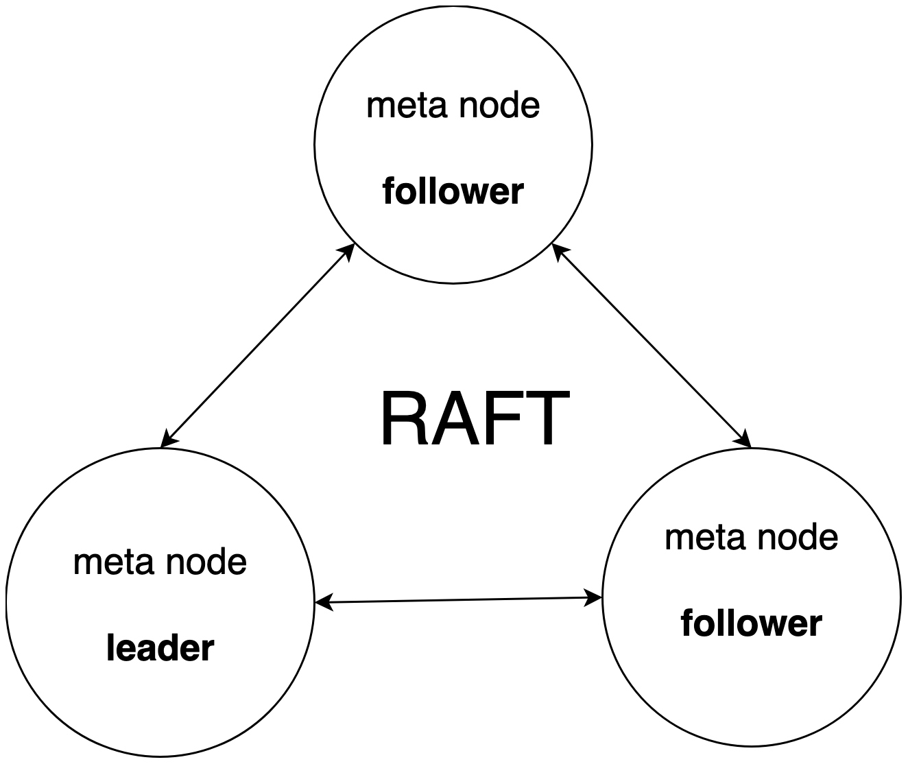

# Cluster Expansion

## **Installation**

Reference [Source Code Installation](../deploy/single#source-code-installation)。

## **Start**

Meta Cluster is a Raft Group composed of multiple cnos-meta via Raft protocol.

### Single-node startup process

```sh
./target/debug/cnosdb-meta --id 1 --http-addr 127.0.0.1:21001
curl http://127.0.0.1:21001/init -d '{}'
curl http://127.0.0.1:21001/metrics
./target/debug/cnosdb run --config ./config/config_31001.toml
```

### Cluster Startup Process

### Meta Custer Startup Process

Start meta-1

```sh
./target/debug/cnosdb-meta --id 1 --http-addr 127.0.0.1:21001
```

**Start meta-2**

```sh
./target/debug/cnosdb-meta --id 2 --http-addr 127.0.0.1:21002
```

**Start meta-3**

```sh
./target/debug/cnosdb-meta --id 3 --http-addr 127.0.0.1:21003
```

**Initialize meta**

```sh
curl http://127.0.0.1:21001/init -d '{}'
curl http://127.0.0.1:21001/add-learner -H "Content-Type: application/json" -d '[2, "127.0.0.1:21002"]'
curl http://127.0.0.1:21001/add-learner -H "Content-Type: application/json" -d '[3, "127.0.0.1:21003"]'
curl http://127.0.0.1:21001/change-membership -H "Content-Type: application/json" -d '[1, 2, 3]'
```

**View meta cluster status**

```sh
curl http://127.0.0.1:21001/metrics
curl http://127.0.0.1:21002/metrics
curl http://127.0.0.1:21003/metrics
```

#### Data Cluster Startup Process

**Start data-1**

```sh
./target/debug/cnosdb run --config ./config/config_31001.toml
```

**Start data-2**

```sh
./target/debug/cnosdb run --config ./config/config_32001.toml
```

## **Overview**

In the CnosDB cluster version, individual running instances are called Nodes, and each Node is divided into two roles: Meta and Data.

### Meta

Meta maintains cluster metadata, such as Table Schema, Node survival heartbeat and load data, Vnode to Node mapping relationships, etc.

Metadata is frequently accessed by each Node, and CnosDB chooses to maintain a strongly consistent Meta Node cluster, where Nodes subscribe to the Meta Node to pull information of interest, and all updates to metadata information are made through the Meta Node cluster.。

[//]: # (TODO: 修改图片大小)


### Data

Provides TCP Service to accept query and write requests distributed by Coodinator, which are similar to the standalone version.

### Data Flow


### Configuration

### Data

The following describes the configuration file of CnosDB Cluster Edition

```toml
[query]
max_server_connections = 10240
query_sql_limit = 16777216 # 16 * 1024 * 1024
write_sql_limit = 167772160 # 160 * 1024 * 1024
auth_enabled = false

[storage]
path = 'data/db'
max_summary_size = 134217728 # 128 * 1024 * 1024
max_level = 4
base_file_size = 16777216 # 16 * 1024 * 1024
compact_trigger = 4
max_compact_size = 2147483648 # 2 * 1024 * 1024 * 1024
strict_write = false

[wal]
enabled = true
path = 'data/wal'
sync = false

[cache]
max_buffer_size = 134217728 # 128 * 1024 * 1024
max_immutable_number = 4

[log]
level = 'info'
path = 'data/log'

[security]
# [security.tls_config]
# certificate = "./config/tls/server.crt"
# private_key = "./config/tls/server.key"

[cluster]
node_id = 100
name = 'cluster_xxx'
meta = '127.0.0.1:21001'

flight_rpc_server = '127.0.0.1:31006'
http_server = '127.0.0.1:31007'
grpc_server = '127.0.0.1:31008'
tcp_server = '127.0.0.1:31009'

[hintedoff]
enable = true
path = '/tmp/cnosdb/hh'
```

#### Configuration item query

| **Configuration items** | **Default Value** | **Description**                                                                                                                                                       |
|-------------------------|-------------------|-----------------------------------------------------------------------------------------------------------------------------------------------------------------------|
| max_server_connections  | 10240             | Maximum number of simultaneous SQL executions                                                                                                                         |
| query_sql_limit         | 16777216          | Maximum length of SQL (bytes)                                                                                                                                         |
| auth_enabled            | false             | Whether to check the identity information of each query request, when set to true, the execution of SQL will check whether the user has the corresponding permission. |

#### Configuration storage

| **Configuration items** | **Default Value** | **Description**                                                                                                                                            |
|-------------------------|-------------------|------------------------------------------------------------------------------------------------------------------------------------------------------------|
| path                    | data/db           | Database file storage path                                                                                                                                 |
| max_summary_size        | 134217728         | Maximum size (in bytes) of a single database summary file, create a new summary file when the size is reached                                              |
| max_level               | 4                 | Maximum hierarchy of database files                                                                                                                        |
| base_file_size          | 16777216          | Database file size (bytes)                                                                                                                                 |
| compact_trigger         | 4                 | When the number of files in level 0 is reached, the compression task is started and the files are merged into a higher level                               |
| max_compact_size        | 2147483648        | Total maximum selected file size per compaction job (bytes)                                                                                                |
| strict_write            | false             | Whether to ensure that each write request strictly conforms to the Table's Schema; when set to true, write requests are not checked for Schema conformance |

#### Configuration wal

| **Configuration items** | **Default Value** | **Description**                                                                                                             |
|-------------------------|-------------------|-----------------------------------------------------------------------------------------------------------------------------|
| enabled                 | true              | Whether to enable WAL for disaster recovery support, when set to ture, write requests will be written to the WAL file first |
| path                    | data/wal          | WAL file directory                                                                                                          |
| sync                    | false             | Whether to ensure that every WAL write request is flushed to disk                                                           |

#### Configuration cache

| **Configuration items** | **Default Value** | **Description**                                                                                                                |
|-------------------------|-------------------|--------------------------------------------------------------------------------------------------------------------------------|
| max_buffer_size         | 134217728         | Maximum writable size (in bytes) per active cache in a single Vnode                                                            |
| max_immutable_number    | 4                 | The maximum number of inactive caches in a single Vnode, and when the number is reached, the inactive cache is written to disk |

#### Configuration log

| **Configuration items** | **Default Value** | **Description**                    |
|-------------------------|-------------------|------------------------------------|
| level                   | info              | Logging level, optionally  trace \ | debug \| info \| warn \| error |
| path                    | data/log          | Log file directory                 |

#### Configuration security

**security.tls_confg**

| **Configuration items** | **Default Value**   | **Description**     |
|-------------------------|---------------------|---------------------|
| certificate             | data/tls/server.crt | data/tls/server.crt |
| private_key             | data/tls/server.key | data/tls/server.key |

#### Configuration cluster

| **Configuration items** | **Default Value** | **Description**                      |
|-------------------------|-------------------|--------------------------------------|
| node_id                 | 100               | Data Node ID                         |
| name                    | cluster_xxx       | Data Node Name                       |
| meta                    | 127.0.0.1:21001   | Meta Node Address                    |
| flight_rpc_server       | 127.0.0.1:31006   | Flight RPC Service Listening Address |
| http_server             | 127.0.0.1:31007   | HTTP Service Listening Address       |
| grpc_server             | 127.0.0.1:31008   | GRPC Service Listening Address       |
| tcp_server              | 127.0.0.1:31009   | TCP Service Listening Address        |

#### Configuration hintedoff

| **Configuration items** | **Default Value** | **Description**                                                                                                                                                          |
|-------------------------|-------------------|--------------------------------------------------------------------------------------------------------------------------------------------------------------------------|
| enable                  | true              | Whether to enable Hinted Off for consistency support, when set to true, failed write requests will automatically enter the hinted-off queue and be retried automatically |
| path                    | data/hh           | Hinted Off persistent directory                                                                                                                                          |

## **Operations and Maintenance Guide**

### Cluster maintenance (coming soon)

**Transferring Vnode**

```
MOVE VNODE [vnode_id] TO NODE [node_id]
```

**Copy Vnode**

```
COPY VNODE [vnode_id] TO NODE [node_id]
```

**Delete Vnode**

```
DROP VNODE <vnode_id>
```

**Compression Vnode**

```
COMPACT VNODE <vnode_id>[, <vnode_id>[, ...]]
```

**Checking Group Data Consistency**

```
CHECKSUM GROUP <replication_set_id>
```
