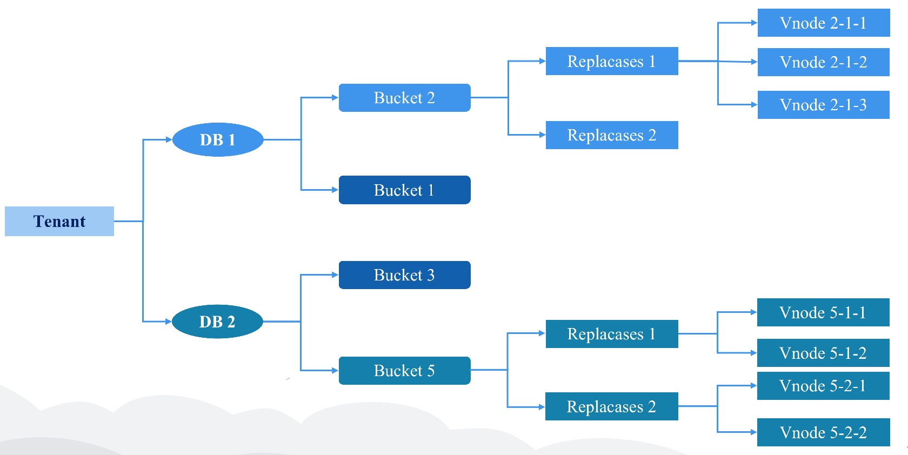
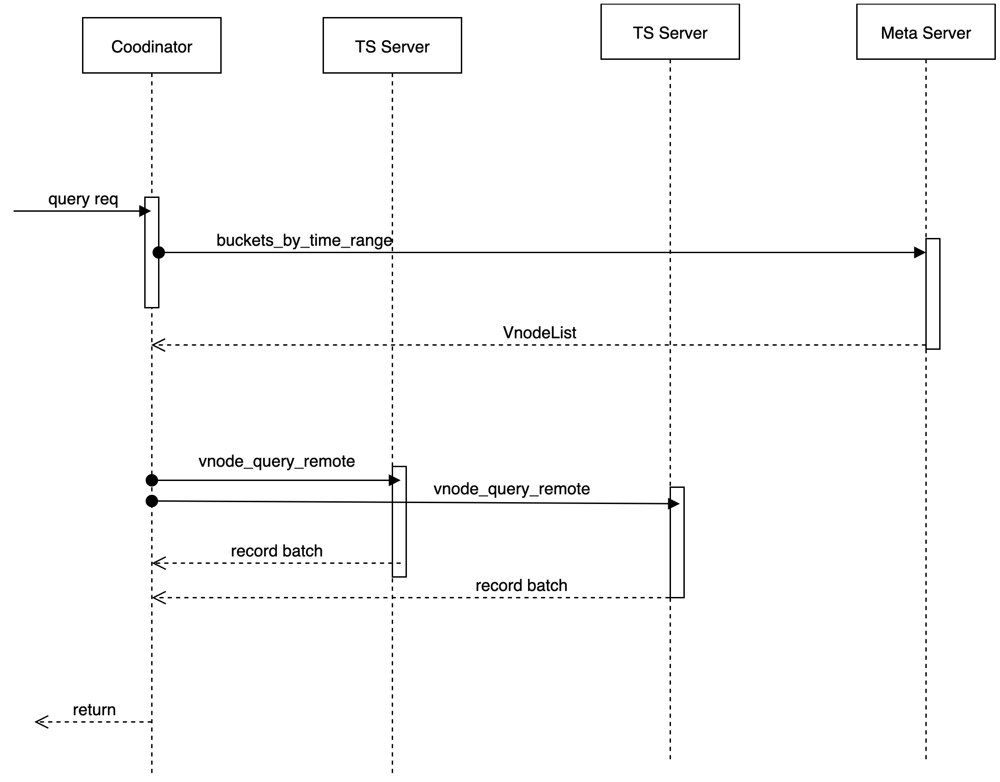
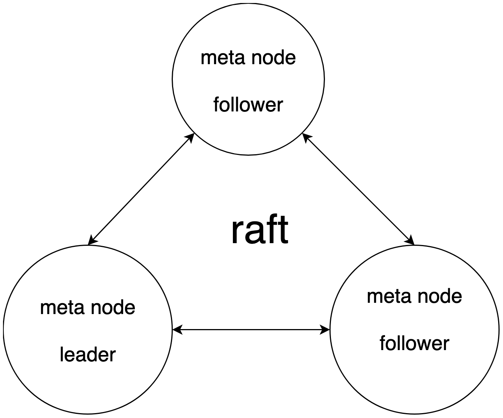
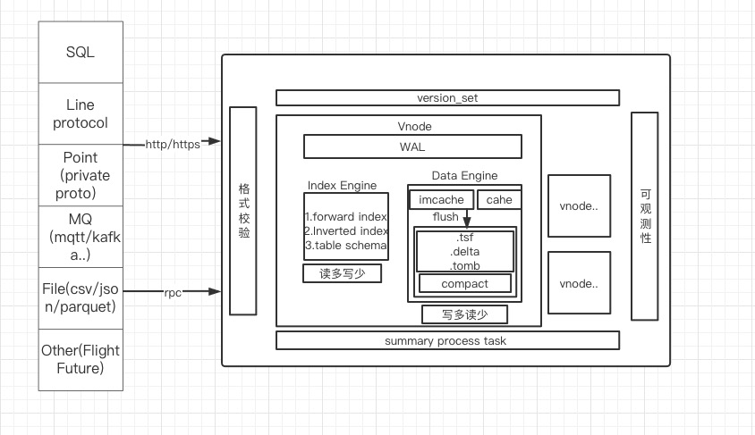
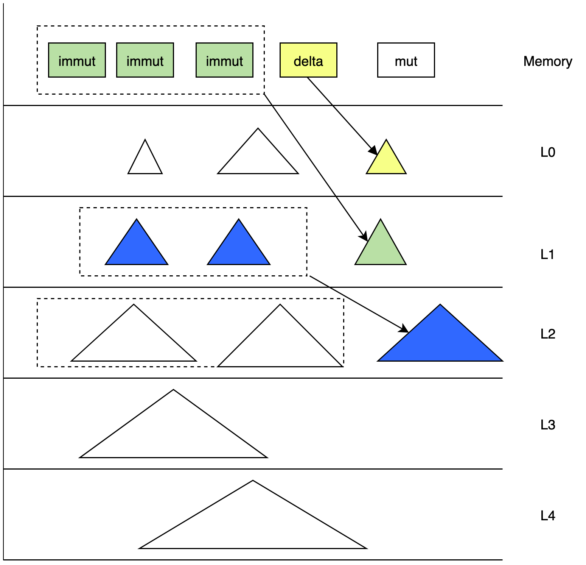
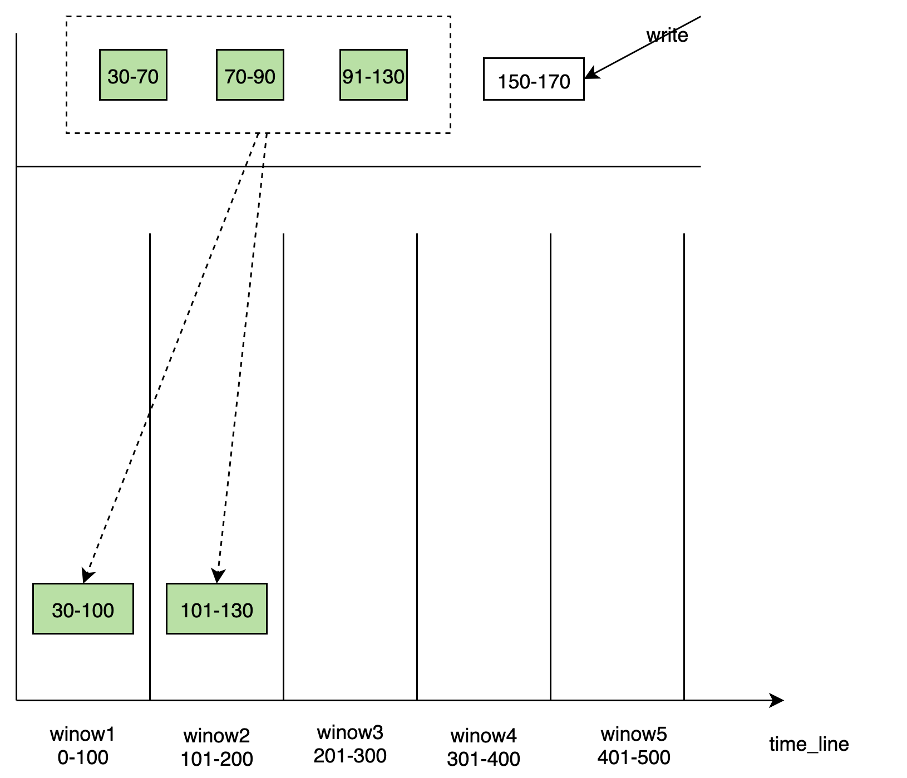
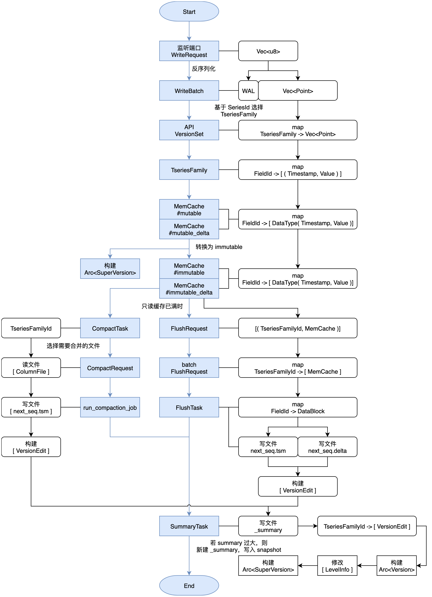
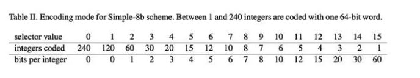
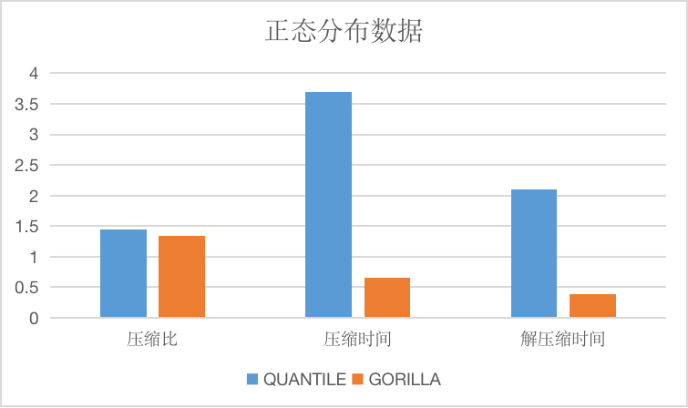
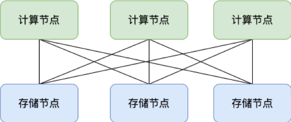

# Design

## **Concepts**

### Background

The twenty-first century we are living in is an era of explosive growth of data information, in which all kinds of data information are expanding, individuals and enterprises are aware of the importance of data information, and with the advent of big data era, we have new challenges and requirements for insight into this data information. Based on the above-mentioned background of massive data, the database field has segmented some data information in specific formats to obtain better storage and retrieval performance.
Our time series data is one of the branches born in this context. This article focuses on the time series database users to carry out a basic concept of pulling together, in order to help us better navigate the time series data.

### Time Series

In the ocean, we may monitor a variety of data indicators, used to study the environment, weather and human production, for example, a scenario: Suppose we have a detector that can record the visibility of the ocean air, we can determine whether to produce based on visibility changes. This visibility information is a time series data, in a common sense is a line graph of changes over time.


So let's make a summary:

Time Series is a line with time on the x-axis and a state index on the y-axis, which is used to describe the state of things over a period of time.

CnosDB is a time series database, whose application is to store data related to time series, providing efficient writing and querying.
Therefore, CnosDB has designed the design model of time series based on the characteristics of time series data.


### Data Model

#### TimeStamp

A time series database requires that each piece of data written be time-stamped, indicating the moment when the data was collected.

CnosDB supports setting the precision of the time.

#### Tag

In the application scenario of temporal database, there are some data that do not change with time, such as the location of the IoT collection device, the name of the device, and the owner of the device.

This data is called**Tag**and we use STRING to store Tag.

In CnosDB a tag data is a key-value pair, consisting of Key and Value, Key is the tag name and Value is the tag value.

Usually, for better classification, multiple Tag pairs are used to tag a time series, i.e. Tags.

#### Field

In a time-series database application scenario, some data changes over time, such as the data collected by IoT collection devices.

For a device that detects the environment, it collects information such as room temperature, humidity, etc., which changes over time, and these data we call **Field**.

The collected data is diverse, CnosDB provides `BIGINT`,`BIGINT UNSIGNED`,`DOUBLE`,`STRING`,`BOOLEAN` for storing fields, and also provides compression algorithm to store them efficiently.

#### Row

A timestamp, a set of tags, and a set of fields make up a row of data, which many people also call a point.

A data row must contain a timestamp, at least one tag, and at least one field.

#### Table

A Table is an organization of rows of data with the same label and fields. This is very similar to the concept of a table in a relational database.

Timestamps, labels, and fields are equivalent to columns of tables in a relational database.

The only difference is that the rows in CnosDB are rows of data consisting of timestamps, labels, and fields.

We can use our familiar SQL to manipulate the tables in CnosDB database that store time series data. INSERT and most SELECT statements in SQL standard are efficiently supported by CnosDB.

**Example**

The following is a table storing data

| Timestamp | NodeID | CPU | Memory |
|-----------|--------|-----|--------|
| time1     | node1  | 15% | 35%    |
| time2     | node2  | 23% | 45%    |
| time3     | node1  | 19% | 50%    |
| time4     | node2  | 80% | 70%    |

Where the Timestamp column is the timestamp, the NodeID column is the label, and CPU and Memory are the fields

#### DataBase

A database is made up of multiple tables, which is similar to a relational database. Each table stores data of different structure.

Users can use SQL to manipulate different tables in the database and also perform join queries of tables.

CnosDB supports setting different storage policies for a database, data retention time, number of data slices, slice setting policy, time precision, etc.

## **Architecture**

### Design Objectives

Consdb2.0 is developed in Rust language, based on its security, high performance and community influence, provides users with an excellent time series database and forms a complete DBaas solution.

> **Time Series Database**
1. Extensive: Theoretically supported time series has no limit, completely solves the problem of time series expansion, and supports cross-river expansion.
2. Calculate storage separation: Calculating nodes and storage nodes, can expand and shrink capacity independently and on a second scale.
3. Storage performance and cost: High performance io stacks support hierarchical storage using cloud discs and object storage.
4. The query engine supports vector queries.
5. Supports multiple time series protocols to write and query, providing external component import data.

> **Original Cloud**
1. Support cloud native, support the full use of cloud infrastructure to integrate into cloud native ecology.
2. High availability, second-level failure recovery, support multi-cloud, cross-regional disaster preparedness.
3. Native support multi-tenant, pay on schedule.
4. The CDC log provides subscriptions and distributions to other nodes.
5. Provide users with more configuration items to meet multiple-scenario complex requirements for public cloud users.
6. Cloud side synergizes to provide the ability to fuse side ends with public clouds.
7. Blend the OLAP / CloudA data ecosystem on the cloud.


In the process of redesigning the time series database, we solve a series of problems faced by the current time series database  as much as possible, form a complete set of time series data solutions and  time series  ecosystem and provide DBaas services in public clouds.


> We will have the elaboration from following aspects.

- Data replication and consensus
- Meta cluster
- SQL engine
- tskv index and data storage

### Data Replication and Consensus

The fragment rule of CnosDB 2.0 is based on Time-range. It uses the fragmentation rule of DB + Time_range to place the data in the corresponding Bucket. Bucket is a virtual logic unit. Each Bucket consists of the following main properties. Bucket creates multiple fragments based on user configurations, dissipating data (suppose data fragment Shad Num is 1).> 「db， shardid， time_range， create_time， end_time， List\<Vnode\>」

Vnode is a virtual running unit and is distributed to a specific Node. Each Vnode is a separate LSM Tree. Its corresponding tsfamily structure is a separate running unit.


#### Replicaset

The high availability of data can be maintained through data replica set. Each db has its own replica group representing the number of data redundants. A set of Vnotes within the same bucket forms a replica group with the same data and inverted index information.

#### Place Rule

To address the possibility of concurrent failures, the meta node may need to ensure that data copies are located on devices that use different nodes, racks, power sources, controllers and physical locations, when creating bucket. Considering that different tenants will access data at different region, Vnote should be dispatched and discharged by the way of optimal cost.

#### Data Separation Strategy

Data from different tenants on Node are physically segmented.

`/User/db/bucket/replicaset_id/vnode_id`



#### Data Consensus Based on Quorum Mechanism

- #### The Cnosdb2.0 is implemented as a system with final consistency.

    The module using the Quorum mechanism to make data consensuss and handling read or write requests is called codenatoor.

    - Meta information cache, interact with meta nodes

        According to user, db, Timemange, get Vnote information, maintain a cache locally and pull VodeList from the remote without a local hit. Provide a trait of Meta Client.

    - Connection management

      Manages connections with different tskvs for data reading/writing.

    - Agent operation for data reading/writing/deleting

      Data is configured by users to support a variety of different consistency levels.

      ```Rust
      pub enum ConsistencyLevel {
          /// allows for hinted handoff， potentially no write happened yet.
          Any，
          /// at least one data node acknowledged a write/read.
          One，
          /// a quorum of data nodes to acknowledge a write/read.
          Quorum，
          /// requires all data nodes to acknowledge a write/read.
          All，
          }
      ```
    - Hinted handoff  
      Add under the scenario of a temporary failure of the target node to provide the Hinted handoff function of the continator node, which is persistently saved in the Hinted handoff queue of the node, until the copy node fails and then copied and recovered from the Hinted handoff queue.

    Data are written

    When a write request is received, the cordinator determines the physical node (note) where the data to be stored, based on the partition policy and the corresponding placement rules (place-rule). As long as at least W nodes return to success, the writing operation is considered successful.

#### Writer Process


#### Data Reading

When a read request is received, the cordinator determines that the physical node (note) where the data to be stored and requires this key corresponding data based on the partition policy and the corresponding placement rules (place-rule), and at present we do not perform the function of read repair (read repair) to initiate only one reading request. In the case of delay in reading, initiate a second reading request.




#### Update of Conflicts

1.  After data creates conflict in a time series scenario, use consistency hash to be replaced by the first copy (replaica) as a confirmation point
2.  At the same time, the last-write-win strategy is used to resolve conflicts.

### Meta Cluster

Maintain a strong consistency meta cluster through raft. Meta cluster api serves externally, while nodes also subscribe to updates to meta information. All metadata updates are updated through the meta-data cluster.



> 1.  Database catalog information, DDL operation.
> 2.  The node probe/node registration, as well as node load information statistics, is the basis for the read and write selected by coordinator.
> 3.  Rent and sub-user information and permissions are relevant.
> 4.  Data routing information, the routing information corresponding to vnodeList corresponding to denant / db / bucket / replicaset.
> 5.  Provides the functionality of distributed locks and watch change notifications.

We adopt a strong consistency meta cluster and realize corresponding optimization. The specific reasons are as follows:

> - In practice, metadata in our cluster is usually controlled on a smaller scale and without extensible requirements.
> - Engineering practice is relatively simple and is conducive to rapid iteration.
> - Make cache and localized storage for access to frequently accessible data, optimize.
    >   - After storage locally, subscribe to schema version changes from the meta cluster to relieve the pressure of meta cluster reading.
>   - Meta clusters share the leveler pressure and provide the Follower / Read scheme. Reading performance is optimized.

### SQL Engine

We used [DataFusion](https://arrow.apache.org/datafusion/) as the query engine. DataFusion is an extensible query execution framework, written with Rust, used [Apache Arrow](https://arrow.apache.org/) As its memory format. DataFusion supports SQL and DataFrame API for building logical query schemes, as well as query optimizers and execution engines that can be executed in parallel with partition data sources using threads. It has the following advantages:

1. High performance: Using the memory models of Rust and Arrow, it has high performance.
2. Strong extensibility: Allows almost any point in its design to be extended and customized with a needle-specific use case.
3. High quality: DataFusion and Arrow ecology are widely tested and can be used as production systems.
4. Fusion of large data ecology: As part of the Apache Arrow ecosystem (Arrow, Flight, Parquet), it is better integrated with large data ecosystems.

By extending DataFusion data sources and providing custom SQL statements, the query process for data under distributed scenarios is as follows:


### TSKV Index and Data Storage

tskv mainly undertakes data and index storage, manages all Vnodes on node, each Vnode is responsible for some of the data in a db. In Vnode, three modules mainly make up WAL, Index Engine and Data Engine.



#### Index Engine

Indexes used to store time series data are usually models that read more and write less, mainly quickly indexing and tagkey-based conditional filtering to filter out the right series.

The main functions are:

1. Storage positive index
2. Storage reverse index
3. Caching catalog information

Common query statements：

```sql
SELECT xxx from table where tag1= value1 && tag2=value2 [and time > aaa and time  \< bbb] [group by\order by\limit ....]
```

The design of index is mainly aimed at the where filtering conditions; used to reduce the search scale of data and speed up the query efficiency of data.

Support the following filtering conditions:

> 1. Equal to; not equal to; such as: tag = value, tag! = Value
> 2. More than; less than; such as: tag  \< value
> 3. Prefix matching; such as: tag = aaa_*
> 4. Regular expressions; such as: tag = aaa*bbb

Indexes is built when the data is written. In time series database, each tag is indexed, and the corresponding value of multiple tags is combined into a searchkey. Although time series databases are writing more and reading less, the use of indexes when writing data is more read than build. Time series databases are often written to different time points of the same search, so each search&apos;s index information needs to be built only when it is first written, and if the search exists (reading operation), no longer indexed;

- #### Storage structure

  - Based on the hash function, calculate HashID: `hash (SeriesKey) -> HashID` (24-bit integer, about 16 million); 2.HashID (uint64): `HashID  \< 40 | auto_increment_id -> SeresID` is obtained.
    - FieldID (uint64) is combined by SeriesID with TableFiledID (field has a number within the table for TableFiledID)：
  
    Conditions of limitation: 
    - The number of HashIDs is about 16 million, and hundreds of millions of single machine Series will lead to List lengthening drag-and-seeking.
    - The 24th bits of FieldID are TableFiledID, and the lower 40 bits are the lower 40 bits of SeresID.
  
  The TSM data file stores FieldID and corresponding Data information. The information about SeresKey is stored in the index file, and the following is about the index data organization.

- #### Design of index data structure

  - HashList: `HashID-> List \< (SeriesKey, SereesID) >` for SeriesKey to interexamine with SereesID
    - SereiesKey looks for the SereesID process: `Hash (SeriesKey) -> HashID`, gets `List \<SerisKey, SereesID >` from HashList, and then traverses List for SeriesID.
    - SereesID looks for the SereesKey process, takes the 24-bit high of SeresID as HashID, and the search process is the same.
  - `TagValue -> List  \<SeriesID> `implements indexing capabilities for Tag, using tag query conditions filtering.
    - Query Conditions: `where tag = value`, get a list of SeresIDs based on TagValue, and further obtain FieldID loading data from TSM files.
    - Multiple query conditions intersect and or need to operate multiple `List\<SereesID\>`.
  - The TagValue sequence is required to store traverse access. Used `show tag value` query HashList structure requires one maintenance, inert loading in memory. `HashID-> List \< (SeriesKey, SereesID) >` and `TagValue-> List \<SeriesID>` are persistent.

#### Data Engine

Data used primarily to store time series data are usually scenes that write more and read less, using LSM models, mainly to write data quickly, while removing expired and deleted data through context. DataEngine is divided into the following modules:

- #### WAL module

    For the pre-log, the WAL applies the write operation to the WAL file on disk before memory is added to the disk before memory, which will be used to restore memory to a state consistent with the collapse. When a write request is received, wal_job first checks whether the current WAL file is full, if it is full, create a new one, and then start writing it in a certain format. Each req corresponds separately to a seq-no, seq-no increment to record how many batches have been written since it started. The wal_job thread returns this seq_no to the main thread. Each point of the same batch has the same seq_no in memory or written to TSM, which is processed for seq_no.

- #### TimeSeriesFamily

    TimeSeriesFamily, a storage unit for time-order data that saves metadata for data in corresponding memory and data in corresponding disks, typically abbreviation for tsfamily, and before we write data, we generate SeresID and FieldID based on the tag and Field of the data. Coordinator gets Bucket based on db and Timemange and gets TseriesFamilyID to write data to tsfamily based on hash (SeriesID) % shard_nums. The tsfamily members are as follows:

    ```
    pub struct TseriesFamily {
        tf_id: u32，
        delta_mut_cache: Arc \<RwLock \<MemCache>>，
        delta_immut_cache: Vec \<Arc \<RwLock \<MemCache>>>，
        mut_cache: Arc \<RwLock \<MemCache>>，
        immut_cache: Vec \<Arc \<RwLock \<MemCache>>>，
        super_version: Arc \<SuperVersion>，
        super_version_id: AtomicU64，
        version: Arc \<RwLock \<Version>>，
        opts: Arc \<TseriesFamOpt>，
        seq_no: u64，
        immut_ts_min: i64，
        mut_ts_max: i64，
    }
    ```
    
    `tf_id`：tthe identifier of tsfamily, each tsfamily has the only tf_id.
    
    `mut-cache`：For the latest data written in a cache
    
    `immut-cache`：When the mut-cache is full, turn to `immut-chache`, `immut-cache` flash to disk to generate TSM files.
    
    `super-version`：Snapshot data from the current `mut-cache` and `immut-cache` of tsfimily.
    
    `version`：Maintains snapshots of disk data in the current tsfaimily.

- #### Recover and Summary

    Summmarry is a metadata file generated by changes in the version of the TSM file, which stores the sample file. The system file stores version-change metadata version_edit for outage recovery of `version_set` metadata. The node runs for a long time to generate larger summary files, and we regularly integrate the summary file to reduce the time of outage recovery.

    tskv first performs the recover function when creating:

  - Gets the summary structure from the sample file. 
  - According to the `last_seq` of ctx of the schema structure, know which batch has been filed by flush 
  - According to the wal file and `last_seq`, the base that is not rewritten into memory by the flush 
  - Restore `version_set` based on the summary file

- #### Flush

    When the `immut-cache` capacity in tsfamily reaches a certain extent, the flash starts after the execution of the write operation, when it is found that the `immut-cache` is full, pack it into a `flash_request`, which is received by the `flash_job` thread after processing.

  - Remove data from the `flash-request` and create a `flash_task` based on data, executed 
  - According to `TseriesFamilyID`, FileID creates a TSM file that writes data to the TSM file 
  - According to file information, the application metadata corresponds to the `Levels_info` of the version 
  - Generate versioned it based on modifications to version and `seq-no`, TseriesFamilyID, etc 
  - Send all generated `version edit` to the `summary_task_sender` created together at the time of creation of tskv, and the thread receives the request and starts processing, and writes the `version_edit` to the summary file.

- #### compaction

    We use the class LSMtree method to sort data. Typically, data from time series databases are written in chronological manner. But IoT has scenarios that make up data, leading to time stamps. In addition, it is difficult to ensure the order of writing for all users due to network delays in public cloud scenarios. In the face of multiple complex write-in scenarios, we need to consider a variety of complex scenarios when performing data. 

    The purpose of the operation is:

  - Aggregate small tsm files to generate larger tsm files. 
  - Clean up files that have expired or marked to delete. 
  - Reduce reading magnification and maintain the metadata of `level_info` in our current version.

- #### level_range compaction

  

  - Typically, time series databases are written in order to respond to disorderly data, we add delta files. The data of Delta is brushed to the L0 layer. 
  - From L1 to L3, The data of `LevelInfo` are classified by time. Each layer has a fixed time range and does not overlap, and the data in memcache has a fixed timerange. Each layer of time is dynamically updated when it works or flashes. 
  - Each newly written TSM file has the latest time range of the layer. That is, `TimeRange ( ts_min, ts_max)`, `ts_max` is the largest in the time range held by file id largest TSM file in the L0 layer. 
  - The pick process of the compact creates a virtual `time_window`. `time_window` selects the appropriate TSM file in this layer for compaction to the next floor, while updating the data of this layer `Level_info`. Update TSMin in `Level_info` to maximum timestamp of `time_window`, the time range of this layer goes forward. The newly generated TSM file is placed on the next floor and ts_max of the next layer is propelled to the maximum value of `time_window`. 
  - At the beginning of L3, the TSM file is divided by directory by table; and the same table TSM file is placed together. Supports the generation of the parquet file and is graded on S3.

- #### time_window compaction

  

  - Window-based components are performed in different lev_lange modes, from immut_cache flash to disk, generating different TSM files into the corresponding windows based on the time range of TSM, and windows are created dynamically over time. Each windows is responsible for writing for some time. 
  
  - There are some discrete data tsm file blocks within windows that need to be merged to generate larger file blocks. The windows internal maintains a list of metadata about files. Compared with the mode of integration with Level_range, the performance of time_window reduces the amplification of writing.

- #### data_engine data stream

  

### Other System Design

#### Concession of tenants

- #### query layer

  In DataFusion, the catalog isolation relationship is divided into `catalog/schema/table`. We use this isolation relationship, which is separated between tenants as `tenant (namespace) / database / table`.

  - Table corresponds to a specific table in a specific database that provides a specific table schema definition implementation TableProvider
  - Database corresponds to a dataabase, which manages multiple tables under a specific database.
  - Namespace corresponds to Catalog. Each tenant occupies only one catalog, and the db seen in different tenants is different, and different tenants can use the same Database name. When the user logs in, take TenantID in the session by default to see his namespace, which means namespace has a soft isolation effect.

- #### tskv layer

  The directory segmentation policy mentioned in the above introduction: `/User/db/book/replicationset_id/vnode_id/tskv` is an instance on each Node node. Save all Vnote information on the current Node. Each Vnode saves the data under a separate directory. Clean up the data based on the configuration db retion policy. At the same time, we can easily carry out the data directory size statistics, the tenant is billed.


## **Compression Algorithm**

### DELTA

Mainly used for timestamp, integer and unsigned integer.

#### Principle

First, the difference is made, that is, the first data is unchanged, other data are transformed into delta with the previous data, and all numbers are processed byzigzag, i64 is mapped to u64, specifically to zero, negative numbers are mapped to odd numbers, such as [0, 1, 2] after zigzag processing to [0, 1,2] and maximum convention numbers are calculated. Then judge that if all deltas are the same, use the cruise path code directly, that is, only the first value, delta, and the number of data. Otherwise, all delta values are divided into maximum convention numbers (maximum convention numbers are encoded into data), and then encoded using Simple 8b.



Simple 8b is a compression algorithm that encapsulates multiple integers to a 64-bit integer, the first four-bit as selector to specify the number and validity of integers stored in the remaining 60 bits, and the latter 60 bits are used to store multiple integers. In addition, when delta is larger than the maximum range of Simple 8b energy encoding (more than 1<60-1, generally not) does not compress and stores arrays directly.

#### Applicability

In some time-consuming data, assuming that data is collected every five seconds, the time stamp is 5, that all timestamps can be restored through only three numbers, with extremely high compression, while some delta does not guarantee consistent scenarios, i.e., where using Simple 8b, are more suitable for smaller, floating data.

In the absence of specifying compression algorithms, we use this compression algorithm for timemarks, integer and unsigned integers, and the compression rate is higher.

### GORILLA

Mainly used for floating point type.

#### Principle

The principle of Gorilla is similar to the difference, the difference is that the difference is the difference between two data, and gorilla is different or different. The first data is not processed at the time of coding, and if the previous data is different from the previous data, if the difference or value is 0, repeat it with the previous data, write a patch to represent repetition, and, if not zero, calculate the first zero and back derivative zeros of the heterogeneous or value delta. If the number is the same, only the intermediate valid bit is encoded. If the number is different, the first 0.5 bits are derived, the back 0. 5 bits are written, and then the intermediate valid bit is written.


#### Applicability

As compared with delta type, it is also suitable for time-order data scenarios, and we may collect data in different locations, but the toponymic-related information collected at the same location is generally consistent, in which the compression rate is higher than that of compression efficiency.

In the absence of specifying compression algorithms, we specify this compression algorithm for floating point type by default.

### QUANTILE

Mainly used for timestamps, integers, unsigned integers and floating points.

#### Principle

Qantile supports multiple levels of compression, and CosDB currently uses the default compression level.

Each data is described by Huffman coding and offset, and the offset specifies the exact location of the range of the data by the Huffman code corresponding to the range of the data. For each block compression, the difference processing is first carried out, the data after the difference is replaced by the current data, then the current array is divided into multiple blocks at an interval of 128, each block determines a range and associated metadata, while calculating the maximum number of conventions per block, optimizes the number of conventions as appropriate, and merges some adjacent blocks, then determines its Huffman encoding based on the weight of each block in the data, and finally encodes the data using them.


#### Applicability

Compared with the delta algorithm and the gorilla algorithm, because the difference algorithm is also used, it is roughly the same in the selection of applicable data.

The longitudinal axis of the image is the compression ratio, the time is only relative.




### BITPACK

Mainly used for Boolean types.

#### Principle

The size of a bool-type data is a byte, and for the information that bool represents, it&apos;s only one bit to represent so that we can assemble eight bool-type data into one byte.

#### Applicability

No matter what data, we can ensure a compression ratio of nearly eight times that we specify this compression algorithm for the Boolean type by default without specifying the compression algorithm.

### String Compression Algorithm

The string compression algorithm currently supported is compressed, such as below.


And compressed time and decompression time, units are us.


### SNAPPY

Snappy algorithms are not designed to minimize compression or are not designed to be compatible with any other compression library. Instead, its goal is to be very high compression efficiency and reasonable compression rates, so it is recommended to use snappy more efficiently.

In the absence of specifying a string compression algorithm, we specify this compression algorithm by default.

### ZSTD

Zstd supports multiple compression levels, and CnosDB currently uses the default compression level.

Zstd, known as Zstand, is a fast compression algorithm that provides high compression ratio, and Zstt uses a finite state entropy encoder. A very powerful compromise scheme for compression speed/compression rate is provided.

### GZIP/ZLIB

Gzip is similar to zlib. For files to be compressed, a variant of the LZ77 algorithm is first used to compress the results by using Huffman coding, with high compression rate but also time-consuming. Both algorithms are widely used and have similar performances and can be selected according to the situation.

### BZIP

Compared with several other algorithms, the compression rate is higher, but the compression efficiency is lower, which can be used for scenarios that require extreme compression rate, in general less recommended.


## **Quorum Algorithm**

Quorum algorithm is a voting algorithm commonly used in distributed systems to ensure data redundancy and eventual consistency. Quorum is used to ensure that if some participants fail, we can still collect votes from the surviving participants and continue to execute the algorithm. A Quorum represents the minimum number of votes needed to perform an action, typically a majority of participants. The core idea behind Quorum is that even if participants fail or happen to be separated by network partitions, at least one of them can act as an arbiter to ensure the accuracy of the protocol.

### Basic Principle of Quorum Algorithm

There are three parameters in Quorum URW algorithm: N, R, W. 

Parameter N is also called a copy factor, meaning a number of copies of data throughout the cluster. 

Parameter R is the level of read consistency, which means successful reading from R copies will be considered a successful reading operation. 

Parameter W is the level of writing consistency, which means successfully written from W copies, will be considered a successful writing operation.

N, R and W parameters can achieve different consistency levels under different combination conditions:
1. When "W + R > N", the latest data can be determined by timestamp, version number, etc. In other words, under the combination of parameters that meet this condition, the strong consistency of data can be realized.
2. When "W + R < = N" is not possible, it can only guarantee final consistency, i.e. system reading may obtain old data.
3. When "W = N, R = 1, so-called Write All Read One" is the scenario of the CP model in CAP theory.
4. When "W <N, R = 1" is the scene of the AP model in CAP theory.

### Modalities for Data Consistency Assurance

Data are required to write N when writing, taking into account that there may be write failures in reality, loss of data copies caused by machine failures, and inconsistencies in multiple copies of data, such as write-and-end.
1. The hinted-handoff mechanism is a machine received to write requests. When a remote replaica is written in failure, it is stored in the hinted-handoff queue of the machine; this opportunity regularly sends the contents of the hinted-handoff queue to a remote node to achieve final consistency in the data. Typically, the hinted-handoff queue has a capacity limit, and overcapacity writes will fail.
2. Reading repair mechanism If two data are found to be inconsistent when read, repairs are made to the final consistency of data based on version number, timestamp or other copy information; reading and repairs are usually used in the CP model.
3. In this distributed algorithm of Quorum, the deletion operation is a special operation to deal with the problem that there may be no resurrection of old data. For example, three copies, two successful deletions of one unsuccessful, and the failure to delete successful data processing may be used as valid data synchronization to cause the resurrection of deleted data; in order to address this situation, marker deletion is usually used when deleted, and is later really deleted from disk, which is often referred to as a tombstone mechanism.
4. The anti-entry anti-entropy mechanism is similar to a background checker, where there is a lack of data between copies and where values exist and are not consistent and then repaired. This mechanism is usually costly for the system, and most systems have a configuration switch when implemented, which is determined by users whether to open.

It is because of the large cost of the system that the antitropy mechanism is different when it is implemented, different systems choose to realize it according to different particle size. Some systems routinely view only whether one data block content is lost without carsandra, while some systems validate each content within the periodic calibration system, such as liak. In content-based consistency implementations, this data structure is usually built on Merkel Tree.


## **Cloud Native**

### Basic Concepts of Cloud Native

Cloud-native time series Database is a kind of Database as a Service (DBaaS), which completes the construction, deployment and delivery of the database through the cloud platform. It is primarily a cloud platform that provides services, providing models that allow organizations, end users and respective applications to store, manage and retrieve data from the cloud. Cloud databases provide a scalable and reliable database solution. Clients have service levels specific to their cloud environment. It is deployed in a non-virtualized environment, making the full extent of the underlying hardware available for the database.

### Advantage of Cloud Native Database

For example, cloud database services provided by cloud service providers such as AWS, Microsoft Azure, Ali Cloud, Google Cloud, and CnosDB have contributed to the development of cloud-native databases. As a result, the market share of cloud databases has been growing rapidly in recent years. More and more enterprises and organizations are migrating their business from local data centers to the cloud. Cloud platforms provide high elasticity, strict service level agreements to ensure reliability and ease of management, while reducing operational costs. Cloud databases play a key role in supporting cloud-based business. It becomes the central hub connecting the underlying resources to various applications, making it a critical system for the cloud.

- Better security. A cloud-native database may seem like a very remote and invisible place to store valuable information. It is more secure than users think. With the help of proper antivirus and firewall and some rules, data can be effectively protected. In addition, keeping up to date software technologies guarantees that cloud computing can provide a higher quality of data protection for businesses dealing with sensitive information.
- More available space. This is one of the most useful aspects of cloud-native databases, which can store large amounts of data without multiple USB drives.
- Enhance collaboration. With a database accessible from anywhere in this service, cloud-native databases create the perfect collaboration tool, especially for colleagues who are geographically distributed, making it easy for all team members to collaborate without the danger of losing or duploking work.
- Cost effective. Cloud-native databases are cost-effective because paying for unlimited storage in the cloud at one time is more cost-effective than having to purchase or repair multiple hard drives in a row. If we buy relatively cheap hard drives, they are easily lost or damaged, so they are costly to maintain in the long run. So, with this cloud-native database, users can buy as much storage space as they need related to their workflow.
- Redundancy. Cloud computing provides replicas and systems that can be used in the event of failure. These replicas can be accessed by replicating the data on multiple computers within the same database. These services help users ensure that their information is always available to them, even if something unexpected happens.
- Highly scalable. The cloud native distributed database is separated from the underlying cloud computing infrastructure, so it can flexibly mobilize resources in time to expand or shrink, so as to calmly cope with the pressure brought by the surge in traffic and the waste caused by excess resources during the traffic valley. The characteristics of ecological compatibility also make the cloud native database have strong portability.
- Ease of use. The cloud-native distributed database is easy to use, and its computing nodes are deployed in the cloud and can be accessed from multiple frontends anytime and anywhere. Because the cluster is deployed on the cloud, the impact of a single point of failure on the service is very small through automated disaster recovery and high availability. When the service needs to be upgraded or replaced, the nodes can also be upgraded by rotation without interrupting the service.
- Fast iteration. Each service in the cloud-native distributed database is independent of each other, and the update of a single service will not affect other parts. In addition, cloud-native development testing and operations tools are highly automated, which allows for more agile updates and iterations.
- Cost savings. Building a data center is an independent and complete project that requires a large amount of hardware investment and professional operations personnel to manage and maintain the data center. Continuous operation and maintenance can also cause a lot of financial pressure. Cloud-native distributed databases obtain a scalable database and achieve more optimized resource allocation at a lower upfront cost.

### Shared Storage VS Shared-Nothing Storage

A shared memory architecture is a storage system that is used by multiple users/computers. It stores all files in a centralized storage pool and allows multiple users to access them simultaneously. For the upper computing nodes, the shared memory architecture provides a uniform data access interface for multiple users, and users do not need to care about the actual data distribution in the system, nor do they need to care about the load balancing problem of data distribution. In the shared storage architecture, cloud vendors can pool disk resources, let multiple users share a distributed storage cluster, and pay according to the actual use of capacity. This business model is more in line with the current market demand. The diagram is as follows:


The shared-nothing storage architecture is a relatively old pattern that has recently seen a resurgence in data storage technologies, especially in the NoSQL, data warehousing, and big data domains. As the architecture evolves, it has some very interesting performance tradeoffs compared to the more common simple shared memory architecture.

Shared-nothing architecture is an architecture used for distributed computing, where each node is independent and different nodes are interconnected through a network. Each node consists of a processor, main memory, and disk. The main motivation for this architecture is to eliminate contention between nodes. The nodes here do not share memory or storage. Disks have a single node that cannot be shared. It works effectively in high volume and read/write environments. The diagram is shown below.




###  Single Tenant Model VS Multi Tenant Model

Single tenant model means that only one cloud software solution instance is running on its supported hardware and infrastructure components. Not shared with multiple customers involved in a single-tenant environment. In a multi-tenant environment, the cloud infrastructure is shared among multiple customers or accounts. No single customer has control over how resources are allocated or consumed.

CnosDB uses a multi-tenant model. Multi-tenancy is a solution to provide Software as a Service (SaaS) in the cloud. Multi-tenancy uses a shared infrastructure to provide access to a SaaS solution to multiple customers. Multi-tenancy means that a single instance of the software and its supporting infrastructure serve multiple customers. Each customer shares the software application and also shares a database. Each tenant's data is isolated and not visible to other tenants.


#### Advantages of Multi Tenant Model

- Low cost: Multiple customers imply shared environment costs, and these savings (from SaaS providers) are often transferred into software costs.
- Integration: The cloud environment allows easier integration with other applications through the use of apis.
- Easy to maintain: The server is technically owned by the SaaS vendor, which means that some level of database maintenance is handled by the vendor rather than you maintaining the environment yourself.

The multi-tenancy model of cloud-native time series database is usually a SaaS multi-tenancy model. Compared with the previous single-tenant model, it has many advantages.

-Cost reduction through economies of scale: With multi-tenancy, scaling has a much smaller impact on the infrastructure than with single-tenant hosting solutions because new users have access to the same basic software.
-Shared infrastructure leads to cost reduction: SaaS allows companies of all sizes to share infrastructure and data center operating costs. There is no need to add applications and more hardware to their environment. There is no need to configure or manage any infrastructure or software outside of internal resources, enabling enterprises to focus on their daily tasks.
- Continuous maintenance and updates: Customers can keep their software up to date without paying expensive maintenance. Vendors roll out new features and updates. These are often included in SaaS subscriptions.
- Configuration can be done while keeping the underlying codebase unchanged: Single-tenant hosting solutions are often custom and require changes to the application's code. This customization is costly, and upgrading is time consuming because the upgrade may not be compatible with your environment.


Multi-tenant solutions are designed to be highly configurable so that enterprises can make applications run the way they want. No code or data structures need to be changed, making the upgrade process simple.

Multi-tenant architectures also allow database products to efficiently serve everyone, from small customers whose scale may not warrant dedicated infrastructure, to large enterprises that need access to virtually unlimited cloud computing resources. Software development and maintenance costs are amortized, resulting in lower expenditures, resulting in cost savings for users.

### Serverless VS Dedicate

#### Serverless Introduction

As a new cloud computing paradigm, Serverless architecture is a revolutionary architecture in the cloud native era, which subverts the traditional understanding of software application deployment and operation. Serverless is a cloud-native development model that allows developers to build and run applications without managing servers. There are still servers in Serverless, but they are abstracted from application development. Cloud providers handle the day-to-day work of configuring, maintaining, and scaling the server infrastructure. Developers can simply package their code into containers for deployment. Once deployed, the Serverless application responds to demand and automatically scales up and down as needed. Serverless offerings from public cloud providers are typically metered on demand through an event-driven execution model. Therefore, when the Serverless service is idle, it incurs no cost.

The Serverless pattern differs from other cloud computing models in that the cloud provider is responsible for managing the scaling of the cloud infrastructure and applications. Serverless applications are deployed in containers that start automatically on demand when called.

Under the standard Infrastructure as a Service (IaaS) cloud computing model, users pre-purchase units of capacity, which means that users need to pay public cloud providers for alway online server components to run their applications. It is the user's responsibility to expand the server capacity when demand is high and to shrink it when that capacity is no longer needed. The cloud infrastructure required to run the application is active even when the application is unused.

In contrast, for Serverless architectures, applications are started only when needed. When an event triggers the application code to run, the public cloud provider dynamically allocates resources for that code. When the code finishes executing, the user stops paying. In addition to cost and efficiency advantages, Serverless frees developers from routine and trivial tasks related to application scaling and server configuration.

With Serverless, everyday tasks such as managing the operating system and file system, security patching, load balancing, capacity management, scaling, logging, and monitoring are offloaded to the cloud service provider, reducing the human cost required by the user.


#### Advantage of Serverless 

- Serverless can increase developer productivity and reduce operational costs. Freed from the daily tasks of configuring and managing servers, developers have more time to focus on their application development efforts.
- Serverless facilitates DevOps adoption because it reduces the need for developers to explicitly describe the infrastructure they need to operate to configure for them.
- Further simplifying application development by incorporating entire components from third-party Backend as a Service (BaaS) products.
  -The operational cost of the Serverless model is reduced because the user can pay for the cloud-based computing time as needed instead of running and managing its servers all the time.

#### Disadvantage of Serverless

- Not running your own server or controlling your own server-side logic can create corresponding problems.
- Cloud providers may have strict restrictions on how their components interact, which in turn affects the flexibility and degree of customization of the user's own system. In a BaaS environment, developers may rely on services whose code is not under their control.
- Giving up control over these aspects of the IT stack also leaves users vulnerable to vendor lock-in. The decision to switch suppliers may also be accompanied by the cost of upgrading the system to conform to the new supplier specification.


#### Dedicated Introduction

Dedicate mode, that is, one client for each server, which is the service method used by traditional database vendors. Dedicate model can effectively solve the shortcomings of Serverless, but it does not have the advantages of Serverless.

### Serverless or Dedicate

Serverless and Dedicate each have their own advantages, so when making a package choice, you can refer to the following content to complete the selection.
- Serverless
  - When automatic elastic scaling is required. Automatically scale up/down and react instantly to changes in requirements. This is especially critical for businesses with dramatically increasing or unpredictable workloads.
  - When minimization is required. Your team can spend less time worrying about the database and more time building your application.
  - When testing, experimenting, or evaluating. Suitable for lightweight applications, prototyping, testing and development environments, side projects, etc., because they are self-service and fast.
  - When cost minimization is required. Charges are based on actual storage and computation usage. The resources allocated by the database automatically increase and decrease with demand.
- Dedicate
  - When hardware control is required. Severless is cloud-based and does not control the hardware. Solutions that can control hardware are needed for security or regulatory reasons.
  - When a deep feature set is needed. Serverless features are still relatively limited. Some companies need a database with multiple regional capabilities.
  -When security concerns are excluded from multi-tenancy. In the end, tenants still share the same machine. For high-security workloads, Dedicate has its advantages.
  - When providing better performance or less cost. Severless is the best choice for many use cases, but there is no "perfect" database solution that meets all possible use cases/workloads.

Based on the above references, users can choose the appropriate package type for their needs and usage situation. CnosDB can provide users with Serverless and Dedicate two package modes to meet the needs of users to the greatest extent.

