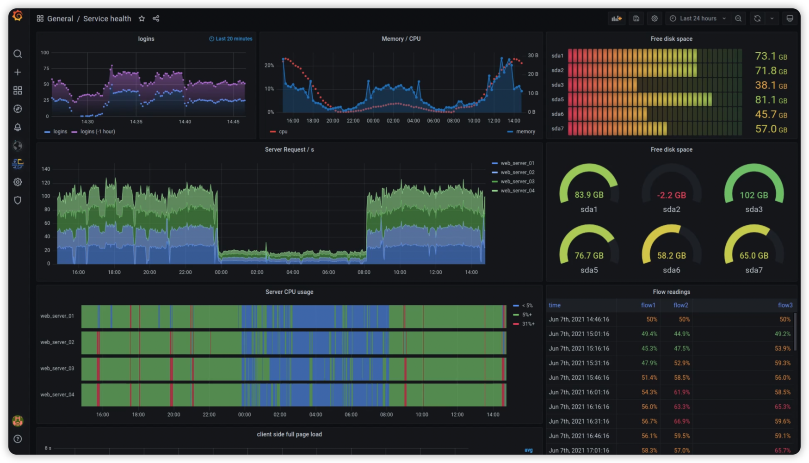
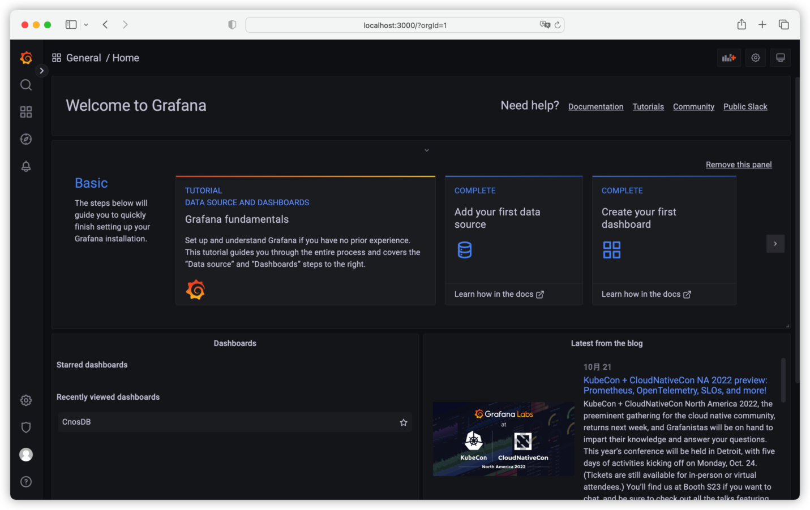
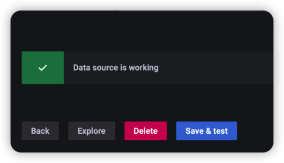
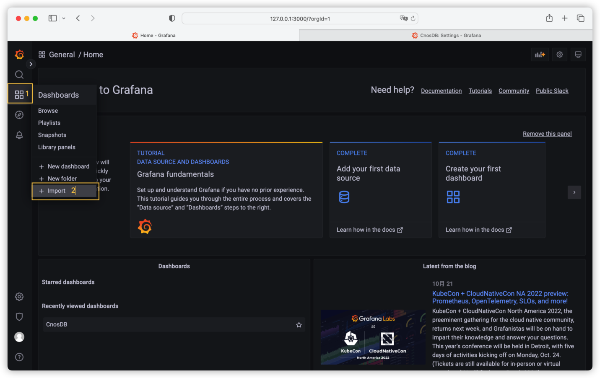
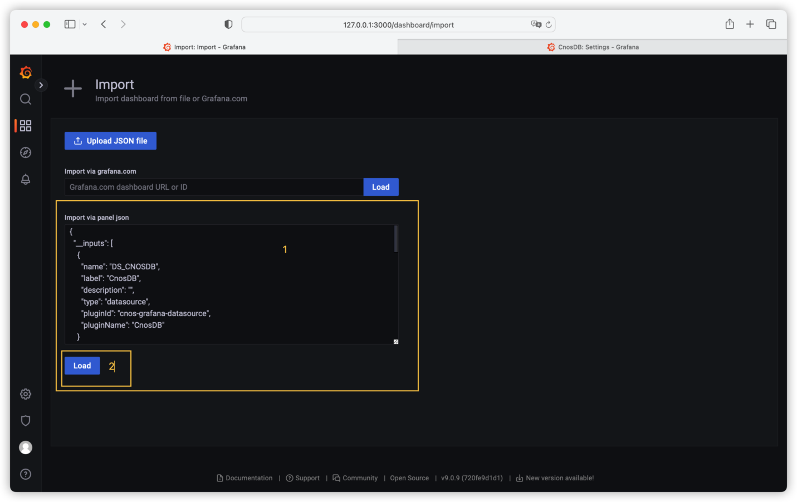
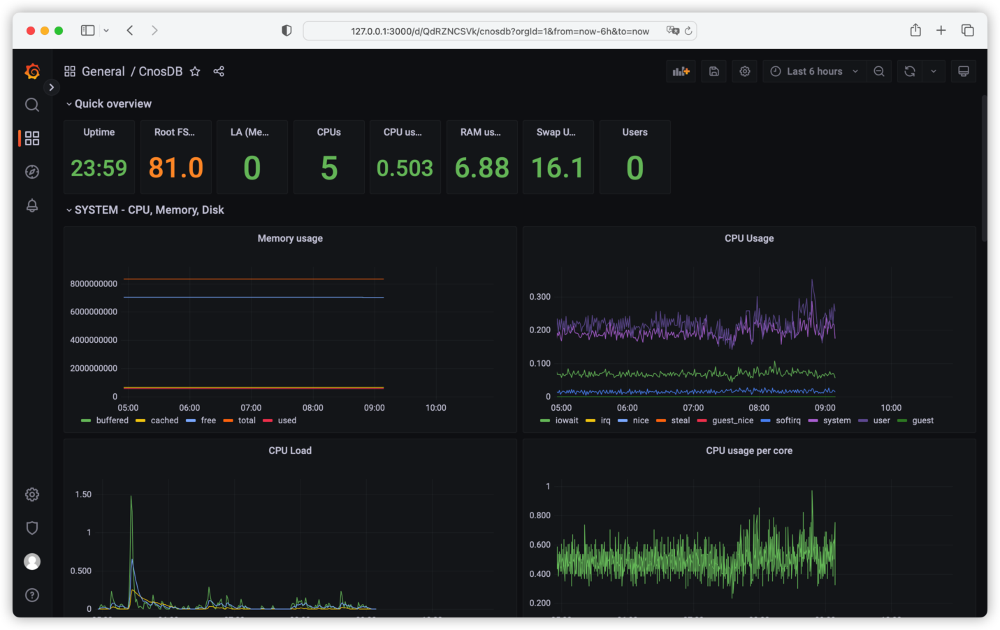
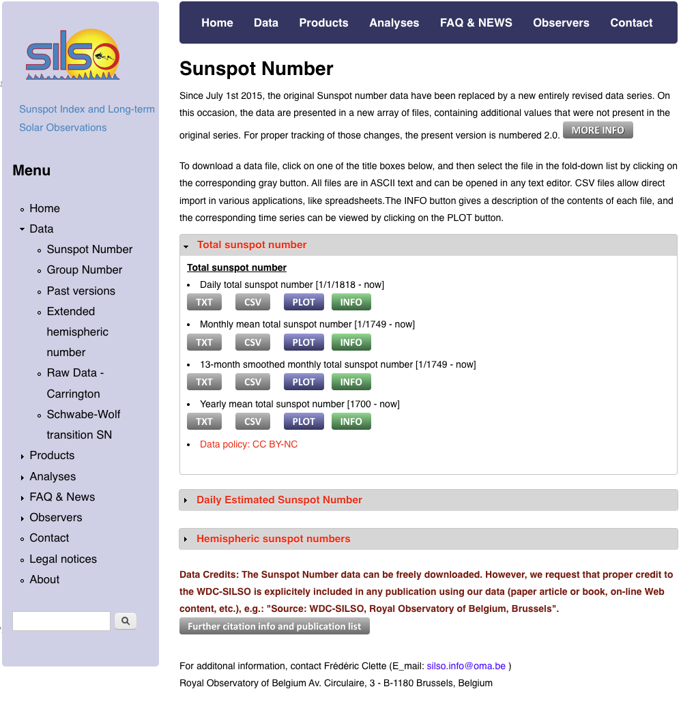
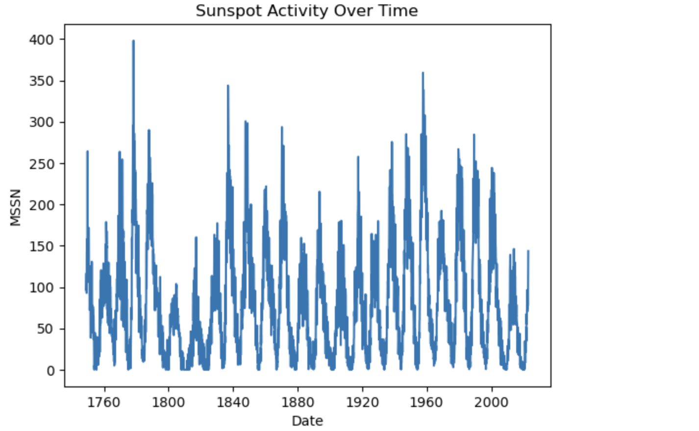
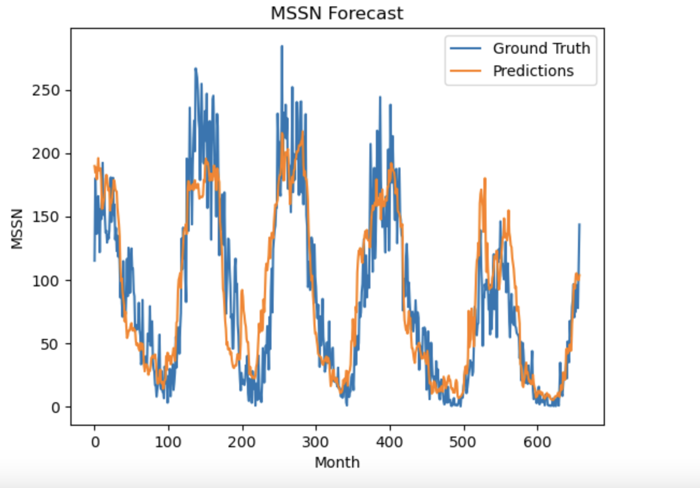

# Eco-integration

## Telegraf

### **Telegraf Introduction**

[Telegraf](https://github.com/influxdata/telegraf) is an open source server agent program used to collect metrics from stacks, sensors, and systems to database intensively, with a minimal memory footprint and support for extensions via plug-ins.Telegraf is simple to configure, easy to get started with, and greatly reducing the difficulty of data acquisition compared to collecting data via handwritten scripts.

#### User scenarios

- **IoT sensor data:** Data transferred based on protocols such as MQTT, ModBus, OPC-UA, and Kafka.
- **DevOps framework data:** Operational metrics from platforms or frameworks such as GitHub, Kubernetes, CloudWatch, Prometheus, etc.
- **System telemetry data:** System telemetry metrics such as iptables, Netstat, NGINX and HAProxy

**Plug-in System**

1. **Input:** Collects metrics data from systems, services, or third-party APIs.
2. **Process:** Process and trim the metrics data before sending them to maintain data cleanliness.
3. **Aggregate:** Generate aggregated metrics, such as average, minimum, and maximum values of metric data.
4. **Output:** Writing data to a data store, service or message queue such as InfluxDB, Graphite, OpenTSDB, Datadog, Kafka, MQTT, NSQ, etc.

In the following, we will describe how to install and configure Telegraf for collecting system metrics data and storing it in CnosDB.

### **Telegraf Deployment**


- #### Download

  [Official Download Link](https://portal.influxdata.com/downloads/)

- **Installation**

  [Offical Installation Tutorial(v1.23)](https://docs.influxdata.com/telegraf/v1.23/install/)

- **Start**

  [Offical Basic Tutorisl(v1.23)](https://docs.influxdata.com/telegraf/v1.23/get_started/)

### **Telegraf Configuration**

- #### Generate configuration files manually

  ```sh
  telegraf --sample-config > telegraf.conf
  ```

- #### Default configuration file path

  - macOS **Homebrew**: `/usr/local/etc/telegraf.conf`
  - Linux debian and RPM packages: `/etc/telegraf/telegraf.conf`

- #### Use a text editor such as `vim` to modify the configuration file.

  In order to output the metrics data to CnosDB, we need to configure Telegraf's output plug-in `http` to output line protocol data to the write interface of CnosDB.
  
  Find [[`outputs.http`]] in the configuration file and modify it as follows:
  
  ```toml
  [[outputs.http]]
  url = "http://CnosDB_Addr:CnosDB_Port/api/v1/write?db=cnos"
  timeout = "5s"
  method = "POST"
  username = "username"
  password = "password"
  data_format = "influx"
  use_batch_format = true
  content_encoding = "identity"
  idle_conn_timeout = 10
  ```

  In the above configuration, there are some texts needed to be replaced:
  
  - `CnosDB_address`
  - `CnosDB_port`
  - `username`
  - `password`
  
  as, for example:
  
  ```toml
  [[outputs.http]]
  url = "http://host.docker.internal:31007/api/v1/write?db=cnos"
  timeout = "5s"
  method = "POST"
  username = "admin"
  password = "admin"
  data_format = "influx"
  use_batch_format = true
  content_encoding = "identity"
  idle_conn_timeout = 10
  ```
  
  Next, start the Telegraf service and provide the configuration file path:

  **macOS Homebrew**
  
  ```sh
  telegraf --config telegraf.conf
  ```
  
  **Linux (sysvinit and upstart installations)**
  
  ```sh
  sudo service telegraf start
  ```
  
  **Linux (systemd installations)**
  
  ```sh
  systemctl start telegraf
  ```
  
  Next, use the CnosDB query interface to view the data to verify that Telegraf is running correctly:
  
  ```sh
  curl -XPOST -H 'ACCEPT: application/json' -H "AUTHORIZATION: Basic $(echo '用户名:密码'|base64)" 'http://CnosDB地址:CnosDB端口/api/v1/sql?db=cnos' -d 'SELECT * from cpu limit 1'
  ```
  
  In the above configuration, there are some texts needed to be replaced:
  
  - `CnosDB_address`
  - `CnosDB_port`
  - `username`
  - `password`
  
  as, for example:
  
  ```sh
  > curl -XPOST -H 'ACCEPT: application/json' -H "AUTHORIZATION: Basic $(echo 'admin:admin'|base64)" 'http://127.0.0.1:31007/api/v1/sql?db=cnos' -d 'SELECT * from cpu limit 1'
  ```
  
  Under correct configuration, you will obtain the following results:
  
  ```json
  [
  {
  "cpu": "cpu0",
  "host": "_HOST",
  "time": "2022-10-10 10:10:10",
  "usage_guest": 0.0,
  "usage_guest_nice": 0.0,
  "usage_idle": 99.49899799596298,
  "usage_iowait": 0.10020040080156893,
  "usage_irq": 0.0,
  "usage_nice": 0.0,
  "usage_softirq": 0.10020040080156893,
  "usage_steal": 0.0,
  "usage_system": 0.10020040080155113,
  "usage_user": 0.20040080160317345
  }
  ]
  ```


## Cnos-Telegraf

CnosDB-Telegraf is based on Telegraf (re1.25, commit 86cd0c0c2), with some added features and plugins.

### **Description of the changes compared to Telegraf**

#### Parser Plugin

Add Parser plug-ins OpenTSDB and OpenTSDB-Telnet to collect write requests from OpenTSDB.

- **OpenTSDB**

  By using the Input plugin http_listener_v2 and configuring the `data_format` to "`opentsdb`", you will be able to parse write requests in OpenTSDB format.

   ```toml
   [[inputs.http_listener_v2]]
   service_address = ":8080"
   paths = ["/api/put"]
   methods = ["POST", "PUT"]
   data_format = "opentsdb"
   ```

- **OpenTSDB-Telnet**

  By using the Input plugin socket_listener and configuring the `data_format` to "`opentsdbtelnet`", you will be able to parse write requests in OpenTSDB-Telnet format.

   ```toml
   [[inputs.socket_listener]]
   service_address = "tcp://:8081"
   data_format = "opentsdbtelnet"
   ```

#### Output Plugin

Add Output plugin CnosDB for exporting metrics to CnosDB.

```toml
[[outputs.cnosdb]]
url = "localhost:31006"
user = "user"
password = "pass"
database = "telegraf"
```

- **Configuration introduction**

| **Parameters** | **Description**             |
| -------------- | --------------------------- |
| url            | CnosDB GRpc service address |
| user           | User Name                   |
| password       | Password                    |
| database       | CnosDB database             |

#### Input Plugin

Add the configuration parameter high_priority_io to enable end-to-end mode.

When set to true, the written data will be sent to the Output plug-in immediately and the return value will be determined based on the Output plug-in's return parameters.

```toml
[[inputs.http_listener_v2]]
service_address = ":8080"
paths = ["/api/put"]
methods = ["POST", "PUT"]
data_format = "opentsdb"
high_priority_io = true
```

The above configuration adds the `high_priority_io = true` configuration compared to the configuration in the [Output Plugin](#output-plugin) section.

### **Build**

- #### [Install Go](https://golang.org/doc/install) >=1.18 (1.18.0 version recommended)
- #### Clone the repository from Github:

   ```shell
   git clone https://github.com/cnosdb/cnos-telegraf.git
   ```

- #### execute `make build` in the repository directory

   ```shell
   cd cnos-telegraf
   make build
   ```

### **Start**

- #### Execute the following command to view the use case:

  ```shell
  telegraf --help
  ```

- #### **Generate a standard telegraf configuration file**

  ```shell
  telegraf config > telegraf.conf
  ```

- #### **Generate a telegraf configuration file that contains only the cpu metrics collection & influxdb output plugins**

  ```shell
  telegraf config --section-filter agent:inputs:outputs --input-filter cpu --output-filter influxdb
  ```

- #### **Run telegraf but output the capture metrics to the standard output**

  ```shell
  telegraf --config telegraf.conf --test
  ```

- #### **Run telegraf and manage the loaded plugins through the configuration file**
  
  ```shell
  telegraf --config telegraf.conf
  ```

- #### **Run telegraf, load only the cpu & memory metrics collection, and the influxdb output plugin**

  ```shell
  telegraf --config telegraf.conf --input-filter cpu:mem --output-filter influxdb
  ```

## Grafana

### Introduction



[Grafana](https://github.com/grafana/grafana) is an open source data visualization tool that easily converts any conforming data into visual charts and comes with an alerting feature that notifies you when metric data reaches a threshold. Grafana supports multiple data sources by default and can also be extended through a plugin system.

We will describe the process of getting CnosDB data through Grafana to present a dashboard.

```mermaid
graph LR
subgraph s1[Server]
tg1[Telegraf]
end
tg1--metrics data-->CnosDB
CnosDB--data frame-->Grafana
```

### Grafana Deployment

[Official Installation Tutorial](https://grafana.com/docs/grafana/latest/setup-grafana/installation/)

[Official profile description](https://grafana.com/docs/grafana/latest/setup-grafana/configure-grafana/)

### Grafana Configuration

- #### **Connect CnosDB**

  Type `http://localhost:3000`，and the Grafana login screen will show up if running correctly. The original username and password are both admin.
  
  
  
  You will be asked to set a new password when you first login. The main Grafana interface shows up after this.
  
  
  
  Grafana provides a common data interface that allows us to read data from the CnosDB database via the CnosDB data source plugin. Firstly, we shall go to the data source configuration screen.
  
  
  
  Then cilck the [`Add data source`] button.
  
  
  
  Search for CnosDB and click to enter the configuration screen.
  
  
  
  In the configuration screen, enter the address of CnosDB and username, and then click the [`Save & test`] button.
  
  
  
  You shall see [`Data source is working`] under correct configuration, indicating that Grafana has access to CnosDB data.
  
  

- #### **Configure Dashboard**

  Grafana can configure dashboards via a graphical interface. The configured dashboards can be exported via JSON formatted data or imported as JSON formatted dashboard data.
  
  We shall import a piece of dashboard data.
  
  
  
  Copy the [JSON](https://github.com/cnosdb/docs/blob/main/assets/grafana_dashboard.json) to [`import via panel json`], and then click the [`load`] button.
  
  
  
  Next, select the CnosDB data source we just configured, and click the [`import`] button.
  
  
  
  We've then created a dashboard.
  
  


## Prometheus

### Introduction

Prometheus is a cloud-native monitoring software that enables data acquisition and monitoring for a wide range of software and systems.

This article describes how to configure CnosDB as a Prometheus terminal via the Prometheus Remote Read/ Write interface.

### Precondition

Start CnosDB service, get the address of  CnosDB service.

### Remote Write

CnosDB supports the Remote Write protocol of Prometheus. To ingest data to the logging service, simply enable the Remote Write functionality in Prometheus, as shown below.

**Operation flow**

- **Edit configuration file**

    ```yaml
    # remote_write cnosdb
    remote_write:
    - url: "http://{db_url}/api/v1/prom/write?db={db_name}"
      basic_auth:
      username: 'root'
      password: ''
    ```
  **Parameter**

    ```
    db_url: Http Server address of CnosDB, such as 127.0.0.1:31001
    db_name: Remote Write database name
    username: CnosDB username
    password: CnosDB user's password
    ```

You can get the all configuration of Prometheus Remote Write via [Prometheus](https://prometheus.io/docs/prometheus/latest/configuration/configuration/?spm=a2c4g.11186623.0.0.231f780eoLUxCY#remote_write).


### Remote Read

CnosDB supports Remote Read protocol of Prometheus. To ingest data to the logging service, simply enable the Remote Read functionality in Prometheus, as shown below.

**Operation flow**

- **Edit configure file**
    ```yaml
    # remote_read cnosdb
    remote_read:
    - url: "http://{db_url}/api/v1/prom/read?db={db_name}"
      basic_auth:
      username: 'root'
      password: ''
    ```
  **Parameter**

  **Parameter**

    ```
    db_url: Http Server address of CnosDB, such as 127.0.0.1:31001
    db_name: Remote Write database name
    username: CnosDB username
    password: CnosDB user's password
    ```

You can get the all configuration of Prometheus Remote Read via [Prometheus](https://prometheus.io/docs/prometheus/latest/configuration/configuration/?spm=a2c4g.11186623.0.0.231f780eoLUxCY#remote_read).

## TensorFlow

### Use CnosDB and TensorFlow for time series prediction

### From three-body motion to Sunspot Change prediction

#### Introduction

Sunspots are solar activity that occurs in the photosphere of the sun and usually appear in groups. Predicting sunspot changes is one of the most active areas of space weather research.

Sunspot observations last for a long time. Long-term data accumulation is conducive to mining the law of sunspot variation. The long-term observation shows that the sunspot number and area change show obvious periodicity, and the period is irregular, roughly ranging from 9 to 13 years, the average period is about 11 years, and the peak value of the sunspot number and area change is not constant.

The latest data show that the number and area of sunspots have declined significantly in recent years.


Since the intensity of sunspot activity has a profound impact on Earth, it is particularly important to detect sunspot activity. Physics-based models, such as dynamical models, and statistical models, such as autoregressive moving averages, have been widely used to detect sunspot activity.
In order to capture the nonlinear relationship in sunspot time series more efficiently, machine learning methods are introduced.

It is worth mentioning that neural networks in machine learning are better at mining nonlinear relationships in data.

** Therefore, this article will introduce how to use the time series database 'CnosDB' to store the sunspot change data and further use TensorFlow to implement the '1DConv+LSTM' network to predict the sunspot number change. **

#### Introduction to the Sunspot Change Observation dataset

The sunspot dataset used in this paper was released by the SILSO website version 2.0. (WDC-SILSO, Royal Observatory of Belgium, Brussels,http://sidc.be/silso/datafiles)



We mainly analyze and explore the changes of the monthly mean sunspot number (MSSN) from 1749 to 2023.

### Import Data to CnosDB

Download MSSN data `SN_m_tot_V2.0.csv`（https://www.sidc.be/silso/infosnmtot）.

Here is the official description of the CSV file:

```
Filename: SN_m_tot_V2.0.csv
Format: Comma Separated values (adapted for import in spreadsheets)
The separator is the semicolon ';'.

Contents:
Column 1-2: Gregorian calendar date
- Year
- Month
Column 3: Date in fraction of year.
Column 4: Monthly mean total sunspot number.
Column 5: Monthly mean standard deviation of the input sunspot numbers.
Column 6: Number of observations used to compute the monthly mean total sunspot number.
Column 7: Definitive/provisional marker. '1' indicates that the value is definitive. '0' indicates that the value is still provisional.
```

We use `pandas` for file loading and previewing.

```python
import pandas as pd

df = pd.read_csv("SN_m_tot_V2.0.csv", sep=";", header=None)
df.columns = ["year", "month", "date_fraction", "mssn", "standard_deviation", "observations", "marker"]

# convert year and month to strings
df["year"] = df["year"].astype(str)
df["month"] = df["month"].astype(str)

# concatenate year and month
df["date"] = df["year"] + "-" + df["month"]

df.head()
```


```python
import matplotlib.pyplot as plt 

df["Date"] = pd.to_datetime(df["date"], format="%Y-%m")
plt.plot(df["Date"], df["mssn"])
plt.xlabel("Date")
plt.ylabel("MSSN")
plt.title("Sunspot Activity Over Time")
plt.show()
```



#### Use TSDB CnosDB to store MSSN data

CnosDB（An Open Source Distributed Time Series Database with high performance, high compression ratio and high usability.）

- Official Website: http://www.cnosdb.com
- Github Repo: https://github.com/cnosdb/cnosdb

（Notice：We suppose the you have the ability to deploy and use CnosDB. You can get more information through https://docs.cnosdb.com/）

Use Docker to start CnosDB service in command line, enter the container and use the [CnosDB CLI](./tools.md) to use CnosDB：

```SHELL
(base) root@ecs-django-dev:~# docker run --restart=always --name cnosdb -d --env cpu=2 --env memory=4 -p 31007:31007 cnosdb/cnosdb:v2.0.2.1-beta

(base) root@ecs-django-dev:~# docker exec -it cnosdb sh sh
# cnosdb-cli
CnosDB CLI v2.0.0
Input arguments: Args { host: "0.0.0.0", port: 31007, user: "cnosdb", password: None, database: "public", target_partitions: None, data_path: None, file: [], rc: None, format: Table, quiet: false }
```

To simplify the analysis, we only need to store the observation time and the number of sunspots in the dataset. Therefore, we concatenate the year (Col 0) and month (Col 1) as the observation time (date, string type), and the monthly mean sunspot number (Col 3) can be stored directly without processing.

We can create a 'sunspot' table in CnosDB CLI using SQL to store the MSSN dataset.


```SQL
public ❯ CREATE TABLE sunspot (
    date STRING,
    mssn DOUBLE,
);
Query took 0.002 seconds.

public ❯ SHOW TABLES;
+---------+
| Table   |
+---------+
| sunspot |
+---------+
Query took 0.001 seconds.

public ❯ SELECT * FROM sunspot;
+------+------+------+
| time | date | mssn |
+------+------+------+
+------+------+------+
Query took 0.002 seconds.
```

#### Use CnosDB Python Connector to Connect and Use CnosDB Database

Github Repo: https://github.com/cnosdb/cnosdb-client-python

```python
# install Python Connector
pip install -U cnos-connector
```

```python
from cnosdb_connector import connect

conn = connect(url="http://127.0.0.1:31001/", user="root", password="")
cursor = conn.cursor()
```

If you are not familiar wit [CnosDB CLI](./tools.md) ，We can use Python Connector to create a data table.

```python

# create tf_demo database
conn.create_database("tf_demo")
# 使用 tf_demo database
conn.switch_database("tf_demo")
print(conn.list_database())

cursor.execute("CREATE TABLE sunspot (date STRING, mssn DOUBLE,);")
print(conn.list_table())
```

Outputs are as follows, the default database of CnosDB included.

```python
[{'Database': 'tf_demo'}, {'Database': 'usage_schema'}, {'Database': 'public'}]
[{'Table': 'sunspot'}]
```

Write the dataframe of pandas to CnosDB.

```python
### df is the dataframe of pandas, "sunspot" is the table name of CnosDB, ['date', 'mssn'] are the name of columns to be written.
### If you write a column that does not contain a time column, it will be automatically generated based on the current time
conn.write_dataframe(df, "sunspot", ['date', 'mssn'])
```

### CnoDB reads the data and uses TensorFlow to reproduce the 1DConv+LSTM network to predict sunspot changes

References：[程术, 石耀霖, and 张怀. "基于神经网络预测太阳黑子变化." (2022).
](http://journal.ucas.ac.cn/CN/10.7523/j.ucas.2021.0068)


#### Use CnosDB to Read Data

```python
df = pd.read_sql("select * from sunspot;", conn)

print(df.head())
```


#### Divide the data into training set and test set

```python
import numpy as np
# Convert the data values to numpy for better and faster processing
time_index = np.array(df['date'])
data = np.array(df['mssn'])   

# ratio to split the data
SPLIT_RATIO = 0.8

# Dividing into train-test split
split_index = int(SPLIT_RATIO * data.shape[0])   

# Train-Test Split
train_data = data[:split_index]
train_time = time_index[:split_index]  
test_data = data[split_index:]
test_time = time_index[split_index:]
```

#### Use the Sliding Window Method to Construct the Training Data


```python
import tensorflow as tf

## required parameters
WINDOW_SIZE = 60
BATCH_SIZE = 32
SHUFFLE_BUFFER = 1000

## function to create the input features
def ts_data_generator(data, window_size, batch_size, shuffle_buffer):
    '''
    Utility function for time series data generation in batches
    '''
    ts_data = tf.data.Dataset.from_tensor_slices(data)
    ts_data = ts_data.window(window_size + 1, shift=1, drop_remainder=True)
    ts_data = ts_data.flat_map(lambda window: window.batch(window_size + 1))
    ts_data = ts_data.shuffle(shuffle_buffer).map(lambda window: (window[:-1], window[-1]))
    ts_data = ts_data.batch(batch_size).prefetch(1)
    return ts_data# Expanding data into tensors


# Expanding data into tensors
tensor_train_data = tf.expand_dims(train_data, axis=-1)
tensor_test_data = tf.expand_dims(test_data, axis=-1)

## generate input and output features for training and testing set
tensor_train_dataset = ts_data_generator(tensor_train_data, WINDOW_SIZE, BATCH_SIZE, SHUFFLE_BUFFER)
tensor_test_dataset = ts_data_generator(tensor_test_data, WINDOW_SIZE, BATCH_SIZE, SHUFFLE_BUFFER)
```

#### Use the tf.keras module to Define the 1DConv+LSTM Neural Network Model

```python
model = tf.keras.models.Sequential([
                            tf.keras.layers.Conv1D(filters=128, kernel_size=3, strides=1, input_shape=[None, 1]),
                            tf.keras.layers.MaxPool1D(pool_size=2, strides=1),
                        	tf.keras.layers.LSTM(128, return_sequences=True),
                        	tf.keras.layers.LSTM(64, return_sequences=True),  
                        	tf.keras.layers.Dense(132, activation="relu"),  
                        	tf.keras.layers.Dense(1)])


```
```python
## compile neural network model
optimizer = tf.keras.optimizers.Adam(learning_rate=1e-3)
model.compile(loss="mse",
          	optimizer=optimizer,
          	metrics=["mae"])
## training neural network model
history = model.fit(tensor_train_dataset, epochs=20, validation_data=tensor_test_dataset)
```


```python
# summarize history for loss
plt.plot(history.history['loss'])
plt.plot(history.history['val_loss'])
plt.title('model loss')
plt.ylabel('loss')
plt.xlabel('epoch')
plt.legend(['train', 'test'], loc='upper left')
plt.show()
```


#### Predict the MSSN using the trained model

```python
def model_forecast(model, data, window_size):
	ds = tf.data.Dataset.from_tensor_slices(data)
	ds = ds.window(window_size, shift=1, drop_remainder=True)
	ds = ds.flat_map(lambda w: w.batch(window_size))
	ds = ds.batch(32).prefetch(1)
	forecast = model.predict(ds)
	return forecast

rnn_forecast = model_forecast(model, data[..., np.newaxis], WINDOW_SIZE)
rnn_forecast = rnn_forecast[split_index - WINDOW_SIZE:-1, -1, 0]
# Overall Error
error = tf.keras.metrics.mean_absolute_error(test_data, rnn_forecast).numpy()
print(error)
```
```python
101/101 [==============================] - 2s 18ms/step
24.676455
```

#### Visualization of the results compared to the ground truth

```python
plt.plot(test_data)
plt.plot(rnn_forecast)
plt.title('MSSN Forecast')
plt.ylabel('MSSN')
plt.xlabel('Month')
plt.legend(['Ground Truth', 'Predictions'], loc='upper right')
plt.show()
```


