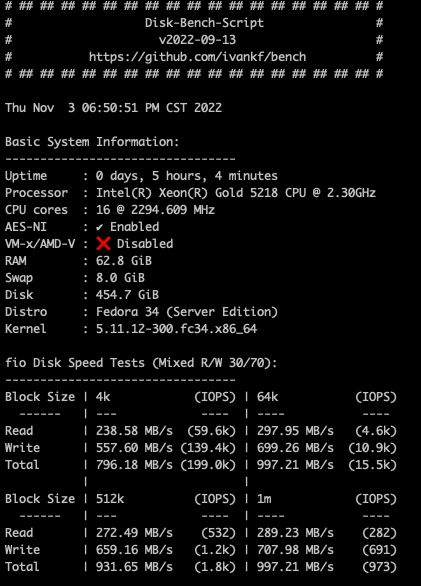
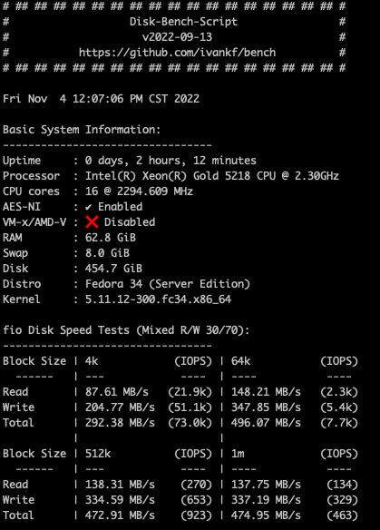
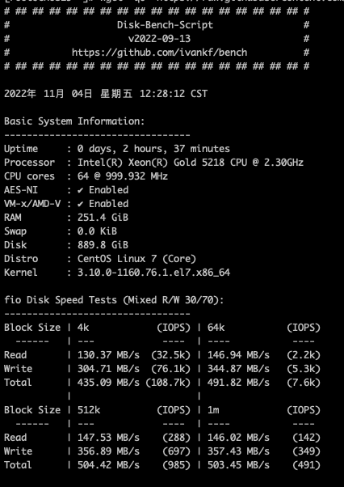

# 性能测试

为了更直观的呈现 CnosDB 的性能，我们使用 [tsdb-comparisons](https://github.com/cnosdb/tsdb-comparisons) 对 [CnosDB](https://github.com/cnosdb/cnosdb) 以及同为时序数据库的 [InfluxDB](https://github.com/influxdata/influxdb) 做了写入的性能测试。

## **基本信息**

|      |     CnosDB     |          InfluxDB          |
|------|:--------------:|:--------------------------:|
| 版本   |     2.0.1      |           1.8.10           |
| 实现语言 |      rust      |             go             |
| 官网   | www.cnosdb.com | https://www.influxdata.com |

## **测试环境**

为了避免受到网络带宽影响，同时更好的模拟多租户场景，我们服务端服务器开启一个虚拟机用来当作服务端机器，客户端机器同时开启两个 benchmark 客户端，向服务端虚拟机 CnosDB 或 InfluxDB 的不同数据库内同时写数据。

所有的测试运行在我们的服务器上，具体的配置如下：

1. 服务端服务器：32 CPUs x Intel(R) Xeon(R) Gold 5218 CPU @ 2.30GHz（内存：255.65 GB）

   虚拟机 CPU 分配16 核。

   磁盘一共两块，一块挂载到虚拟机 /opt-sdc1，性能 bench 如下：

   

   虚拟机其他目录磁盘性能 bench 如下：

   


2. 客户端服务器：32 CPUs x Intel(R) Xeon(R) Gold 5218 CPU @ 2.30GHz (内存 256)

   磁盘性能 bench 如下：

   

## **配置**

CnosDB 的配置如下：

```
[storage]
# Directory for summary: $path/summary/
# Directory for index: $path/index/$database/
# Directory for tsm: $path/data/$database/tsm/
# Directory for delta: $path/data/$database/delta/
path = '/opt/data/db'
max_summary_size = 134217728 # 128 * 1024 * 1024
max_level = 4
base_file_size = 16777216 # 16 * 1024 * 1024
compact_trigger = 4
max_compact_size = 2147483648 # 2 * 1024 * 1024 * 1024
dio_max_resident = 1024
dio_max_non_resident = 1024
dio_page_len_scale = 10
strict_write = false

[wal]
enabled = true
path = '/opt-sdc1/data/wal'
sync = false

[cache]
max_buffer_size = 10485760 # 10 * 1024 * 1024
max_immutable_number = 4

[log]
level = 'info'
path = 'data/log'

[security]
# [security.tls_config]
# certificate = "./config/tls/server.crt"
# private_key = "./config/tls/server.key"
```

InfluxDB 除 [data] 与 [meta] 外，其他均为默认配置。

```
[meta]
  # Where the metadata/raft database is stored
  dir = "/opt-sdc1/var/lib/influxdb/meta"
[data]
  # The directory where the TSM storage engine stores TSM files.
  dir = "/opt/var/lib/influxdb/data"

  # The directory where the TSM storage engine stores WAL files.
  wal-dir = "/opt-sdc1/var/lib/influxdb/wal"
```

## **具体步骤**

1. 提前安装好对应机器的db环境，go环境等，确保可以正常连接。

2. 安装 CnosDB。

   从 GitHub 拉下代码：

   ```
   git clone https://github.com/cnosdb/cnosdb.git
   ```

   修改 `comfig/config.toml` 内的部分配置，运行：

    ````
    cargo run --release run --cpu 64
    ````

   下载 InfluxDB，修改 `etc/influxdb/influxdb.conf` 内的配置，运行：

   ```
   wget https://dl.influxdata.com/influxdb/releases/influxdb-1.8.10_linux_amd64.tar.gz
   tar xvfz influxdb-1.8.10_linux_amd64.tar.gz
   ./influxd run -config ../../etc/influxdb/influxdb.conf
   ```

3. tsdb-comparisons 生成数据。

   从 GitHub 拉下代码：

   ```
   git clone https://github.com/cnosdb/tsdb-comparisons.git
   ```

   编译运行生成数据：

   	cd tsdb-comparisons/cmd/generate_data
   	go build
   	./generate_data --use-case="iot" --seed=123 --scale=100          --timestamp-start="2022-01-01T00:00:00Z" --timestamp-end="2023-01-01T00:00:00Z" --log-interval="50s" --format="influx"   > <file_path>/data.txt

4. 测试 CnosDB 写入。

   ```
   cd tsdb-comparisons/cmd/load_cnosdb
   go build
   ./load_cnosdb --do-abort-on-exist=false --do-create-db=false --gzip=false        --file=<file_path>/data.txt  --db-name=<db_name> --urls="http://<ip>:31007"   --batch-size=<batch_size_num> --workers=<workers_num>
   ```

5. 测试 InfluxDB 写入。

   ```
   cd tsdb-comparisons/cmd/load_influx
   go build
   ./load_influx --do-abort-on-exist=false --do-create-db=true --gzip=false --file=<file_path>/data.txt  --db-name=<db_name> --urls="http://<ip>:8086"  --batch-size=<batch_size_num> --workers=<workers_num>
   ```

## **测试结果**

在我们的测试场景下，InfluxDB 只能做到 wrokers = 100，即 100 并发场景，测试结果如下（row 和 metric 单位：万）：

|            | CnosDB        |                  | InfluxDB      |                  |
| ---------- | ------------- | ---------------- | ------------- | ---------------- |
| batch-size | overall row/s | overall metric/s | overall row/s | overall metric/s |
| 20000      | 75            | 604              |               |                  |
| 10000      | 68            | 538              | 54            | 420              |
| 5000       | 66            | 512              | 61            | 480              |
| 2500       | 53            | 420              | 57            | 450              |
| 1000       | 43            | 330              | 49            | 389              |
| 1          | 6             | 48               | 2.5           | 15               |

我们取在 benchmark 中数据库写入趋于稳定时的数据，值为两个客户端的和。

当 batch-size 设置为 20000 时，InfluxDB 在客户端报错：

`{"error":"engine: cache-max-memory-size exceeded: (1074767264/1073741824)"}`，

所以我们没有测试这种情况下 InfluxDB 的性能，但是可以看到在大多数场景下，CnosDB 的性能是优于 InfluxDB 的。

除此之外，CnosDB 支持更高的并发数，我们同时也测试了 CnosDB 在 workers = 200，即 200 并发场景下的性能，结果如下（row 和 metric 单位：万）：

|            | CnosDB        |                  |
| ---------- | ------------- | ---------------- |
| batch-size | overall row/s | overall metric/s |
| 20000      | 75            | 601              |
| 10000      | 75            | 607              |
| 5000       | 67            | 518              |
| 2500       | 60            | 463              |
| 1000       | 49            | 382              |
| 1          | 6             | 47               |

随着并发数的提高，某些场景下的性能也会提高，CnosDB 的性能拥有更高的上限。

## **结论**

1. CnosDB 相比 InfluxDB，在大多数情况下，拥有更高的性能。
2. CnosDB 相比 InfluxDB，可以支持更高的并发数，更高的 batch-size。
3. 我们未与其他不支持 Line Protocol 或者将 Line Protocol 在客户端进行转化的时序数据库比较，这对直接写入 Line Protocol 的 CnosDB 以及 InfluxDB 来说是不太公平的。