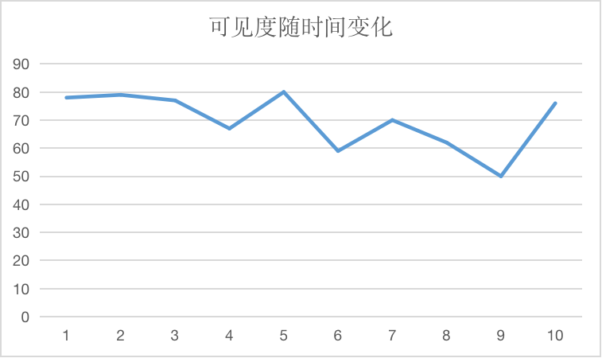
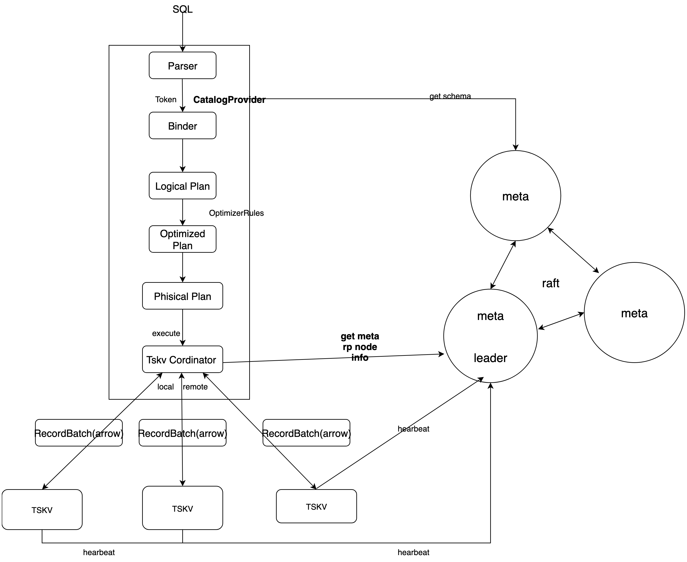
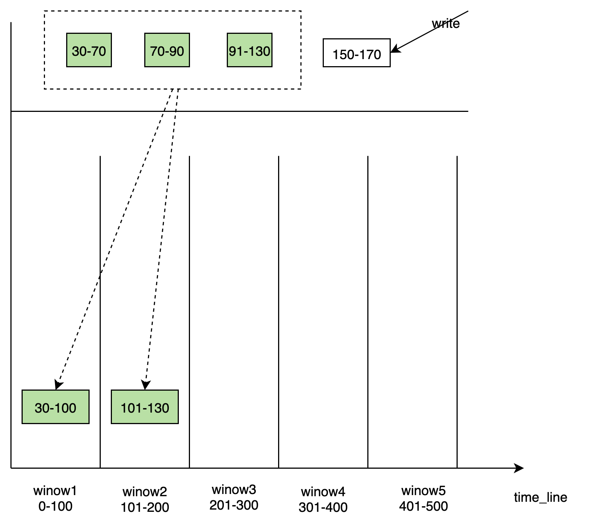
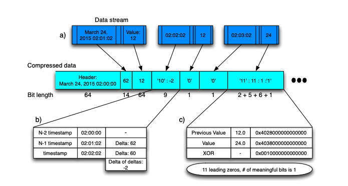
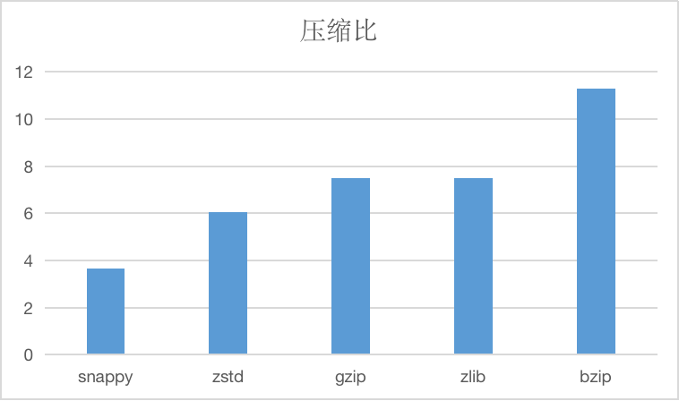

# 设计

## 基础概念

### 前言

我们所处的二十一世纪是一个数据信息爆炸性增长的时代，在这个时代各种各样的数据信息都在不断地进行膨胀，个人和企业都意识到数据信息的重要性，随着大数据时代的到来，我们对洞察这些数据信息提出了新的的挑战和要求。
基于上述海量数据的背景下，数据库领域对一些特定格式的数据信息进行了细分，以获得更好的存储、检索性能。我们的时间序列数据就是在这个背景下诞生的分支之一。本文主要针对时序数据库使用人员进行一次基本概念的拉齐，有利于我们更好的驾驭时序数据。

### 时间序列(Time Series)

在海洋之上，我们可能会去监控各种各样的数据指标，用来研究环境，天气和人类生产， 列举一个场景： 假设我们有一个检测器，可以记录海洋空气能见度，我们可以根据能见度变化来判断是否进行生产，那么这个能见度信息就是一条时间序列数据， 通俗意义上来讲就是就是一条随着时间变化的折线图。



那么让我们做一个总结：
时间序列是一条折线，x轴为时间，y轴为状态指数，用于描述事物在一段时间内的状态变化。

CnosDB 是一款时序数据库，他的应用就是存储与时间序列有关的数据，提供高效的写入和查询。

因此 CnosDB 依据时间序列数据的特性，设计了时间序列的设计模型。

### 数据模型

#### 时间戳(TimeStamp)

时序数据库要求写入的每一条数据都带有时间戳，表示采集到该条数据的时刻。

CnosDB 支持设置时间的精度。

#### 标签(Tag)

在时序数据库的应用场景中，有些数据是不随时间变化而变化的，比如物联网采集设备的所在地，设备的名字，设备的所有者。

这些数据我们称之为**标签(Tag)**，我们使用字符串(STRING)来存储Tag。

在 CnosDB 中一个标签数据是一个键值对，由 Key ， Value 两部分组成， Key 即标签名， Value 是标签值。

通常情况下为了更好的分类会对用多个 Tag 标记一个时间序列，即 Tags 。


#### 字段(Field)

在时序数据库的应用场景中，有些数据是随时间变化而变化的，比如物联网采集设备所收集的数据。

对检测环境的设备来说，它采集的室温，湿度等信息就是随时间变化而变化，这些数据我们称之为**字段(Field)**。

采集的数据是多样的，CnosDB 为存储字段提供了`BIGINT`，`BIGINT UNSIGNED`，`DOUBLE`，
`STRING`，`BOOLEAN`来存储多样的数据，还提供压缩算法高效地存储。

#### 行(Row)

一个时间戳，一组标签(Tags)，一组字段(Fields)，就组成了一个数据行(Row)，很多人也称之为点(Point)。

一个数据行必须包含一个时间戳，至少一个标签，至少一个字段。

#### 表(Table)

表(Table)组织着有相同标签，字段的数据行。这十分类似关系型数据库中表的概念。

时间戳，标签，字段就相当于关系型数据库中表的**列(Column)**。

区别仅在于，CnosDB 中的行是时间戳，标签，字段组成的数据行。

我们可以使用我们熟知的 SQL 来操作 CnosDB 数据库中存储时间序列数据的表，SQL 标准中的 INSERT，大部分 SELECT 语句，CnosDB都高效地支持。

**示例**：

如下是一张表存储的数据

| Timestamp   |   NodeID    |   CPU      | Memory    |   
| ----------- | ----------- | -----------|-----------|
| time1      | node1     |     15%    | 35%       |
| time2      | node2     |     23%    | 45%       |
| time3      | node1     |     19%    | 50%       |
| time4      | node2     |     80%    | 70%       |

其中的Timestamp列就是时间戳，NodeID列就是标签，CPU和Memory就是字段

#### 数据库(DataBase)

数据库是由多张表组成的，这与关系型数据库类似。每张表存储不同结构的数据。

用户可以使用SQL操纵数据库中的不同表，也可以进行表的连接查询。

CnosDB 支持设置一个数据库的不同存储策略，数据保留时间，数据分片数目，分片设置策略，时间精度等。


## 整体架构

本节将介绍 CnosDB 的整体架构与实现原理。

### 设计目标

CnosDB2.0 使用 Rust 语言进行开发，基于它的安全性、高性能和社区上的影响，为用户提供一款出色的时序数据库，形成一套完整的 DBaas 解决方案。


> **时序数据库**
1. 扩展性：理论上支持的时间序列无上限，彻底解决时间序列膨胀问题，支持横/纵向扩展。
2. 计算存储分离：计算节点和存储节点，可以独立扩缩容，秒级伸缩。
3. 存储性能和成本：高性能io栈，支持利用云盘和对象存储进行分级存储。
4. 查询引擎支持矢量化查询。
5. 支持多种时序协议写入和查询，提供外部组件导入数据。
> **云原生**
1. 支持云原生，支持充分利用云基础设施带来的便捷，融入云原生生态。
2. 高可用性，秒级故障恢复，支持多云，跨区容灾备灾。
3. 原生支持多租户，按量付费。
4. CDC，日志可以提供订阅和分发到其他节点。
5. 为用户提供更多可配置项，来满足公有云用户的多场景复杂需求。
6. 云边端协同，提供边端与公有云融合的能力。
7. 融合云上OLAP/CloudAI 数据生态系统。


在重新设计时序数据库的过程中我们尽可能去解决当前时序数据库面临的一系列问题，形成一套完整的时序数据解决方案及时序生态系统，在公有云提供 DBaas 服务。


> 下面我们将从一下几个方面进行详细阐述，

- 数据复制与共识
- meta 集群
- SQL 引擎
- tskv 索引与数据存储

### 数据复制与共识

CnosDB 2.0 的分片规则基于Time-range。它采用 DB + Time_range 的分片规则将数据放入对应的 Bucket 中。Bucket 是一个虚拟逻辑单元。每个 Bucket 由以下主要的属性组成。 Bucket 会根据用户配置创建多个分片，把数据打散（默认情况下数据的分片 Shard Num 是 1）。
> 「db， shardid， time_range， create_time， end_time， List\<Vnode\>」

Vnode 是一个虚拟的运行单元，并被分布到一个具体的 Node 上。每个 Vnode 是一个单独的LSM Tree。 其对应的 tsfamily结构体是一个独立的运行单元。


#### 复制组（replicaset）

数据的高可用通过数据 replicaset 维护。 每个 db 都会有一个自己的复制组。它表示数据冗余份数。 同一个 bucket 内的一组 Vnode 组成了 一个复制组， 他们之间具有相同的数据和倒排索引信息。

#### 放置规则 （place rule）

为了解决并发故障的可能性，meta 节点在创建 bucket 的时候，可能需要确保数据副本位于使用不同 node、机架、电源、控制器和物理位置的设备上，考虑不同租户会在不同 region 进行访问数据，需要将 Vnode 按照最优成本的方式进行调度排放。

#### 数据的分隔策略

在 Node 上不同租户的数据是在物理上进行分割的。

`/User/db/bucket/replicaset_id/vnode_id`


#### 基于 Quorum 机制的数据共识

- #### Cnosdb2.0 实现为一个最终一致性的系统

    我们使用 Quorum 机制来做数据共识负责处理读或写请求的模块为 coordinator。
    
    - 元信息缓存，与 meta 节点交互
    
      根据（user，db， timerange）获取 Vnode 信息，在本地维护了一份缓存，在本地没有命中的情况下去远端拉取 VnodeList。提供了一个 MetaClient 的 trait。
    - connetion 管理
    
      管理与不同的 tskv 的 connection， 用于数据读取/写入。
    - 数据读/写/删的代理操作
    
      数据根据用户配置，支持多种不同的一致性级别。
  
      ```Rust
      pub enum ConsistencyLevel {
          /// allows for hinted handoff， potentially no write happened yet.
          Any，
          /// at least one data node acknowledged a write/read.
          One，
          /// a quorum of data nodes to acknowledge a write/read.
          Quorum，
          /// requires all data nodes to acknowledge a write/read.
          All，
          }
      ```
    - Hinted handoff  
      目标节点临时故障的场景下加入，提供 condinator 节点的 Hinted handoff 功能，节点的 Hinted handoff 队列中持久化保存，等到副本节点故障恢复后，再从 Hinted handoff 队列中复制恢复。
    
#### 数据写入
    
当收到一个 write 请求后，coordinator 根据分区策略以及 db 对应的放置规则（place-rule），确定出要存放的数据所在物理节点（node）。只要有至少 W 个节点返回成功，这次写操作就认为是成功了。


#### 数据读取

当收到一个 read 请求后，coordinator 会根据分区策略以及 db 对应的放置规则（place-rule），确定出要存放的数据所在物理节点（node）请求这个 key 对应的数据，当前我们不实现读修复（read repair）的功能，只发起一个读请求。在读延迟的情况下，发起第二个读请求。


#### 更新冲突

1.  在时序场景下数据产生冲突之后，采用将一致性 hash 换上第一副本(replica)为确认点。
2.  同时间戳的采用 last-write-win 的策略解决冲突。

### Meta 集群

通过 raft 去维护一个强一致性的 meta 集群。meta 集群 api 的方式对外进行服务，同时 node 也会对 meta 信息的更新进行订阅。所有的元数据信息的更新都通过 meta 集群进行更新。


> 1.  数据库 catalog 信息，DDL 操作。
> 2.  节点探活/节点注册，以及节点负载信息统计，作为 coordinator 进行选择的 read 和 write 的依据。
> 3.  租户以及子用户信息以及权限相关。
> 4.  数据路由信息，tenant/db/bucket/replicaset 对应的 vnodeList 的路由信息。
> 5.  提供分布式锁和 watch 变更通知的功能。

我们采用强一致性 meta 集群并实现了相应优化。具体原因如下：

> - 实际在工程实践中我们集群中元数据通常控制在较小的规模，无扩展性需求。
> - 工程实践相对简单，有利于快速实施迭代。
> - 对访问频繁的数据进行 cache 和 本地化存储，进行优化。
    >   - schema 信息 在本地存储后，订阅来自 meta 集群的 schema version 变更，缓解 meta 集群读压力。
    >   - meta 集群分担 leader 压力，提供 Follower/Read 方案。读性能得以优化。

### SQL 引擎

查询引擎我们使用了 [DataFusion](https://arrow.apache.org/datafusion/)，DataFusion 是一个可扩展的查询执行框架，用 Rust 编写，使用 [Apache Arrow](https://arrow.apache.org/) 作为其内存格式。DataFusion 支持用于构建逻辑查询计划的 SQL 和 DataFrame API 以及能够使用线程对分区数据源并行执行的查询优化器和执行引擎。具有如下优点：

1. 高性能：利用 Rust 和 Arrow 的内存模型，具有较高的性能。
2. 扩展性强：允许在其设计中的几乎任何点进行扩展，可以针特定用例进行定制。
3. 高质量：DataFusion 和 Arrow 生态都经过广泛测试，可用作生产系统。
4. 融合大数据生态：作为 Apache Arrow 生态系统（Arrow、Flight、Parquet）的一部分，与大数据生态系统融合的较好。

我们通过扩展 DataFusion 的数据源并且提供自定义 SQL 语句，在分布式场景下数据的查询流程如下：



### TSKV 索引与数据存储

tskv 主要承担数据和索引的存储，对 node 节点上所有 Vnode 进行管理， 每个 Vnode 负责某个 db 里的部分数据。在 Vnode 中主要有 3 个模块组成 WAL，IndexEngine 和 DataEngine。


#### IndexEngine

用来存储时序数据的索引通常来说是读多写少的模型，主要能够进行快速索引和基于 tagkey 进行条件过滤，过滤出合适的 series。

主要功能有：

1. 存储正排索引。
2. 存储倒排索引。
3. 缓存 catalog 信息。

常用查询语句：

```sql
SELECT xxx from table where tag1= value1 && tag2=value2 [and time > aaa and time < bbb] [group by\order by\limit ....]
```

索引的设计主要针对 where 过滤条件；用于降低数据的搜索规模，加快数据的查询效率。

支持以下几种过滤条件：

> 1. 等于、不等于；如：tag=value，tag!=value
> 2. 大于、小于；如：tag < value
> 3. 前缀匹配；如：tag=aaa\_\*
> 4. 正则表达式；如：tag=aaa\*bbb

数据写入的时进行索引的构建。在时序数据库中多是对每个 tag 进行索引，多个 tag 所对应的 value 组合为一个 series key。

虽然时序数据库是写多读少，但是写入数据时对索引的使用更多是读取而不是构建。时序数据库多是对同一个 series 不同时间点采样写入，所以每个 series 的索引信息只在第一次写入时需要构建，后面写入时判断 series 存在（读操作）就不再进行索引构建。

- #### 存储结构

  - 根据 hash 函数计算 `HashID：hash(SeriesKey) -> HashID` (24 位整型，大约 1600 万); HashID 与自增 id 得到 SeriesID(uint64)：`HashID << 40 | auto_increment_id -> SeriesID` 。
  - FieldID（uint64）由 SeriesID 与 TableFiledID 组合而成(field 在 table 内部有一个编号记为 TableFiledID)：FieldID 的高 24 位是 TableFiledID、低 40 位是 SeriesID 的低 40 位。
     
    限制条件：
    - HashID 数量大约 1600 万，单台机器 Series 规模上亿以后会导致 List 变长拖累查找。
    - SeriesID 的高 24 位有其他用途，只有低 40 位有意义大约是 1 万亿左右。
      TSM 数据文件存放 FieldID 以及对应的 Data 信息。
  
    SeriesKey 相关信息存放在索引文件，下面讲述索引数据组织方式。

- #### 索引数据结构设计

  - HashList：`HashID -> List<(SeriesKey、SeriesID)>` 用于 SeriesKey 与 SeriesID 互查。
    - SeriesKey 查找 SeriesID 过程：`Hash(SeriesKey) -> HashID`，根据 HashID 从 HashList 中得到 `List\<SeriesKey、SeriesID\>`，然后遍历 List 获取 SeriesID。
    - SeriesID 查找 SeriesKey 过程，取 SeriesID 的高 24 位为 HashID，后面查找过程同上。
  - `TagValue -> List\<SeriesID\> ` 实现对 Tag 的索引功能，用于 tag 查询条件过滤。
    - 查询条件：`where tag=value`，根据 TagValue 得到 SeriesID 列表，进一步获取 FieldID 从 TSM 文件加载数据。
    - 多个查询条件与或需要对多个 `List\<SeriesID\>` 进行交、并操作。
  - 要求 TagValue 顺序存储可遍历访问。用途 `show tag values` 查询。 HashList 结构需要在内存维护一份，惰性加载。
     `HashID -> List<(SeriesKey、SeriesID)>`与  `TagValue -> List\<SeriesID\>` 进行持久化。

#### DataEngine

主要是用来存储时序数据的数据通常来说是写多读少的场景，使用 LSM 的模型，主要是能够快速进行数据写入，同时通过 compaction 清除掉过期和被删除的数据。DataEngine 分为如下几个模块进行：

- #### WAL 模块

    WAL 为写前日志，将写入操作具体应用到内存前先增补到磁盘中的WAL文件里，数据库在崩溃后恢复时，这个日志将被用来使内存恢复到与崩溃前一致的状态。当接收到写入请求后，`wal_job` 首先会检查当前WAL 文件是否已满，如果满了就新建一个，然后开始按照一定格式将内容写入文件中。每一个req单独对应一个`seq-no`，`seq-no` 递增，用来记录开机以来有多少批次已经被写入。 `wal_job` 线程会将这个 `seq_no` 传回主线程。同一批次的每个point都有相同的 `seq_no` 写入内存或写入成TSM时都会针对 `seq_no` 进行一定的处理。

- #### TimeSeriesFamily

    TimeSeriesFamily， 时序数据的储存单元，保存着对应的内存中的数据和对应的磁盘中的数据的元数据，一般简写为 tsfamily，我们在写入数据前，会根据数据的 tag 和 field 生成 SeriesID 和 FieldID。coordinator 根据 db 和 time_range，获取 bucket，根据 `hash（SeriesID）% shard_nums` 获取 TseriesFamilyID 向 tsfamily 写数据。
    tsfamily 成员如下：
    
    ```
    pub struct TseriesFamily {
        tf_id: u32，
        delta_mut_cache: Arc<RwLock<MemCache>>，
        delta_immut_cache: Vec<Arc<RwLock<MemCache>>>，
        mut_cache: Arc<RwLock<MemCache>>，
        immut_cache: Vec<Arc<RwLock<MemCache>>>，
        super_version: Arc<SuperVersion>，
        super_version_id: AtomicU64，
        version: Arc<RwLock<Version>>，
        opts: Arc<TseriesFamOpt>，
        seq_no: u64，
        immut_ts_min: i64，
        mut_ts_max: i64，
    }
    ```
    
    `tf_id`：tsfamily 的标识符，每个 tsfamily 具有唯一的 tf_id。
    
    `mut-cache`：用于 cache 最新写入的数据。
    
    `immut-cache`：当 mut-cache 满了后，转为 `immut-chache`，`immut-cache` flush 到磁盘，生成 TSM 文件。
    
    `super-version`：当前 tsfamily 的 `mut-cache` 和 `immut-cache` 的快照数据。
    
    `version`：维护当前 tsfaimily 中磁盘数据的快照。

- #### Recover 和 Summary

    Summary 是 TSM 文件版本变更产生的元数据文件，summary 会对应存储 summary 文件。summary 文件中存储着版本变更元信息 `version_edit`，用于宕机恢复 `version_set` 元数据。node 节点长时间运行会产生较大的 summary 文件，我们会定期将 summary 文件进行整合。减少宕机恢复的时间。

    tskv 在创建时首先会执行 recover 函数：

  - 从 summary 文件中获取得到 summary 结构体。
  - 根据 summary 结构体的 ctx 的 `last_seq`，得知有哪些 batch 已经被 flush 成文件。
  - 根据 wal 文件和 `last_seq`，将没有被 flush 的 batch 重新写入到内存中。
  - 根据 summary 文件恢复出 `version_set`。

- #### Flush

    当 tsfamily 中 `immut-cache` 容量达到一定程度后，就会开始进行 flush。
    在执行完写入操作后，当发现 `immut-cache` 满了后，将其中的数据拿出来打包成一个 `flush_request`，由 `flush_job` 线程接收到请求后开始处理。

  - 将 `flush-request` 中的数据取出，根据数据创建一个 `flush_task`，执行。
  - 根据 `TseriesFamilyID`，FileID 创建 TSM 文件，将数据写入 TSM 文件。
  - 根据文件信息，apply 元数据到 `version` 的 `levels_info` 的对应的 `level_info`。
  - 根据对 `version` 的修改以及 `seq-no`，`TseriesFamilyID` 等，生成 `version edit`。
  - 将所有生成的 `version edit` 通过 tskv 的 `summary_task_sender` 发送给 tskv 创建时一并创建的 `summary_job` 线程，线程接收到请求后开始处理，将 `version_edit` 写入 summary 文件。

- #### compaction

  我们使用类 LSM tree 的方式进行数据整理。通常情况下时序数据库的数据按时间顺序方式写入。但在 IoT 会有补录数据的场景，会导致时间戳陈旧的问题。 除此之外，因网络延迟在公有云的场景下很难保证所有的用户的写入顺序。面对多种复杂的写入场景，我们需要在对数据 compaction 的时候考虑多种复杂的场景。

  compaction 的目的有：

  - 把小的 tsm 文件进行聚合生成较大的 tsm 文件。
  - 清理已过期或被标记删除的文件。
  - 减小读放大，维护我们当前 version 中 `level_info` 的元数据。
  

- #### level_range compaction

  

  - 通常情况下，时间序列数据库是按照时间点的数据进行顺序写入，为了应对乱序数据，我们增加了 delta 文件。delta 的数据会刷到 L0 层。
  - 从 L1 到 L3，`LevelInfo` 中的数据是按照时间进行分层排放的。 每一层都有一个固定的时间范围 且 不会重叠，memcache 中的数据是有一个固定的时间范围。每一层的时间范围都会有在 compaction 或者 flush 的时候进行动态更新。
  - 每次新写入的 TSM 文件都具有本层最新的时间范围。即 L0 层中 filename 中文件 id 最大 TSM 文件所持有的时间范围中 `TimeRange（ts_min， ts_max)`， `ts_max` 是最大的。
  - compact 的 pick 流程会建立一个虚拟的 `time_window`。`time_window` 会选取本层中合适的 TSM 文件 进行 compaction 到下一层，同时更新本层 `level_info` 的数据。将 `level_info` 中 TSMin 更新到 `time_window` 的最大时间戳，即本层的时间范围向前推进。新生成的 TSM 文件会放入到下一层，下一层的 `time_range` 的 `ts_max` 推进到 `time_window` 的最大值。
  - 在 L3 开始，按照 table 把 TSM 文件按照目录进行划分；同一个 table 的 TSM 文件放到一起。 支持生成 parquet 文件 放到 S3 上进行分级存储。

- #### time_window compaction

  

  - 基于 window 的 compaction 方式 不同 `level_range` 的 compaction 方式， 从 `immut_cache` flush 到磁盘中时，会根据 TSM 的时间范围生成不同的 TSM 文件放入到对应的 window 中， window 随着时间的推移，会动态创建。每个 window 负责一段时间内的写入。
  
  - 在 window 内部会有一些离散的数据 tsm 文件块 需要进行合并，生成较大的文件块。 window 内部会维护一个关于文件的元信息一个列表。 相比与 `level_range` 的合并方式， `time_window` 的 compaction 方式会减小写入的放大。

- #### data_engine 数据流

  

### 其他系统设计

#### 租户隔离

- #### query 层

  在 DataFusion 中，catalog 隔离关系分为 `catalog/schema/table` 。我们利用这种隔离关系， 拆分租户之间的隔离关系为 `tenant（namespace）/database/table`。

  - table对应到具体的数据库中的一个具体的表，提供具体 table 的 schema 定义实现 TableProvider
  - database对应到具体数据库中一个 database，database 下面管理多个 table。
  - namespace对应 Catalog。 每个租户独占一个 catalog，不同的租户中看到的 db 都是不一样的，并且不同的租户可以使用相同的 database name。 用户登陆的时候在 session 中拿到 TenantID 默认看到自己所在的 namespace，这个意义上 namespace 有软隔离的作用。

  - #### tskv 层

  上面的介绍中提到的目录分割策略： `/User/db/bucket/replicaset_id/vnode_id`。
  tskv 是每个 Node 节点上的一个实例。保存当前 Node 上所有的 Vnode 的信息。每个 Vnode 把数据保存在单独的目录下。根据配置的 db retention policy，将数据清理掉。同时我们可以方便的进行数据目录的大小统计，对租户进行计费。

## 压缩算法

时序数据规模很大，且可能存在大量冗余，因而在时序数据库中经常使用压缩方法来节约存储空间和查询执行时的I/O代价，下面将讨论一些时序数据库中常见的压缩技术。

不同时序数据库的具体存储结构与压缩算法在设计上相差很大。以Open TSDB为代表的分布式时序数据库底层依托HBase集群存储，存在基本的时序数据模型，根据时序数据的基本特征对时序数据进行压缩存储。Open TSDB使用类字典压缩算法，通过将索引名称和每个序列名称的每个标签，通过进行编码来减少序列内存使用。然而依然存在很多无用的字段，无法有效的压缩，聚合能力比较弱。InfluxDB具有更丰富的数据类型，InfluxDB在整型数据采用整型编码，整数编码的压缩具体取决于原始数值的范围。时间戳为独立的数据类型，并且具有一定的规律可循，在InfluxDB中，针对时间戳数据先执行排序操作后使用delta算法进行编码，然后再根据编码结果采用不同的算法进行处理。有关 CnosDB 的压缩算法，下面的内容将帮您对其有更清楚的了解。

### DELTA

主要用于时间戳，整型以及无符号整型。

#### 原理

首先进行差分，即第一个数据不变，其他数据转化为与上一个数据的delta，再将所有数字进行zigzag处理，即将i64映射到u64，具体为0映射到0，负数映射到奇数，正数映射到偶数，例如[0，-1，1，-2]经过zigzag处理后变为[0，1，2，3]，并计算出最大公约数。之后判断一下如果所有的delta都相同，就直接使用游程编码，即只需要记录第一个值，delta和数据的数量。否则就将所有的delta值除以最大公约数（最大公约数也会编码进数据），然后使用simple8b进行编码。


simple8b是一种将多个整数打包到一个64位整数的压缩算法，前4位作为selector，用于指定剩余60位中储存的整数的个数和有效位长度，后60位用于储存多个整数。另外当delta的大小超过simple8b能编码的最大范围（超过1<<60 - 1，一般情况下不会出现）则不进行压缩，直接储存数组。

#### 适用情况

在一些定时采集的数据，假设每5秒采集一次数据，时间戳的delta为5，通过游程编码仅仅通过三个数字就可以复原所有的时间戳，压缩比极高，而一些delta不能保证一致的场景，即在使用simple8b的情况下，更适用于范围较小的，浮动较小的数据。

在不指定压缩算法的情况下，我们默认为时间戳，整型和无符号整型使用这种压缩算法，压缩率与压缩效率都比较高。

### GORILLA

主要用于浮点型。

#### 原理

gorilla的原理与差分类似，区别在于差分是两个数据的差，gorilla则是异或。编码时第一个数据不进行处理，计算后一个的数据与前一个数据的异或，如果异或值为0，则与上一个数据重复，写一个补位用来表示重复，如果不为零，则计算异或值delta的前导零和后导零个数，如果个数相同，则只编码中间有效位，如果个数不同则前导零写5位，后导零写6位，然后再写中间有效位。



#### 适用情况

与delta类型，同样比较适用于时序数据场景下，我们可能在不同地点采集数据，但同一地点采集的数据的地名相关信息大体上是一致的，在这种场景下，压缩率与压缩效率都比较高。

在不指定压缩算法的情况下，我们默认为浮点型指定这种压缩算法。

### QUANTILE

主要用于时间戳，整型，无符号整型以及浮点数。

#### 原理

quantile支持多种级别压缩，CnosDB 目前采用默认的压缩等级。

通过哈夫曼编码和偏移量描述每个数据，用哈夫曼码对应数据所在的范围[lower, upper]，偏移量指定该范围内的确切位置。对于每个块的压缩首先进行差分处理，用差分后的数据来代替现在的数据，然后将当前的数组大致以128为间隔分割成多个块，每个块确定一个范围与关联的元数据，同时计算每个块的最大公约数，根据情况使用最大公约数优化，以及合并一些相邻的块，再根据每个块在数据中的权重确定其哈夫曼编码，最后使用这些块对数据进行编码。


#### 适用情况

相比较于delta算法与gorilla算法，由于同样使用了差分算法，在适用数据的选择上大致相同，由于quantile算法采用了更复杂的编码方式，导致压缩效率比较低，大约有5到10倍的差距，相对地，压缩率则稍优于delta与gorilla算法。

图片纵轴为压缩比，时间只比较相对值。


### BITPACK

主要用于布尔类型。

#### 原理

一个bool类型的数据的大小是一个字节，而对于bool所表示的信息，其实只需要1位就可以表示，这样我们可以将8个bool类型的数据组装成1个字节的数据。

#### 适用情况

无论任何数据，都可以保证接近8倍的压缩比，在不指定压缩算法的情况下，我们默认为布尔类型指定这种压缩算法。

### 字符串压缩算法

目前支持的字符串压缩算法压缩比如下：



以及压缩时间和解压缩时间，单位为us


#### SNAPPY

snappy算法不旨在最大程度地压缩，也不旨在与任何其他压缩库兼容。相反，它的目标是非常高的压缩效率和合理的压缩率，所以在更加需要效率的情况下推荐使用snappy。

在不指定字符串压缩算法的情况下，我们默认指定这种压缩算法。

#### ZSTD

zstd支持多种压缩等级，CnosDB 目前采用默认的压缩等级。

Zstd 全称叫 Zstandard，是一个提供高压缩比的快速压缩算法，Zstd 采用了有限状态熵编码器。提供了非常强大的压缩速度/压缩率的折中方案。

#### GZIP/ZLIB

gzip与zlib比较相似，对于要压缩的文件，首先使用LZ77算法的一个变种进行压缩，对得到的结果再使用Huffman编码的方法进行压缩，压缩率很高，但同样比较耗时。这两种算法使用均比较广泛，性能相似，可以根据情况选择。

#### BZIP

与其他几种算法比较，压缩率更高，但是压缩效率也更低，可以用于需要极致压缩率的场景，一般情况下不太推荐使用。

## Quorum 算法

Quorum 机制，是一种分布式系统中常用的，用来保证数据冗余和最终一致性的投票算法。Quorum用于保证在某些参与者发生故障的情况下，我们依然可以从存活的参与者那里收集投票，从而继续执行算法。Quorum 表示执行操作所需的最小票数，通常为多数派的参与者。Quorum 背后的核心思想就是，即使参与者发生故障或恰好被网络分区隔开，也至少有一个参与者可以充当仲裁者，以确保协议的准确性。

### Quorum 算法基本原理

在Quorum NRW算法中，存在三个参数：N、R、W。

参数N为副本数又被称作复制因子，其含义是一份数据在整个集群中的副本数量。

参数R为读一致性级别，其含义为成功从R个副本读取，才会视为本次读操作成功。

参数W为写一致性级别，其含义为成功从W个副本写入，才会视为本次写操作成功。

N、R、W参数在不同组合条件下，可实现不同的一致性级别：
1. 当 「W + R > N」时，利用时间戳、版本号等手段即可确定出最新的数据。换言之在满足该条件的参数组合下，可以实现数据的强一致性。
2. 当 「W + R <= N」时，无法实现强一致性，其只能保障最终一致性，即系统读取可能会获取旧数据。
3. 当 「W=N、R=1」时，即所谓的WARO(Write All Read One)，就是CAP理论中CP模型的场景。
4. 当 「W<N、R=1」时，就是CAP理论中AP模型的场景。

### 数据一致性保证方式

数据在写入时要求写N份，考虑到现实情况可能会存在写入失败，机器故障引起的数据副本丢失，以及写入并发等引起多个副本数据不一致，通常的解决方式有以下几点。
1. hinted-handoff 机制
   一台机器接收到写入请求，当远端的replica写入失败时，会先存储到本机的hinted-handoff队列；本机会定期的将hinted-handoff队列的内容发送给远端节点，达到数据的最终一致。通常hinted-handoff队列会有一个容量限制，超过容量写入将会响应失败。
2. 读修复机制
   在读取的时候如果发现两份数据不一致，会根据版本号、时间戳或者其他副本信息进行修复达到数据的最终一致；读修复通常用在CP模型中。
3. 墓碑机制
   在Quorum这种分布式算法中，删除操作是一项特殊的操作，处理不当可能存在旧数据复活的问题。比如3个副本，两个成功删除一个没删除成功，未删除成功的这份数据处理不当可能会被当成有效数据同步给已删除的节点造成已删除数据的复活；为解决这种情况通常在删除的时候使用标记删除法，待后期再真正从磁盘中删除，这种标记删除法通常被称为墓碑机制。
4. anti-entropy 反熵机制
   反熵机制类似于一种后台对账程序，各个副本之间比对数据是否存在缺失、以及数值不一致存在然后修复。这种机制通常对系统开销巨大，多数系统在实现的时候都会有个配置开关，由用户决定是否开启。

反熵机制正是由于系统开销巨大所以在实现的时候，不同系统会选择按照不同粒度实现方式不同。有些系统常规情况只查看一个数据块内容是否有丢失，而不关心数据块内部内容是否一致例如cassandra,有一些系统则会周期性校验系统内部每条内容是否一致例如riak。在基于内容的一致性实现中通常借助于默克尔树(Merkle Tree)这种数据结构。


## 云原生

### 云原生基本概念

云原生时序数据库是一种数据库服务（Database as a Service，DBaaS），通过云平台完成数据库的构建、部署和交付。其主要是一个提供服务的云平台，提供模型，允许组织、最终用户和各自的应用程序从云中存储、管理和检索数据。云数据库提供可扩展的、可靠的数据库解决方案。客户端有针对其云环境的服务级别。它部署在非虚拟化环境中，使底层硬件的全部都可以用于数据库。

### 云原生数据库的优势

例如 AWS、Microsoft Azure、阿里云、谷歌云和 CnosDB 等云服务厂商提供的云数据库服务，为云原生数据库的发展做出了贡献。因此，近年来云数据库的市场份额一直在快速增长。越来越多的企业和组织将其业务从本地数据中心迁移到云端。云平台提供高弹性、严格的服务级别协议以确保可靠性和易于管理，同时降低运营成本。云数据库在支持基于云的业务方面发挥着关键作用。它成为将底层资源连接到各种应用程序的中心枢纽，使其成为云的关键系统。

- 更好的安全性。云原生数据库可能看起来像是一个非常遥远且无形的地方来存储有价值的信息。它比用户想象的更安全。在适当的防病毒和防火墙以及一些规则的帮助下，可以有效保护数据。此外，保持最新的软件技术保证了云计算可以为处理敏感信息的业务提供更高质量的数据保护。
- 更多可用空间。这是云原生数据库最有用的方面之一，它可以存储大量数据而无需多个 USB 驱动器。
- 加强协作。通过这项服务中，可以从任何地方访问数据库，云原生数据库创造了完美的协作工具，尤其是分布在各地的同事，使所有团队成员可以轻松协作，而不会出现丢失或重复工作的危险。
- 成本效益。云原生数据库具有成本效益，因为一次性支付无限存储在云中比必须连续购买或维修多个硬盘驱动器更具成本效益。如果我们购买相对便宜的硬盘，它们很容易丢失或损坏，因此从长远来看，它们的维护成本很高。因此，通过此云原生数据库，用户可以购买与工作流程相关的尽可能多的存储空间。
- 冗余。云计算提供可在发生故障时使用的副本和系统。通过在同一数据库内的多台计算机上复制数据，可以访问这些副本。这些服务可帮助用户确保他们的信息始终可供他们使用，即使情况发生意外情况也是如此。
- 高扩展性。云原生分布式数据库与底层的云计算基础设施分离，所以能够灵活及时调动资源进行扩容缩容，以从容应对流量激增带来的压力，以及流量低谷期因资源过剩造成的浪费。生态兼容的特点，也让云原生数据库具备很强的可迁移性。
- 易用性。云原生分布式数据库易于使用，它的计算节点在云端部署，可以随时随地从多前端访问。因其集群部署在云上，通过自动化的容灾与高可用能力，单点失败对服务的影响非常小。当需要升级或更换服务时，还可以对节点进行不中断服务的轮转升级。
- 快速迭代。云原生分布式数据库中的各项服务之间相互独立，个别服务的更新不会对其他部分产生影响。此外，云原生的研发测试和运维工具高度自动化，也就可以实现更加敏捷的更新与迭代。
- 节约成本。建立数据中心是一项独立而完备的工程，需要大量的硬件投资以及管理和维护数据中心的专业运维人员，持续运维也会造成很大的财务压力。云原生分布式数据库以较低的前期成本，获得一个可扩展的数据库，实现更优化的资源分配。

### 共享存储架构 VS 无共享存储架构

共享存储架构就是一个供多个用户/计算机使用的存储系统。它将所有文件存储在一个集中的存储池中，并允许多个用户同时访问它们。对于上层计算节点，共享存储架构为多个用户提供了统一的数据访问接口，用户不需要关心数据在系统中实际分布情况，也不需要关心数据分布的负载均衡问题。在共享存储架构下，云厂商可以将磁盘资源池化，让多个用户共享一个分布式存储集群，按照实际使用的容量付费。这种商业经营模式更符合当前市场需求。其示意图如下所示：


无共享存储架构是一种相对较旧的模式，最近在数据存储技术中重新兴起，特别是在NoSQL、数据仓库和大数据领域。随着架构的发展，与更常见的简单共享存储架构相比，它有一些非常有趣的性能折衷。

无共享架构是一种用于分布式计算的架构，其中每个节点都是独立的，不同的节点通过网络互连。每个节点都由处理器、主内存和磁盘组成。这种架构的主要动机是消除节点之间的争用。这里的节点不共享内存或存储。磁盘具有无法共享的单个节点。它在高容量和读写环境中有效工作。其示意图如下所示。


### 多租户模型 VS 单租户模型

单租户意味着只有一个云软件解决方案实例在其支持的硬件和基础架构组件上运行。不会与单租户环境中涉及的多个客户共享。在多租户环境中，云基础架构在多个客户或帐户之间共享。没有任何一个客户可以控制资源的分配或消耗方式。

CnosDB 采用多租户模型。多租户是提供云软件即服务（SaaS，Software as a Service）的一种解决方案。多租户使用共享基础架构为多个客户提供对 SaaS 解决方案的访问。多租户意味着软件的单个实例及其支持的基础设施服务于多个客户。每个客户共享软件应用程序，还共享一个数据库。每个租户的数据都是隔离的，并且对其他租户不可见。


#### 多租户的潜在好处

- 成本低：多个客户意味着共享环境成本，而这些节省（来自 SaaS 供应商）通常会转移到软件成本中。
- 集成：云环境允许通过使用 API 更轻松地与其他应用程序集成。
- 易于维护：服务器在技术上属于 SaaS 供应商，这意味着一定程度的数据库维护由供应商处理，而不是您自己维护环境。

云原生时序数据库的多租户模型通常是一种 SaaS 的多租户。相比以往的单租户模型，其有着诸多优势。

- 通过规模经济降低成本：与单租户托管解决方案相比，通过多租户，扩展对基础设施的影响要小得多，因为新用户可以访问相同的基本软件。
- 共享基础架构导致成本降低：SaaS 允许各种规模的公司共享基础架构和数据中心运营成本。无需向其环境添加应用程序和更多硬件。无需配置或管理内部资源之外的任何基础架构或软件，使企业能够专注于日常任务。
- 持续维护和更新：客户无需支付昂贵的维护费用即可使软件保持最新状态。供应商推出新功能和更新。这些通常包含在 SaaS 订阅中。
- 可以在保持底层代码库不变的情况下完成配置：单租户托管解决方案通常是定制的，需要更改应用程序的代码。这种定制的成本很高，而且升级很耗时，因为升级可能与您的环境不兼容。


多租户解决方案被设计为高度可配置的，这样企业就可以让应用程序以他们想要的方式运行。无需更改代码或数据结构，使升级过程变得简单。

多租户架构还允许数据库产品高效地为所有人提供服务，从规模可能无法保证专用基础设施的小型客户，到需要访问几乎无限的云计算资源的大型企业。软件开发和维护成本是分摊的，从而降低了支出，从而为用户带来了成本的节约。

### Serverless VS Dedicate

#### Serverless 简介

Serverless 架构作为一种新型的云计算范式，是云原生时代一种革命性的架构，颠覆了传统意义上对软件应用部署和运营的认识。 Serverless 是一种云原生开发模型，允许开发人员构建和运行应用程序而无需管理服务器。Serverless 中仍然有服务器，但它们是从应用程序开发中抽象出来的。云提供商处理配置、维护和扩展服务器基础设施的日常工作。开发人员可以简单地将他们的代码打包到容器中进行部署。部署后，Serverless 应用程序会响应需求并根据需要自动扩大和缩小规模。来自公共云提供商的Serverless产品通常通过事件驱动的执行模型按需计量。因此，当 Serverless 服务闲置时，它不会产生任何成本。

Serverless 模式与其他云计算模型的不同之处在于，云提供商负责管理云基础设施和应用程序的扩展。无服务器应用程序部署在容器中，容器在调用时会按需自动启动。

在标准的基础设施即服务（Infrastructure as a Service，IaaS)云计算模型下，用户预购容量单位，这意味着用户需要向公共云提供商支付永远在线的服务器组件以运行其的应用程序。用户有责任在需求高时扩大服务器容量，并在不再需要该容量时缩减服务器容量。即使应用程序未被使用，运行应用程序所需的云基础设施也是活跃的。

相比之下，对于 Serverless 架构，应用程序仅在需要时启动。当事件触发应用程序代码运行时，公共云提供商会为该代码动态分配资源。当代码完成执行时，用户停止支付。除了成本和效率优势之外，Serverless 还使开发人员从与应用程序扩展和服务器配置相关的日常和琐碎任务中解放出来。

使用 Serverless，管理操作系统和文件系统、安全补丁、负载平衡、容量管理、扩展、日志记录和监控等日常任务都被移交到云服务提供商，降低了用户所需要的人力成本。


#### Serverless 优点

- Serverless 可以提高开发人员的工作效率并降低运营成本。摆脱了配置和管理服务器的日常任务，开发人员可以有更多时间专注于他们的应用程序开发工作。
- Serverless 有助于 DevOps 的采用，因为它降低了开发人员明确描述他们需要操作来为他们配置的基础设施的需要。
- 通过合并来自第三方后端即服务（Backend as a Service，BaaS）产品的整个组件，可以进一步简化应用程序的开发。
- Serverless模型的运营成本降低了，因为用户可以根据需要为基于云的计算时间付费，而不是一直运行和管理其的服务器。

#### Serverless 缺点

- 不运行自己的服务器或控制自己的服务器端逻辑可能会产生相应的问题。
- 云提供商可能对其组件的交互方式有严格的限制，进而影响用户自己的系统的灵活性和定制化程度。在 BaaS 环境中，开发人员可能会依赖于其代码不受其控制的服务。
- 放弃对 IT 堆栈这些方面的控制也会使用户容易被供应商锁定。决定更换供应商还可能伴随着升级系统以符合新供应商规范的成本。


#### Dedicate 简介

Dedicate模式，也就是一个客户端对应一个服务器的服务方式，这是传统数据库厂商所采用的服务方式。Dedicate 模式可以有效解决 Serverless 的缺点，但是其也不具备 Serverless 的优点。

### Serverless or Dedicate

Serverless 和 Dedicate 各有千秋，因此在做套餐选择时，可以参考以下内容，完成选择。
- Serverless
    - 需要自动弹性扩展时。自动扩大/缩小规模，对需求的变化即时作出反应。对工作负荷剧增或不可预测的企业尤为关键。
    - 需要最小化操作时。团队可以花更少的时间来担心数据库，而把更多的时间用于构建你的应用程序。
    - 测试、实验或者评估时。适合轻量级应用、原型、测试和开发环境、辅助项目等，因为它们是自助式的、快速的。
    - 需要最小化成本时。根据实际存储和计算使用量收费。数据库所分配的资源会随着需求自动增加和减少。
- Dedicate
    - 需要对硬件进行控制时。Severless是基于云的，不能控制硬件。出于安全或监管的原因需要可以控制硬件的解决方案。
    - 需要一个深入的功能集时。Serverless的功能目前还相对较少。有些公司需要一个具有多区域功能的数据库。
    - 安全问题排除在多租户之外时。Severless归根结底租户仍共享同一台机器。高安全性工作负载，Dedicate 有其优势。
    - 提供更好的性能或成本更低时。Severless是许多用例的最佳选择，但没有"完美"的数据库解决方案能满足所有可能的用例/工作负载。

根据上述参考内容，用户可以针对自己的需求和使用情况选出合适的套餐类型。CnosDB 可以为用户提供 Serverless 和 Dedicate 两种套餐模式，最大程度满足用户的需要。

