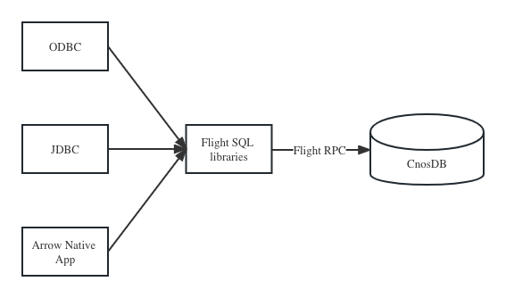
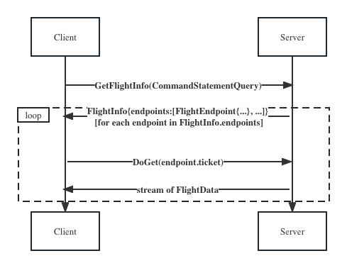

Arrow Flight SQL 是一种使用 Arrow 内存格式和 Flight RPC 框架与 SQL 数据库交互的协议。

目前我们支持Arrow Flight SQL 客户端的环境有

- [C++](c++.md)
- [Go](go.md)
- [Java](java.md)
- [Rust](rust.md)
- 基于Arrow Flight SQL 的 [JDBC](JDBC.md)
- 基于Arrow Flight SQL 的 [ODBC](ODBC.md)

## Arrow Flight SQL 的优势

1. 功能强大。功能与JDBC和ODBC等API类似，包括执行查询，创建准备好的语句
2. 安全。Flight，支持开箱即用的加密和身份验证等功能。
3. 性能。与实现Arrow Flight 的客户端服务端通信，无需进行数据转化，同时允许进一步优化，如并行数据访问。

虽然它可以直接用于数据库访问，但它不能直接替代 JDBC/ODBC。 但是，Flight SQL 可以用作具体的有线协议/驱动程序实现，支持 JDBC/ODBC 驱动程序，并减少数据库的实现负担。

## Arrow Flight SQL 查询的流程

客户端使用arrow flight sql 客户端与数据库连接，查询数据，执行SQL的流程大致如下。

1. 创建FlightSql客户端
2. 验证用户名，密码
3. 执行SQL，获取FlightInfo结构体
4. 通过FlightInfo结构体中的FlightEndPoint获取到FlightData数据流

FlightInfo中包含有关数据所在位置的详细信息，
客户端可以从适当的服务器获取数据。
服务器信息被编码为 FlightInfo 中的一系列 FlightEndpoint 消息。 
每个Endpoint代表包含响应数据子集的某个位置。

一个FlightEndpoint包含一个服务器地址列表，
一个Ticket, 一个服务器用来识别请求数据的二进制Token。
FlightEndPoint 没有定义顺序，如果数据集是排序的，
只会在一个FlightEndPoint中返回数据。

流程图如下

