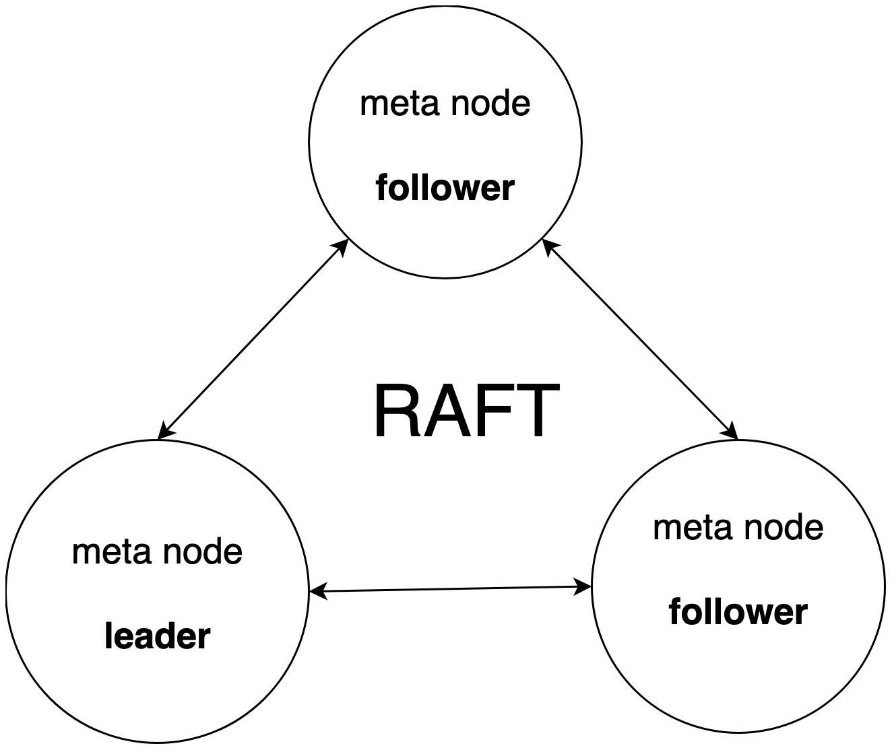
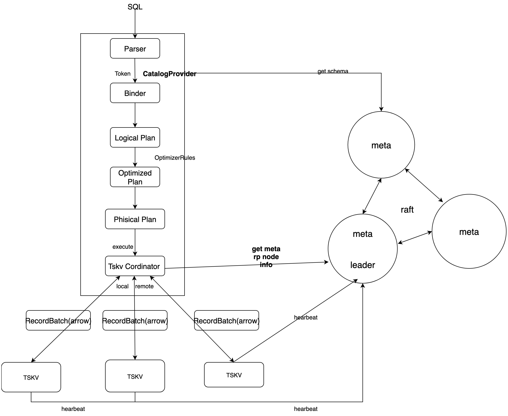

---

title: 集群版使用手册
icon: launch
order: 1

---

# 安装

## 源码安装

我们支持以下平台，如果发现可以在列表以外的平台上运行，请[报告](https://github.com/cnosdb/cnosdb/issues)给我们。

- Linux x86(x86_64-unknown-linux-gnu)
- Darwin arm(aarch64-apple-darwin)

### 编译环境

1. 安装 Rust，可前往[官网](https://www.rust-lang.org/learn/get-started)下载安装。
2. 安装 Cmake。

```sh
# Debian or Ubuntu
apt-get install cmake
# Arch Linux
pacman -S cmake
# CentOS
yum install cmake
# Fedora
dnf install cmake
# macOS
brew install cmake
```

对于 Windows，你也可以在 [Cmake 官网](https://cmake.org/download/)下载和安装 Cmake。

1. 安装 FlatBuffers。

```sh
# Arch Linux
pacman -S flatbuffers
# Fedora
dnf install flatbuffers
# Ubuntu
snap install flatbuffers
# macOS
brew install flatbuffers
```

如果您的系统不在此列，可按照如下方法安装 FlatBuffers。

```sh
git clone -b v22.9.29 --depth 1 https://github.com/google/flatbuffers.git && cd flatbuffers

# 根据操作系统选择以下命令之一
cmake -G "Unix Makefiles" -DCMAKE_BUILD_TYPE=Release
cmake -G "Visual Studio 10" -DCMAKE_BUILD_TYPE=Release
cmake -G "Xcode" -DCMAKE_BUILD_TYPE=Release

sudo make install
```

### 编译

```sh
git clone https://github.com/cnosdb/cnosdb.git && cd cnosdb
make build
```

# 启动

可通过以下命令来体验集群版功能。Meta 集群是由多个 cnos-meta 通过 Raft 协议组成的一个 Raft Group。Meta Node 也支持单节点启动。

## 单节点启动流程

```sh
./target/debug/cnosdb-meta --id 1 --http-addr 127.0.0.1:21001
curl http://127.0.0.1/21001/init -d '{}'
curl http://127.0.0.1/21001/metrics
./target/debug/cnosdb run --config ./config/config_31001.toml
```

## 集群启动流程

### Meta 集群启动流程

**启动 meta-1**

```sh
./target/debug/cnosdb-meta --id 1 --http-addr 127.0.0.1:21001
```

**启动 meta-2**

```sh
./target/debug/cnosdb-meta --id 2 --http-addr 127.0.0.1:21002
```

**启动 meta-3**

```sh
./target/debug/cnosdb-meta --id 3 --http-addr 127.0.0.1:21003
```

**初始化 meta**

```sh
curl http://127.0.0.1/21001/init -d '{}'
curl http://127.0.0.1/21001/add-learner -d '[2, "127.0.0.1:21002"]'
curl http://127.0.0.1/21001/add-learner -d '[3, "127.0.0.1:21003"]'
curl http://127.0.0.1/21001/change-membership -d '[1, 2, 3]'
```

**查看 meta 集群状态**

```sh
curl http://127.0.0.1/21001/metrics
curl http://127.0.0.1/21002/metrics
curl http://127.0.0.1/21003/metrics
```

### Data 集群启动流程

**启动 data-1**

```sh
./target/debug/cnosdb run --config ./config/config_31001.toml
```

**启动 data-2**

```sh
./target/debug/cnosdb run --config ./config/config_32001.toml
```

## 执行 SQL

```sh
./target/debug/cnosdb-cli --host 127.0.0.1 --port 31001
CnosDB CLI v2.0.0
Input arguments: Args { host: "0.0.0.0", port: 31001, user: "root", password: None, database: "public", tenant: "cnosdb", target_partitions: None, data_path: None, file: [], rc: None, format: Table, quiet: false }
public> SHOW DATABASES;
+-----+
| Database |
+-----+
| public   |
+-----+
public > CREATE DATABASE test;
Query took 0.053 seconds.
public > SHOW DATABASES;
+-----+
| Database |
+-----+
| test     |
| public   |
+-----+
> \c test
test > CREATE TABLE test(c1 DOUBLE CODEC(GORILLA), TAGS(c2, c3));
Query took 0.038 seconds.
test > INSERT test (time, c1, c2, c3) VALUES (1667456411000000000, 1, 't1', 't2');
+-----+
| rows |
+-----+
| 1    |
+-----+
Query took 0.094 seconds.
test > SELECT * FROM test;
+-----+-----+-----+-----+
| time                | c2 | c3 | c1 |
+-----+-----+-----+-----+
| 2022-11-03T06:20:11 | t1 | t2 | 1  |
+-----+-----+-----+-----+
Query took 0.027 seconds.
test > \q
```

# 概述

在 CnosDB 集群版中，单个运行实例被称作 Node，每个 Node 分为 Meta 和 Data 两种角色。

## Meta

Meta 维护集群的元数据，如 Table Schema、Node 存活心跳与负载数据、Vnode 与 Node 的映射关系等。

元数据频繁被每个 Node 所访问，CnosDB 选择维护一个强一致性的 Meta Node 集群，Node 订阅 Meta Node 来拉取感兴趣的信息，所有的元数据信息的更新都通过 Meta Node 集群进行。



## Data

提供 TCP Service 承接 Coodinator 分发过来的查询和写入请求，查询和写入与单机版本类似。

## 数据流



# 配置

## Data

以下介绍 CnosDB 集群版的配置文件。

```toml
[query]
max_server_connections = 10240
query_sql_limit = 16777216 # 16 _ 1024 _ 1024
write_sql_limit = 167772160 # 160 _ 1024 _ 1024
auth_enabled = false

[storage]
path = 'data/db'
max_summary_size = 134217728 # 128 _ 1024 _ 1024
max_level = 4
base_file_size = 16777216 # 16 _ 1024 _ 1024
compact_trigger = 4
max_compact_size = 2147483648 # 2 _ 1024 _ 1024 \* 1024
strict_write = false

[wal]
enabled = true
path = 'data/wal'
sync = false

[cache]
max_buffer_size = 134217728 # 128 _ 1024 _ 1024
max_immutable_number = 4

[log]
level = 'info'
path = 'data/log'

[security]

# [security.tls_config]

# certificate = "./config/tls/server.crt"

# private_key = "./config/tls/server.key"

[cluster]
node_id = 100
name = 'cluster_xxx'
meta = '127.0.0.1:21001'

flight_rpc_server = '127.0.0.1:31006'
http_server = '127.0.0.1:31007'
grpc_server = '127.0.0.1:31008'
tcp_server = '127.0.0.1:31009'

[hintedoff]
enable = true
path = '/tmp/cnosdb/hh'
```

### 配置项 query

| 配置项                 | 默认值   | 说明                                                                                      |
| ---------------------- | -------- | ----------------------------------------------------------------------------------------- |
| max_server_connections | 10240    | 最大同时执行的 SQL 数量                                                                   |
| query_sql_limit        | 16777216 | SQL 的最大长度（字节）                                                                    |
| auth_enabled           | false    | 是否检查每个查询请求的身份信息，当设置为 true 时，执行 SQL 时会检查用户是否拥有对应权限。 |

### 配置项 storage

| 配置项           | 默认值     | 说明                                                                                              |
| ---------------- | ---------- | ------------------------------------------------------------------------------------------------- |
| path             | data/db    | 数据库文件存放路径                                                                                |
| max_summary_size | 134217728  | 单个数据库概要文件的最大大小（字节），达到大小时，创建新的概要文件                                |
| max_level        | 4          | 数据库文件的最大层级                                                                              |
| base_file_size   | 16777216   | 数据库文件大小（字节）                                                                            |
| compact_trigger  | 4          | 当层级 0 的文件达到数量时，开启压缩任务，将文件合入更高层级                                       |
| max_compact_size | 2147483648 | 每次压实任务中，最大选择的文件总大小（字节）                                                      |
| strict_write     | false      | 是否确保每个写入请求能够严格符合 Table 的 Schema，当设置为 true 时，不检查写入请求是否符合 Schema |

### 配置项 wal

| 配置项  | 默认值   | 说明                                                                     |
| ------- | -------- | ------------------------------------------------------------------------ |
| enabled | true     | 是否开启 WAL 以获得容灾支持，当设置为 ture 时，写请求会先写入到 WAL 文件 |
| path    | data/wal | WAL 文件目录                                                             |
| sync    | false    | 是否确保每个 WAL 的写请求都刷入磁盘                                      |

### 配置项 cache

| 配置项               | 默认值    | 说明                                                                    |
| -------------------- | --------- | ----------------------------------------------------------------------- |
| max_buffer_size      | 134217728 | 单个 Vnode 中，每个活跃缓存最大可写入的大小（字节）                     |
| max_immutable_number | 4         | 单个 Vnode 中，最大的不活跃缓存数量，当达到数量时，将不活跃缓存写入磁盘 |

### 配置项 log

| 配置项 | 默认值   | 说明                                                       |
| ------ | -------- | ---------------------------------------------------------- |
| level  | info     | 日志级别，可选项为 trace \| debug \| info \| warn \| error |
| path   | data/log | 日志文件目录                                               |

### 配置项 security

**security.tls_confg**

| 配置项      | 默认值              | 说明             |
| ----------- | ------------------- | ---------------- |
| certificate | data/tls/server.crt | TLS 证书文件路径 |
| private_key | data/tls/server.key | TLS 私钥文件路径 |

### 配置项 cluster

| 配置项            | 默认值          | 说明                    |
| ----------------- | --------------- | ----------------------- |
| node_id           | 100             | Data 节点 ID            |
| name              | cluster_xxx     | Data 节点名称           |
| meta              | 127.0.0.1:21001 | Meta 节点地址           |
| flight_rpc_server | 127.0.0.1:31006 | Flight RPC 服务监听地址 |
| http_server       | 127.0.0.1:31007 | HTTP 服务监听地址       |
| grpc_server       | 127.0.0.1:31008 | GRPC 服务监听地址       |
| tcp_server        | 127.0.0.1:31009 | TCP 服务监听地址        |

### 配置项 hintedoff

| 配置项 | 默认值  | 说明                                                                                                         |
| ------ | ------- | ------------------------------------------------------------------------------------------------------------ |
| enable | true    | 是否开启 Hinted Off 以获取一致性支持，当设置为 true 时，失败的写入请求将会自动进入 hinted-off 队列并自动重试 |
| path   | data/hh | Hinted Off 持久化目录                                                                                        |

# 运维指南

## SQL

### 租户

**创建租户**

```
CREATE TENANT [IF NOT EXISTS] <tenant_name> [WITH comment = <tenant_comment>];
```

**删除租户**

```
DROP TENANT [IF EXISTS] <tenant_name>
```

### 用户

**创建用户**

```
CREATE USER [IF NOT EXISTS] <user_name>
[WITH [password = <user_password>]
[[,]must_change_password = true|false]
[[,]rsa_public_key = <key>]
[[,]comment = <user_comment>]
];
```

**删除用户**

```
DROP USER [IF EXISTS] <user_name>
```

### 角色

**创建角色**

```
CREATE ROLE [IF NOT EXISTS] <role_name> [INHERIT owner|member];
```

**删除角色**

```
DROP ROLE [IF EXISTS] <role_name>;
```

### 权限

**角色赋予权限**

```
GRANT READ|WRITE|ALL ON DATABASE <database_name> TO ROLE <role_name>;
```

**角色撤销权限**

```
REVOKE READ|WRITE|ALL FROM ROLE <role_name>;
```

### 数据导入

**从云存储导入数据**

```
COPY INTO [<database>.]<table_name>
FROM externalLocation
[ FILES = ( '<file_name>' [ , '<file_name>' ] [ , ... ] ) ]
[ PATTERN = '<regex_pattern>' ]
[ CONNECTION = ( connection_options ) ]
[ FILE_FORMAT = ( TYPE = { 'CSV' | 'NDJSON' | 'PARQUET' | 'AVRO' } [ formatTypeOptions ] ) ]
[ copyOptions ]

externalLocation (for Amazon S3) ::=
's3://<bucket>[/<path>]'
[ { STORAGE_INTEGRATION = <integration_name> } | { CREDENTIALS = ( { { AWS_KEY_ID = '<string>' AWS_SECRET_KEY = '<string>' [ AWS_TOKEN = '<string>' ] } } ) } ]
[ ENCRYPTION = ( [ TYPE = 'AWS_CSE' ] [ MASTER_KEY = '<string>' ] |
[ TYPE = 'AWS_SSE_S3' ] |
[ TYPE = 'AWS_SSE_KMS' [ KMS_KEY_ID = '<string>' ] ] |
[ TYPE = 'NONE' ] ) ]

externalLocation (for Google Cloud Storage) ::=
'gcs://<bucket>[/<path>]'
[ STORAGE_INTEGRATION = <integration_name> ]
[ ENCRYPTION = ( [ TYPE = 'GCS_SSE_KMS' ] [ KMS_KEY_ID = '<string>' ] | [ TYPE = 'NONE' ] ) ]

externalLocation (for Microsoft Azure) ::=
'azure://<account>.blob.core.windows.net/<container>[/<path>]'
[ { STORAGE_INTEGRATION = <integration_name> } | { CREDENTIALS = ( [ AZURE_SAS_TOKEN = '<string>' ] ) } ]
[ ENCRYPTION = ( [ TYPE = { 'AZURE_CSE' | 'NONE' } ] [ MASTER_KEY = '<string>' ] ) ]

formatTypeOptions ::=
DELIMITER = '<character>'
WITH_HEADER = true | false
auto_infer_schema = true | false
```

### 集群维护（即将上线）

**转移 Vnode**

```
Move Vnode [vnode_id] to Node [node_id]
```

**复制 Vnode**

```
Copy Vnode [vnode_id] to Node [node_id]
```

**删除 Vnode**

```
DROP VNODE <vnode_id>
```

**压缩 Vnode**

```
COMPACT VNODE <vnode_id>[, <vnode_id>[, ...]]
```

**检查 Group 数据一致性**

```
CHECKSUM GROUP <replication_set_id>
```
