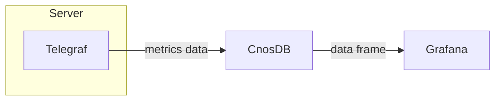

## Telegraf

### 简介

[Telegraf](https://github.com/influxdata/telegraf) 是一个开源的服务器代理程序，用于从堆栈、传感器和系统中收集一些指标，集中输出到数据库，内存占用极小，支持通过插件进行扩展。Telegraf 配置简单，易于上手，相较于通过手写脚本采集数据，大大降低了数据获取的难度。

**使用场景**

- **IoT 传感器数据**: 基于 MQTT、ModBus、OPC-UA 和 Kafka 等协议传输的数据。
- **DevOps 框架数据**: GitHub、Kubernetes、CloudWatch、Prometheus 等平台或框架的运行指标。
- **系统遥测数据**: iptables, Netstat, NGINX 和 HAProxy 等系统遥测指标。

**插件系统**

1. **输入**: 收集来自系统、服务或第三方 API 的指标数据。
2. **处理**: 在发送指标数据前对数据进行处理、修饰，以维持数据整洁。
3. **聚合**: 生成聚合指标，如指标数据的平均值、最小值、最大值等。
4. **输出**: 将数据写入数据存储、服务或消息队列，如 InfluxDB, Graphite, OpenTSDB, Datadog, Kafka, MQTT, NSQ 等。

在下文中，我们将介绍如何安装、配置 Telegraf，以实现采集系统指标数据，并存储在 CnosDB 中。

### Telegraf 部署

- **下载**

[官方下载链接](https://portal.influxdata.com/downloads)

- **安装**

[官方安装教程(v1.23)](https://docs.influxdata.com/telegraf/v1.23/install/)

- **启动**

[官方基础教程(v1.23)](https://docs.influxdata.com/telegraf/v1.23/get_started/)

### Telegraf 配置

- **手动生成配置文件**

```sh
telegraf --sample-config > telegraf.conf
```

- **默认配置文件路径**

- macOS **Homebrew**: `/usr/local/etc/telegraf.conf`
- Linux debian and RPM packages: `/etc/telegraf/telegraf.conf`

- **使用 `vim` 等文本编辑器修改配置文件**

为实现将指标数据输出至 CnosDB，我们需要配置 Telegraf 的输出插件 `http`，来将行协议数据输出至 CnosDB 的写如接口。

在配置文件中找到 `[[outputs.http]]`，将其内容修改如下：

```toml
[[outputs.http]]
url = "http://CnosDB地址:CnosDB端口/api/v1/write?db=cnos"
timeout = "5s"
method = "POST"
username = "用户名"
password = "密码"
data_format = "influx"
use_batch_format = true
content_encoding = "identity"
idle_conn_timeout = 10
```

在上面的配置中，有一些文本可能需要替换：

- `CnosDB地址`
- `CnosDB端口`
- `用户名`
- `密码`

如：

```toml
[[outputs.http]]
url = "http://host.docker.internal:8902/api/v1/write?db=cnos"
timeout = "5s"
method = "POST"
username = "admin"
password = "admin"
data_format = "influx"
use_batch_format = true
content_encoding = "identity"
idle_conn_timeout = 10
```

接下来，启动 Telegraf 服务，并提供配置文件路径：

**macOS Homebrew**

```sh
telegraf --config telegraf.conf
```

**Linux (sysvinit and upstart installations)**

```sh
sudo service telegraf start
```

**Linux (systemd installations)**

```sh
systemctl start telegraf
```

接下来使用 CnosDB 查询接口来查看数据，以验证 Telegraf 是否正确运行：

```sh
curl -XPOST 'http://CnosDB地址:CnosDB端口/api/v1/sql?db=cnos' \
  -u "<用户名>:<密码>" \
  -H 'ACCEPT: application/json' \
  -d 'SELECT * from cpu limit 1'
```

在上面的命令中，有一些文本可能需要替换：

- `CnosDB地址`
- `CnosDB端口`
- `用户名`
- `密码`

如：

```sh
> curl -XPOST 'http://127.0.0.1:8902/api/v1/sql?db=cnos' \
  -u "root:" \
  -H 'ACCEPT: application/json' \
  -d 'SELECT * from cpu limit 1'
```

在正确配置的情况下，我们能够获得以下结果：

```json
[
    {
        "cpu": "cpu0",
        "host": "_HOST",
        "time": "2022-10-10 10:10:10",
        "usage_guest": 0.0,
        "usage_guest_nice": 0.0,
        "usage_idle": 99.49899799596298,
        "usage_iowait": 0.10020040080156893,
        "usage_irq": 0.0,
        "usage_nice": 0.0,
        "usage_softirq": 0.10020040080156893,
        "usage_steal": 0.0,
        "usage_system": 0.10020040080155113,
        "usage_user": 0.20040080160317345
    }
]
```

## Cnos-Telegraf

CnosDB-Telegraf 基于 Telegraf (re1.25, commit 86cd0c0c2) 进行开发，增加了一些功能与插件。

### 相较于 Telegraf 的改动说明

#### Parser Plugin

增加 Parser 插件 OpenTSDB 和 OpenTSDB-Telnet，用于采集 OpenTSDB 的写入请求。

- **OpenTSDB**

通过使用 Input 插件 http_listener_v2 并配置 `data_format` 为 `"opentsdb"`，将能够解析 OpenTSDB 格式的写入请求。

```toml
[[inputs.http_listener_v2]]
service_address = ":8080"
paths = ["/api/put"]
methods = ["POST", "PUT"]
data_format = "opentsdb"
```

- **OpenTSDB-Telnet**

通过使用 Input 插件 socket_listener，并配置 `data_format` 为 `"opentsdbtelnet"`，将能够解析 OpenTSDB-Telnet 格式的写入请求。

```toml
[[inputs.socket_listener]]
service_address = "tcp://:8081"
data_format = "opentsdbtelnet"
```

#### Output Plugin

增加 Output 插件 CnosDB，用于将指标输出到 CnosDB。

```toml
[[outputs.cnosdb]]
url = "localhost:8902"
user = "user"
password = "pass"
database = "telegraf"
```

- **配置介绍**

| 参数       | 说明               |
|----------|------------------|
| url      | CnosDB GRpc 服务地址 |
| user     | 用户名              |
| password | 密码               |
| database | CnosDB 数据库       |

#### Input Plugin

增加配置参数 high_priority_io，用于开启端到端模式。

当设置为 true 时，写入的数据将立即发送到 Output 插件，并根据 Output 插件的返回参数来决定返回值。

```toml
[[inputs.http_listener_v2]]
service_address = ":8080"
paths = ["/api/put"]
methods = ["POST", "PUT"]
data_format = "opentsdb"
high_priority_io = true
```

以上配置与在 [Output Plugin](#output-plugin) 章节中的配置相比，增加了 `high_priority_io = true` 配置项。

### 构建

- #### [安装 Go](https://golang.org/doc/install) >=1.18 (推荐 1.18.0 版本)
- #### 从 Github 克隆仓库:

```shell
git clone https://github.com/cnosdb/cnos-telegraf.git
```

- #### 在仓库目录下执行 `make build`

```shell
cd cnos-telegraf
make build
```

### 启动

- #### 执行以下指令，查看用例:

```shell
telegraf --help
```

- #### 生成一份标准的 telegraf 配置文件

```shell
telegraf config > telegraf.conf
```

- #### 生成一份 telegraf 配置文件，仅包含 cpu 指标采集 & influxdb 输出两个插件

```shell
telegraf config --section-filter agent:inputs:outputs --input-filter cpu --output-filter influxdb
```

- #### 运行 telegraf 但是将采集指标输出到标准输出

```shell
telegraf --config telegraf.conf --test
```

- #### 运行 telegraf 并通过配置文件来管理加载的插件

```shell
telegraf --config telegraf.conf
```

- #### 运行 telegraf，仅加载 cpu & memory 指标采集，和 influxdb 输出插件

```shell
telegraf --config telegraf.conf --input-filter cpu:mem --output-filter influxdb
```


## Grafana

### 简介


[Grafana](https://github.com/grafana/grafana) 是一个开源的数据可视化工具，可以很方便地将任意符合要求的数据转换为可视化的图表，并且还带有告警功能，可以在指标数据达到阈值时通知你。Grafana 默认持多种数据源，并且还可以通过插件系统进行拓展。

本文将介绍通过 Grafana 获取 CnosDB 数据，以展示仪表板的流程。



### Grafana 部署

[官方安装教程](https://grafana.com/docs/grafana/latest/setup-grafana/installation/)

[官方配置文件说明](https://grafana.com/docs/grafana/latest/setup-grafana/configure-grafana/)

### Grafana 配置

- **连接 CnosDB**

输入 `http://localhost:3000`，当 Grafana 正确运行，便可以看到 Grafana 登录界面了。初始用户名 `admin`，初始密码 `admin`。


初次登陆时，还会要求你输入新的密码。再之后，我们便进入了 Grafana 的主界面。


Grafana 提供了通用的数据接口，我们可以通过 CnosDB 数据源插件来从 CnosDB 数据库中读取数据。首先我们进入数据源配置界面。


然后点击【`Add data source`】 按钮。


搜索 CnosDB，然后点击进入配置界面。


在配置界面中，输入 CnosDB 的地址，以及用户名等信息，然后点击【`Save & test`】按钮。


配置正确的情况下，之后会出现 `Data source is working` 提示，表明 Grafana 已经能够获取 CnosDB 的数据。


- **配置仪表板**

Grafana 可以通过图形化界面来配置仪表板，配置好的仪表板可以通过 JSON 格式的数据进行导出，也可以导入 JSON 格式的仪表板数据。

我们接下来导入一段仪表板数据。


将 [JSON](https://github.com/cnosdb/docs/blob/main/assets/grafana_dashboard.json) 复制到【`import via panel json`】处，随后点击【`load`】按钮。


接下来选择我们刚才配置好的 CnosDB 数据源，随后点击【`import`】按钮。


我们便创建好一张仪表板了。


