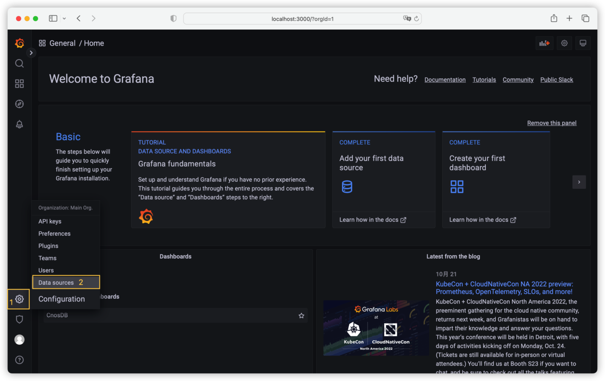
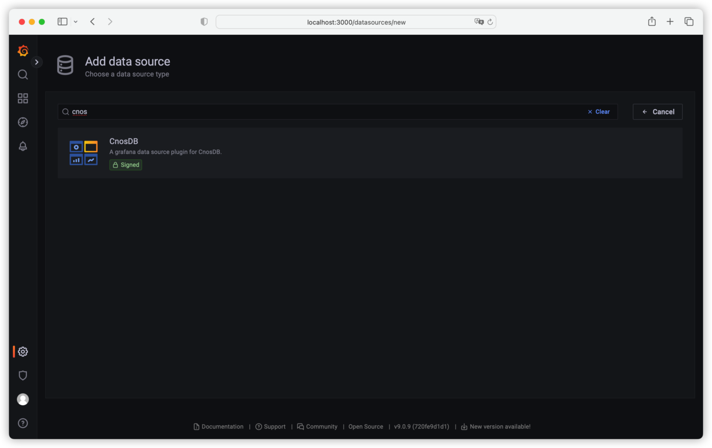
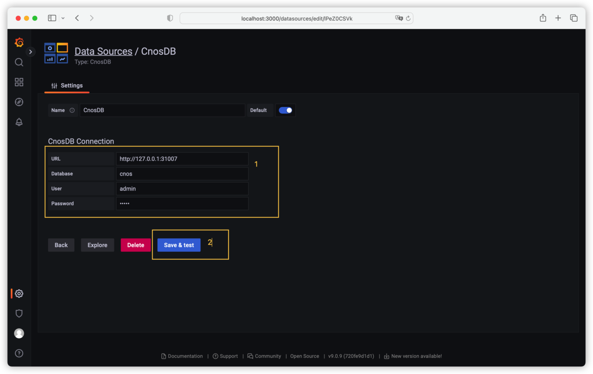
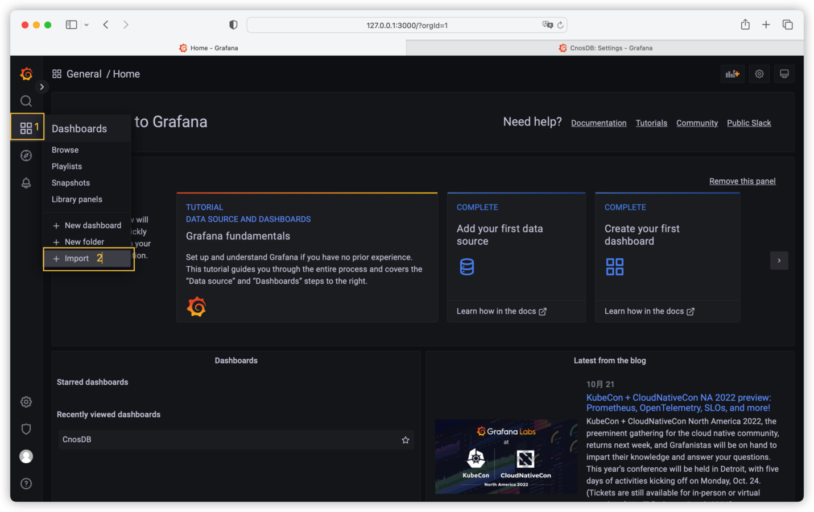
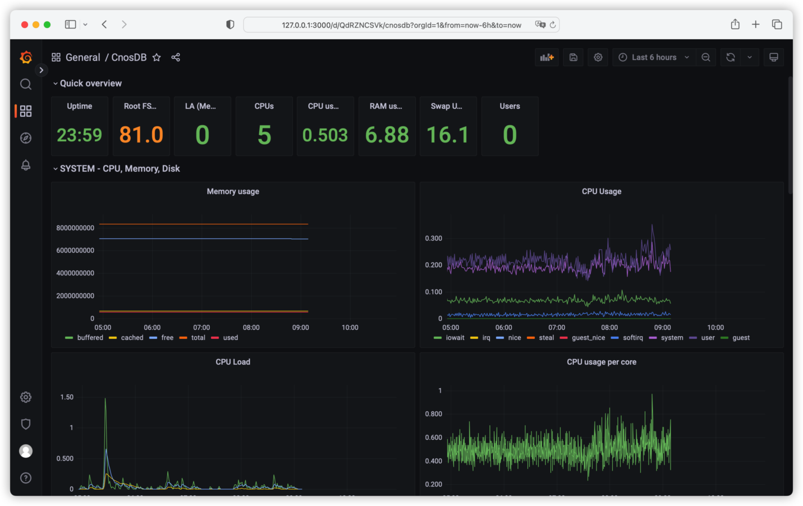
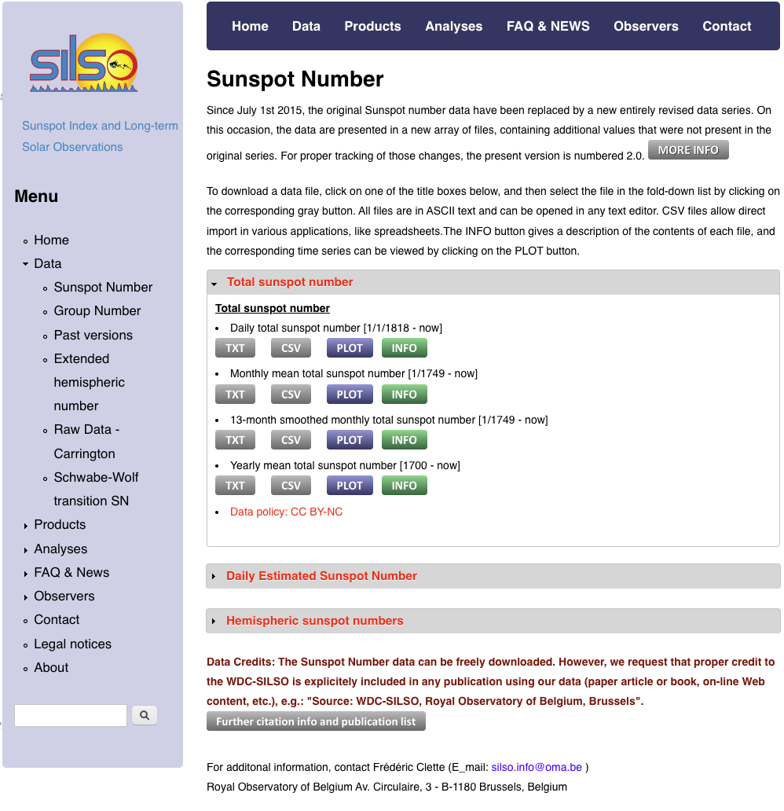
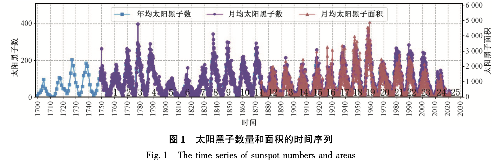
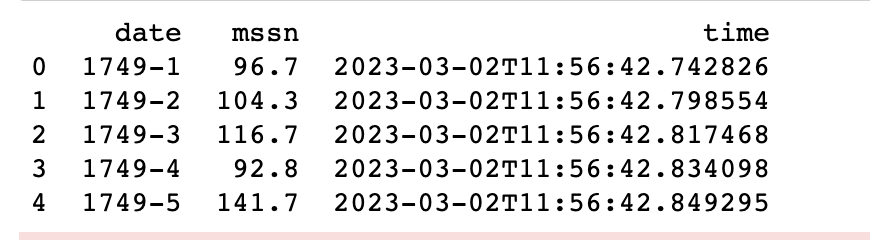
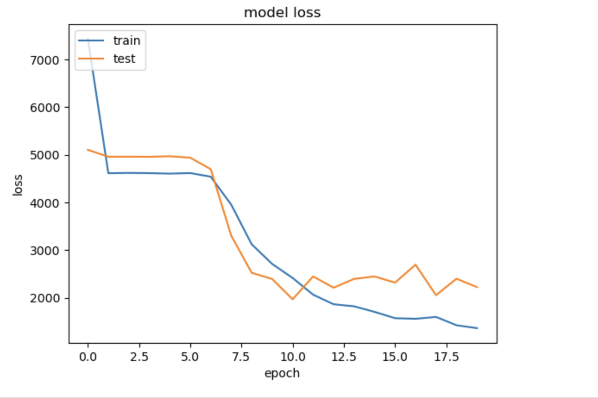
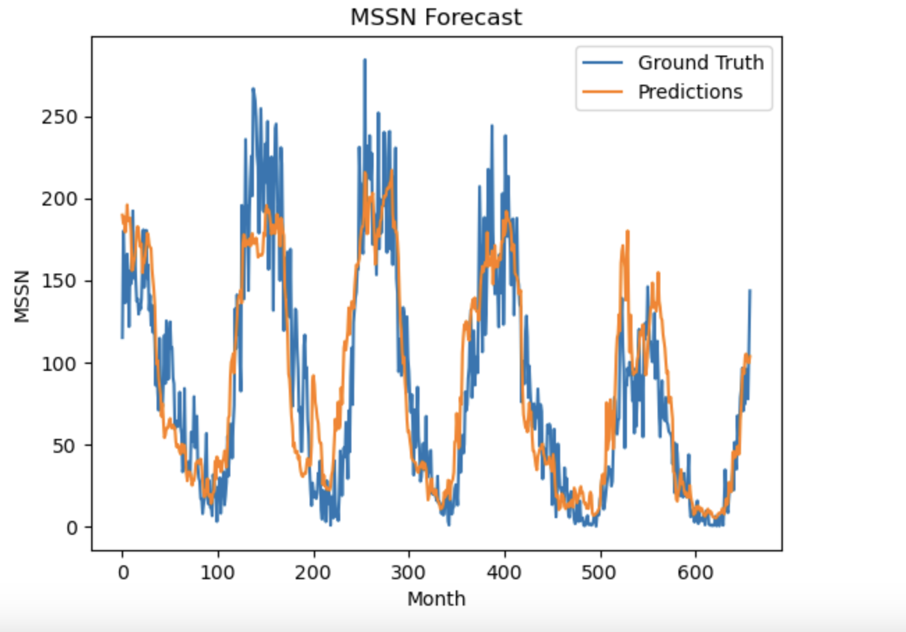

# 生态集成

## Telegraf

### 简介

[Telegraf](https://github.com/influxdata/telegraf) 是一个开源的服务器代理程序，用于从堆栈、传感器和系统中收集一些指标，集中输出到数据库，内存占用极小，支持通过插件进行扩展。Telegraf 配置简单，易于上手，相较于通过手写脚本采集数据，大大降低了数据获取的难度。

**使用场景**

- **IoT 传感器数据**: 基于 MQTT、ModBus、OPC-UA 和 Kafka 等协议传输的数据。
- **DevOps 框架数据**: GitHub、Kubernetes、CloudWatch、Prometheus 等平台或框架的运行指标。
- **系统遥测数据**: iptables, Netstat, NGINX 和 HAProxy 等系统遥测指标。

**插件系统**

1. **输入**: 收集来自系统、服务或第三方 API 的指标数据。
2. **处理**: 在发送指标数据前对数据进行处理、修饰，以维持数据整洁。
3. **聚合**: 生成聚合指标，如指标数据的平均值、最小值、最大值等。
4. **输出**: 将数据写入数据存储、服务或消息队列，如 InfluxDB, Graphite, OpenTSDB, Datadog, Kafka, MQTT, NSQ 等。

在下文中，我们将介绍如何安装、配置 Telegraf，以实现采集系统指标数据，并存储在 CnosDB 中。

### Telegraf 部署

- **下载**

  [官方下载链接](https://portal.influxdata.com/downloads)

- **安装**

  [官方安装教程(v1.23)](https://docs.influxdata.com/telegraf/v1.23/install/)

- **启动**

  [官方基础教程(v1.23)](https://docs.influxdata.com/telegraf/v1.23/get_started/)

### Telegraf 配置

- **手动生成配置文件**

    ```sh
    telegraf --sample-config > telegraf.conf
    ```

- **默认配置文件路径**

    - macOS **Homebrew**: `/usr/local/etc/telegraf.conf`
    - Linux debian and RPM packages: `/etc/telegraf/telegraf.conf`

- **使用 `vim` 等文本编辑器修改配置文件**

  为实现将指标数据输出至 CnosDB，我们需要配置 Telegraf 的输出插件 `http`，来将行协议数据输出至 CnosDB 的写如接口。

  在配置文件中找到 `[[outputs.http]]`，将其内容修改如下：

    ```toml
    [[outputs.http]]
      url = "http://CnosDB地址:CnosDB端口/api/v1/write?db=cnos"
      timeout = "5s"
      method = "POST"
      username = "用户名"
      password = "密码"
      data_format = "influx"
      use_batch_format = true
      content_encoding = "identity"
      idle_conn_timeout = 10
    ```

  在上面的配置中，有一些文本可能需要替换：

    - `CnosDB地址`
    - `CnosDB端口`
    - `用户名`
    - `密码`

  如：

    ```toml
    [[outputs.http]]
      url = "http://host.docker.internal:31007/api/v1/write?db=cnos"
      timeout = "5s"
      method = "POST"
      username = "admin"
      password = "admin"
      data_format = "influx"
      use_batch_format = true
      content_encoding = "identity"
      idle_conn_timeout = 10
    ```

  接下来，启动 Telegraf 服务，并提供配置文件路径：

  **macOS Homebrew**

    ```sh
    telegraf --config telegraf.conf
    ```

  **Linux (sysvinit and upstart installations)**

    ```sh
    sudo service telegraf start
    ```

  **Linux (systemd installations)**

    ```sh
    systemctl start telegraf
    ```

  接下来使用 CnosDB 查询接口来查看数据，以验证 Telegraf 是否正确运行：

    ```sh
    curl -XPOST -H 'ACCEPT: application/json' -H "AUTHORIZATION: Basic $(echo '用户名:密码'|base64)" 'http://CnosDB地址:CnosDB端口/api/v1/sql?db=cnos' -d 'SELECT * from cpu limit 1'
    ```

  在上面的命令中，有一些文本可能需要替换：

    - `CnosDB地址`
    - `CnosDB端口`
    - `用户名`
    - `密码`

  如：

    ```sh
    > curl -XPOST -H 'ACCEPT: application/json' -H "AUTHORIZATION: Basic $(echo 'admin:admin'|base64)" 'http://127.0.0.1:31007/api/v1/sql?db=cnos' -d 'SELECT * from cpu limit 1'
    ```

  在正确配置的情况下，我们能够获得以下结果：

    ```json
    [
      {
        "cpu": "cpu0",
        "host": "_HOST",
        "time": "2022-10-10 10:10:10",
        "usage_guest": 0.0,
        "usage_guest_nice": 0.0,
        "usage_idle": 99.49899799596298,
        "usage_iowait": 0.10020040080156893,
        "usage_irq": 0.0,
        "usage_nice": 0.0,
        "usage_softirq": 0.10020040080156893,
        "usage_steal": 0.0,
        "usage_system": 0.10020040080155113,
        "usage_user": 0.20040080160317345
      }
    ]
    ```

## Cnos-Telegraf

CnosDB-Telegraf 基于 Telegraf (re1.25, commit 86cd0c0c2) 进行开发，增加了一些功能与插件。

### 相较于 Telegraf 的改动说明

#### Parser Plugin

增加 Parser 插件 OpenTSDB 和 OpenTSDB-Telnet，用于采集 OpenTSDB 的写入请求。

- **OpenTSDB**

  通过使用 Input 插件 http_listener_v2 并配置 `data_format` 为 `"opentsdb"`，将能够解析 OpenTSDB 格式的写入请求。

   ```toml
   [[inputs.http_listener_v2]]
   service_address = ":8080"
   paths = ["/api/put"]
   methods = ["POST", "PUT"]
   data_format = "opentsdb"
   ```

- **OpenTSDB-Telnet**

  通过使用 Input 插件 socket_listener，并配置 `data_format` 为 `"opentsdbtelnet"`，将能够解析 OpenTSDB-Telnet 格式的写入请求。

   ```toml
   [[inputs.socket_listener]]
   service_address = "tcp://:8081"
   data_format = "opentsdbtelnet"
   ```

#### Output Plugin

增加 Output 插件 CnosDB，用于将指标输出到 CnosDB。

```toml
[[outputs.cnosdb]]
url = "localhost:31006"
user = "user"
password = "pass"
database = "telegraf"
```

- **配置介绍**

| 参数       | 说明               |
|----------|------------------|
| url      | CnosDB GRpc 服务地址 |
| user     | 用户名              |
| password | 密码               |
| database | CnosDB 数据库       |

#### Input Plugin

增加配置参数 high_priority_io，用于开启端到端模式。

当设置为 true 时，写入的数据将立即发送到 Output 插件，并根据 Output 插件的返回参数来决定返回值。

```toml
[[inputs.http_listener_v2]]
service_address = ":8080"
paths = ["/api/put"]
methods = ["POST", "PUT"]
data_format = "opentsdb"
high_priority_io = true
```

以上配置与在 [Output Plugin](#output-plugin) 章节中的配置相比，增加了 `high_priority_io = true` 配置项。

### 构建

- #### [安装 Go](https://golang.org/doc/install) >=1.18 (推荐 1.18.0 版本)
- #### 从 Github 克隆仓库:

   ```shell
   git clone https://github.com/cnosdb/cnos-telegraf.git
   ```

- #### 在仓库目录下执行 `make build`

   ```shell
   cd cnos-telegraf
   make build
   ```

### 启动

- #### 执行以下指令，查看用例:

  ```shell
  telegraf --help
  ```

- #### 生成一份标准的 telegraf 配置文件

  ```shell
  telegraf config > telegraf.conf
  ```

- #### 生成一份 telegraf 配置文件，仅包含 cpu 指标采集 & influxdb 输出两个插件

  ```shell
  telegraf config --section-filter agent:inputs:outputs --input-filter cpu --output-filter influxdb
  ```

- #### 运行 telegraf 但是将采集指标输出到标准输出

  ```shell
  telegraf --config telegraf.conf --test
  ```

- #### 运行 telegraf 并通过配置文件来管理加载的插件
  
  ```shell
  telegraf --config telegraf.conf
  ```

- #### 运行 telegraf，仅加载 cpu & memory 指标采集，和 influxdb 输出插件

  ```shell
  telegraf --config telegraf.conf --input-filter cpu:mem --output-filter influxdb
  ```


## Grafana

### 简介


[Grafana](https://github.com/grafana/grafana) 是一个开源的数据可视化工具，可以很方便地将任意符合要求的数据转换为可视化的图表，并且还带有告警功能，可以在指标数据达到阈值时通知你。Grafana 默认持多种数据源，并且还可以通过插件系统进行拓展。

本文将介绍通过 Grafana 获取 CnosDB 数据，以展示仪表板的流程。


### Grafana 部署

[官方安装教程](https://grafana.com/docs/grafana/latest/setup-grafana/installation/)

[官方配置文件说明](https://grafana.com/docs/grafana/latest/setup-grafana/configure-grafana/)

### Grafana 配置

- **连接 CnosDB**

  输入 `http://localhost:3000`，当 Grafana 正确运行，便可以看到 Grafana 登录界面了。初始用户名 `admin`，初始密码 `admin`。

  

  初次登陆时，还会要求你输入新的密码。再之后，我们便进入了 Grafana 的主界面。

  

  Grafana 提供了通用的数据接口，我们可以通过 CnosDB 数据源插件来从 CnosDB 数据库中读取数据。首先我们进入数据源配置界面。

  

  然后点击【`Add data source`】 按钮。

  

  搜索 CnosDB，然后点击进入配置界面。

  

  在配置界面中，输入 CnosDB 的地址，以及用户名等信息，然后点击【`Save & test`】按钮。

  

  配置正确的情况下，之后会出现 `Data source is working` 提示，表明 Grafana 已经能够获取 CnosDB 的数据。

  

- **配置仪表板**

  Grafana 可以通过图形化界面来配置仪表板，配置好的仪表板可以通过 JSON 格式的数据进行导出，也可以导入 JSON 格式的仪表板数据。

  我们接下来导入一段仪表板数据。

  

  将 [JSON](https://github.com/cnosdb/docs/blob/main/assets/grafana_dashboard.json) 复制到【`import via panel json`】处，随后点击【`load`】按钮。

  

  接下来选择我们刚才配置好的 CnosDB 数据源，随后点击【`import`】按钮。

  

  我们便创建好一张仪表板了。

  

## Prometheus

### 简介

Prometheus 是一款面向云原生的监控软件，支持众多软件、系统的数据采集与监控。

本文介绍如何通过 Prometheus Remote Read/ Write 接口,配置 CnosDB 作为Prometheus终端。

### 前置条件

启动 CnosDB服务，获取 CnosDB 服务的地址。

### Remote Write

CnosDB 支持Prometheus的Remote Write协议，只需要在 Prometheus 中启动 Remote Write 功能即可采集数据到日志服务，相关操作如下所示。

**操作步骤**

- **修改配置文件**
    ```yaml
    # remote_write cnosdb
    remote_write:
    - url: "http://{db_url}/api/v1/prom/write?db={db_name}"
      basic_auth:
        username: 'root'
        password: ''
    ```
  **参数说明**:

    ```
    db_url: CnosDB 的Http Server地址，如 127.0.0.1:31001
    db_name: Remote Write 写入的db名字
    username: CnosDB 中用户的用户名
    password: CnosDB 中用户的用户密码
    ```

Prometheus的remote_write的所有配置项可以从[Prometheus](https://prometheus.io/docs/prometheus/latest/configuration/configuration/?spm=a2c4g.11186623.0.0.231f780eoLUxCY#remote_write)
官网得到。


### Remote Read
CnosDB 支持 Prometheus 的 Remote Read 协议，只需要在 Prometheus 中启动 Remote Read 功能即可采集数据到日志服务，相关操作如下所示。

**操作步骤**

- **修改配置文件**
    ```yaml
    # remote_read cnosdb
    remote_read:
    - url: "http://{db_url}/api/v1/prom/read?db={db_name}"
      basic_auth:
        username: 'root'
        password: ''
    ```
  **参数说明**:

    ```
    db_url: CnosDB 的Http Server地址，如 127.0.0.1:31001
    db_name: Remote Read 读取的db名字
    username: CnosDB 中用户的用户名
    password: CnosDB 中用户的用户密码
    ```

  Prometheus的remote_write的所有配置项可以从
  [Prometheus](https://prometheus.io/docs/prometheus/latest/configuration/configuration/#remote_read)
  官网得到。

## TensorFlow

### 使用 CnosDB 与 TensorFlow 进行时间序列预测

### 从三体运动到太阳黑子变化预测

### 前言

太阳黑子是太阳光球层上发生的太阳活动现象，通常成群出现。 预测太阳黑子变化是空间气象研究中最活跃的领域之一。

太阳黑子观测持续时间很长。 长时间的数据积累有利于挖掘太阳黑子变化的规律。 长期观测显示,太阳黑子数及面积变化呈现出明显的周期 性，且周期呈现不规则性,大致范围在 9 ~ 13 a , 平均周期约为 11 a,太阳黑子数及面积变化的峰值不恒定。

最新数据显示,近些年来太阳黑子数和面积有明显的下降趋势。


鉴于太阳黑子活动强烈程度对地球有着深刻的影响，因此探测太阳黑子活动就显得尤为重要。基于物理学模型(如动力模型)和统计学模型(如自回归滑动平均)已被广泛应用于探测太阳黑子活动。
为了更高效地捕捉太阳黑子时间序列中存在的非线性关系,机器学习方法被引入。

值得一提的是,机器学习中的神经网络更擅长挖掘数据中的非线性关系。

**因此，本文将介绍如何使用时序数据库`CnosDB`存储太阳黑子变化数据，并进一步使用TensorFlow实现`1DConv+LSTM` 网络来预测太阳黑子数量变化。**

#### 太阳黑子变化观测数据集简介

本文使用的太阳黑子数据集是由SILSO 网站发布2.0版本 (WDC-SILSO, Royal Observatory of Belgium, Brussels,http://sidc.be/silso/datafiles)



我们主要分析和探索：1749至2023年，月均太阳黑子数(monthly mean sunspot number，MSSN)变化情况。

### CnosDB 数据导入

将 MSSN 数据 csv 格式文件`SN_m_tot_V2.0.csv`（https://www.sidc.be/silso/infosnmtot） 下载到本地。

以下是官方提供的CSV文件描述：

```
Filename: SN_m_tot_V2.0.csv
Format: Comma Separated values (adapted for import in spreadsheets)
The separator is the semicolon ';'.

Contents:
Column 1-2: Gregorian calendar date
- Year
- Month
Column 3: Date in fraction of year.
Column 4: Monthly mean total sunspot number.
Column 5: Monthly mean standard deviation of the input sunspot numbers.
Column 6: Number of observations used to compute the monthly mean total sunspot number.
Column 7: Definitive/provisional marker. '1' indicates that the value is definitive. '0' indicates that the value is still provisional.
```

我们使用 `pandas` 进行文件加载和预览。

```python
import pandas as pd

df = pd.read_csv("SN_m_tot_V2.0.csv", sep=";", header=None)
df.columns = ["year", "month", "date_fraction", "mssn", "standard_deviation", "observations", "marker"]

# convert year and month to strings
df["year"] = df["year"].astype(str)
df["month"] = df["month"].astype(str)

# concatenate year and month
df["date"] = df["year"] + "-" + df["month"]

df.head()
```


```python
import matplotlib.pyplot as plt 

df["Date"] = pd.to_datetime(df["date"], format="%Y-%m")
plt.plot(df["Date"], df["mssn"])
plt.xlabel("Date")
plt.ylabel("MSSN")
plt.title("Sunspot Activity Over Time")
plt.show()
```


### 使用时序数据库 CnosDB 存储 MSSN 数据

CnosDB（An Open Source Distributed Time Series Database with high performance, high compression ratio and high usability.）

- Official Website: http://www.cnosdb.com
- Github Repo: https://github.com/cnosdb/cnosdb

（注：本文假设你已具备 CnosDB 安装部署和基本使用能力，相关文档详见 https://docs.cnosdb.com/）

在命令行中使用 Docker 启动 CnosDB 数据库服务，并进入容器使用 [CnosDB CLI](./tools.md) 工具直接访问 CnosDB：

```SHELL
(base) root@ecs-django-dev:~# docker run --restart=always --name cnosdb -d --env cpu=2 --env memory=4 -p 31007:31007 cnosdb/cnosdb:v2.0.2.1-beta

(base) root@ecs-django-dev:~# docker exec -it cnosdb sh sh
# cnosdb-cli
CnosDB CLI v2.0.0
Input arguments: Args { host: "0.0.0.0", port: 31007, user: "cnosdb", password: None, database: "public", target_partitions: None, data_path: None, file: [], rc: None, format: Table, quiet: false }
```

为了简化分析，我们只需存储数据集中观测时间和太阳黑子数。因此，我们将年（Col 0）和月（Col 1）拼接作为观测时间（date, 字符串类型），月均太阳黑子数（Col 3）可以不作处理直接存储。

我们可以在 CnosDB CLI 中使用 SQL 创建一张名为 `sunspot` 数据表，以用于存储 MSSN 数据集。

```SQL
public ❯ CREATE TABLE sunspot (
    date STRING,
    mssn DOUBLE,
);
Query took 0.002 seconds.

public ❯ SHOW TABLES;
+---------+
| Table   |
+---------+
| sunspot |
+---------+
Query took 0.001 seconds.

public ❯ SELECT * FROM sunspot;
+------+------+------+
| time | date | mssn |
+------+------+------+
+------+------+------+
Query took 0.002 seconds.
```

#### 使用 CnosDB Python Connector 连接和读写 CnosDB 数据库

Github Repo: https://github.com/cnosdb/cnosdb-client-python

```python
# 安装 Python Connector
pip install -U cnos-connector
```

```python
from cnosdb_connector import connect

conn = connect(url="http://127.0.0.1:31001/", user="root", password="")
cursor = conn.cursor()
```

如果不习惯使用 [CnosDB CLI](./tools.md) ，我们也可以直接使用 Python Connector 创建数据表。

```python
# 创建 tf_demo database
conn.create_database("tf_demo")
# 使用 tf_demo database
conn.switch_database("tf_demo")
print(conn.list_database())

cursor.execute("CREATE TABLE sunspot (date STRING, mssn DOUBLE,);")
print(conn.list_table())
```
输出如下，其中包括 CnosDB 默认的 Database。
```python
[{'Database': 'tf_demo'}, {'Database': 'usage_schema'}, {'Database': 'public'}]
[{'Table': 'sunspot'}]
```
将之前 pandas 的 dataframe 写入 CnosDB.
```python
### df 为pandas的dataframe，"sunspot"为CnosDB中的表名，['date', 'mssn']为需要写入的列的名字
### 如果写入的列不包含时间列，将会根据当前时间自动生成
conn.write_dataframe(df, "sunspot", ['date', 'mssn'])
```

### CnoDB 读取数据，并使用 TensorFlow 复现 1DConv+LSTM 网络，预测太阳黑子变化

参考论文：[程术, 石耀霖, and 张怀. "基于神经网络预测太阳黑子变化." (2022).
](http://journal.ucas.ac.cn/CN/10.7523/j.ucas.2021.0068)



#### 使用 CnosDB 读取数据

```python
df = pd.read_sql("select * from sunspot;", conn)

print(df.head())
```



#### 将数据集划分为训练集和测试集

```python
import numpy as np
# Convert the data values to numpy for better and faster processing
time_index = np.array(df['date'])
data = np.array(df['mssn'])   

# ratio to split the data
SPLIT_RATIO = 0.8

# Dividing into train-test split
split_index = int(SPLIT_RATIO * data.shape[0])   

# Train-Test Split
train_data = data[:split_index]
train_time = time_index[:split_index]  
test_data = data[split_index:]
test_time = time_index[split_index:]
```

#### 使用滑动窗口法构造训练数据


```python
import tensorflow as tf

## required parameters
WINDOW_SIZE = 60
BATCH_SIZE = 32
SHUFFLE_BUFFER = 1000

## function to create the input features
def ts_data_generator(data, window_size, batch_size, shuffle_buffer):
    '''
    Utility function for time series data generation in batches
    '''
    ts_data = tf.data.Dataset.from_tensor_slices(data)
    ts_data = ts_data.window(window_size + 1, shift=1, drop_remainder=True)
    ts_data = ts_data.flat_map(lambda window: window.batch(window_size + 1))
    ts_data = ts_data.shuffle(shuffle_buffer).map(lambda window: (window[:-1], window[-1]))
    ts_data = ts_data.batch(batch_size).prefetch(1)
    return ts_data# Expanding data into tensors


# Expanding data into tensors
tensor_train_data = tf.expand_dims(train_data, axis=-1)
tensor_test_data = tf.expand_dims(test_data, axis=-1)

## generate input and output features for training and testing set
tensor_train_dataset = ts_data_generator(tensor_train_data, WINDOW_SIZE, BATCH_SIZE, SHUFFLE_BUFFER)
tensor_test_dataset = ts_data_generator(tensor_test_data, WINDOW_SIZE, BATCH_SIZE, SHUFFLE_BUFFER)
```

#### 定义 1DConv+LSTM 神经网络模型

```python
model = tf.keras.models.Sequential([
                            tf.keras.layers.Conv1D(filters=128, kernel_size=3, strides=1, input_shape=[None, 1]),
                            tf.keras.layers.MaxPool1D(pool_size=2, strides=1),
                        	tf.keras.layers.LSTM(128, return_sequences=True),
                        	tf.keras.layers.LSTM(64, return_sequences=True),  
                        	tf.keras.layers.Dense(132, activation="relu"),  
                        	tf.keras.layers.Dense(1)])


```
```python
## compile neural network model
optimizer = tf.keras.optimizers.Adam(learning_rate=1e-3)
model.compile(loss="mse",
          	optimizer=optimizer,
          	metrics=["mae"])
## training neural network model
history = model.fit(tensor_train_dataset, epochs=20, validation_data=tensor_test_dataset)
```


```python
# summarize history for loss
plt.plot(history.history['loss'])
plt.plot(history.history['val_loss'])
plt.title('model loss')
plt.ylabel('loss')
plt.xlabel('epoch')
plt.legend(['train', 'test'], loc='upper left')
plt.show()
```



#### 使用训练好的模型预测 MSSN


```python
def model_forecast(model, data, window_size):
	ds = tf.data.Dataset.from_tensor_slices(data)
	ds = ds.window(window_size, shift=1, drop_remainder=True)
	ds = ds.flat_map(lambda w: w.batch(window_size))
	ds = ds.batch(32).prefetch(1)
	forecast = model.predict(ds)
	return forecast

rnn_forecast = model_forecast(model, data[..., np.newaxis], WINDOW_SIZE)
rnn_forecast = rnn_forecast[split_index - WINDOW_SIZE:-1, -1, 0]
# Overall Error
error = tf.keras.metrics.mean_absolute_error(test_data, rnn_forecast).numpy()
print(error)
```
```python
101/101 [==============================] - 2s 18ms/step
24.676455
```

#### 与真实值对比的可视化结果

```python
plt.plot(test_data)
plt.plot(rnn_forecast)
plt.title('MSSN Forecast')
plt.ylabel('MSSN')
plt.xlabel('Month')
plt.legend(['Ground Truth', 'Predictions'], loc='upper right')
plt.show()
```


