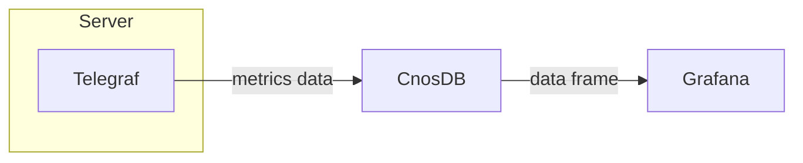

## Grafana

### 简介

[Grafana](https://github.com/grafana/grafana) 是一个开源的数据可视化工具，可以很方便地将任意符合要求的数据转换为可视化的图表，并且还带有告警功能，可以在指标数据达到阈值时通知你。Grafana 默认持多种数据源，并且还可以通过插件系统进行拓展。

本文将介绍通过 Grafana 获取 CnosDB 数据，以展示仪表板的流程。

### Grafana 部署

[官方安装教程](https://grafana.com/docs/grafana/latest/setup-grafana/installation/)

[官方配置文件说明](https://grafana.com/docs/grafana/latest/setup-grafana/configure-grafana/)

### Grafana 配置

- **连接 CnosDB**

输入 `http://localhost:3000`，当 Grafana 正确运行，便可以看到 Grafana 登录界面了。初始用户名 `admin`，初始密码 `admin`。

初次登陆时，还会要求你输入新的密码。再之后，我们便进入了 Grafana 的主界面。

Grafana 提供了通用的数据接口，我们可以通过 CnosDB 数据源插件来从 CnosDB 数据库中读取数据。首先我们进入数据源配置界面。

然后点击【`Add data source`】 按钮。

搜索 CnosDB，然后点击进入配置界面。

在配置界面中，输入 CnosDB 的地址，以及用户名等信息，然后点击【`Save & test`】按钮。

配置正确的情况下，之后会出现 `Data source is working` 提示，表明 Grafana 已经能够获取 CnosDB 的数据。

- **配置仪表板**

Grafana 可以通过图形化界面来配置仪表板，配置好的仪表板可以通过 JSON 格式的数据进行导出，也可以导入 JSON 格式的仪表板数据。

我们接下来导入一段仪表板数据。

将 [JSON](https://github.com/cnosdb/docs/blob/main/assets/grafana_dashboard.json) 复制到【`import via panel json`】处，随后点击【`load`】按钮。

接下来选择我们刚才配置好的 CnosDB 数据源，随后点击【`import`】按钮。

我们便创建好一张仪表板了。

