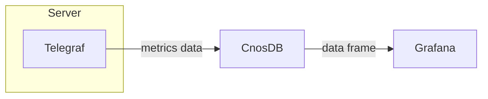

[Grafana](https://github.com/grafana/grafana) is an open-source data visualization tool that can easily convert any data that meets the requirements into visualized graphs and also with warning functions that can inform you when indicator data reach thresholds.Grafana defaults to multiple data sources and can also be expanded through the plugin system.

We will describe the process of getting CnosDB data through Grafana to present a dashboard.

### Grafana Deployment

[Official Installation Tutorial](https://grafana.com/docs/grafana/latest/setup-grafana/installation/)

[Official profile description](https://grafana.com/docs/grafana/latest/setup-grafana/configure-grafana/)

### Grafana Configuration

- **Connect CnosDB**

Enter `http://localhost:3000`, when Grafana works correctly, to see Grafana login interface.Initial username `admin`, initial password `admin`.

You will also be asked to enter a new password when first logged in.Then we entered the main screen of Grafana.

Grafana provides a common data interface, and we can read the data from the CnosDB database via the CnosDB Data Source plugin.First we enter the data source configuration interface.

Then cilck the [`Add data source`] button.

Search for CnosDB and click to enter the configuration screen.

In the configuration screen, enter the address of CnosDB and username, and then click the [`Save & test`] button.

You shall see [`Data source is working`] under correct configuration, indicating that Grafana has access to CnosDB data.

- **Configure Dashboard**

Grafana can configure dashboards via a graphical interface. The configured dashboards can be exported via JSON formatted data or imported as JSON formatted dashboard data.

We shall import a piece of dashboard data.

Copy the [JSON](https://github.com/cnosdb/docs/blob/main/assets/grafana_dashboard.json) to [`import via panel json`], and then click the [`load`] button.

Next, select the CnosDB data source we just configured, and click the [`import`] button.

We've then created a dashboard.

