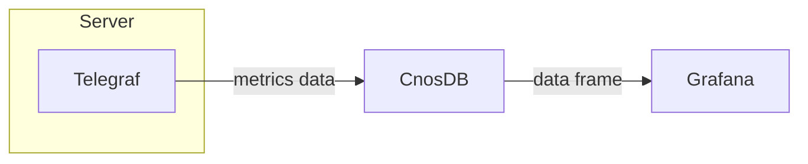

## Grafana

### Introduction

[Grafana](https://github.com/grafana/grafana) is an open source data visualization tool that easily converts any conforming data into visual charts and comes with an alerting feature that notifies you when metric data reaches a threshold. Grafana supports multiple data sources by default and can also be extended through a plugin system.

We will describe the process of getting CnosDB data through Grafana to present a dashboard.

### Grafana Deployment

[Official Installation Tutorial](https://grafana.com/docs/grafana/latest/setup-grafana/installation/)

[Official profile description](https://grafana.com/docs/grafana/latest/setup-grafana/configure-grafana/)

### Grafana Configuration

- #### **Connect CnosDB**

Type `http://localhost:3000`, and the Grafana login screen will show up if running correctly. The original username and password are both admin.

You will be asked to set a new password when you first login. The main Grafana interface shows up after this.

Grafana provides a common data interface that allows us to read data from the CnosDB database via the CnosDB data source plugin. Firstly, we shall go to the data source configuration screen.

Then cilck the [`Add data source`] button.

Search for CnosDB and click to enter the configuration screen.

In the configuration screen, enter the address of CnosDB and username, and then click the [`Save & test`] button.

You shall see [`Data source is working`] under correct configuration, indicating that Grafana has access to CnosDB data.

- #### **Configure Dashboard**

Grafana can configure dashboards via a graphical interface. The configured dashboards can be exported via JSON formatted data or imported as JSON formatted dashboard data.

We shall import a piece of dashboard data.

Copy the [JSON](https://github.com/cnosdb/docs/blob/main/assets/grafana_dashboard.json) to [`import via panel json`], and then click the [`load`] button.

Next, select the CnosDB data source we just configured, and click the [`import`] button.

We've then created a dashboard.

