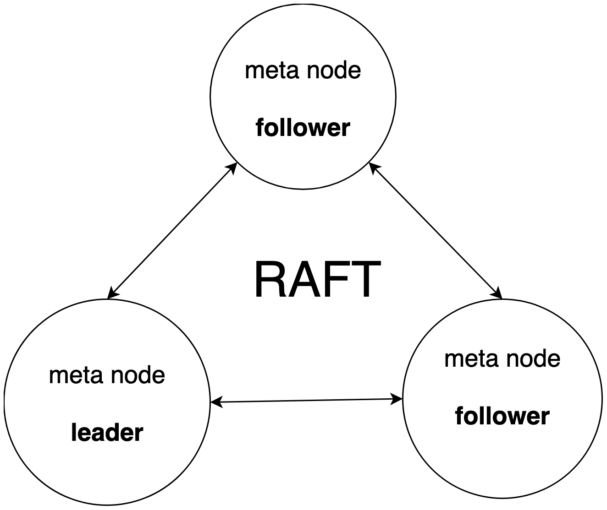

# 集群扩容

## **概述**

在 CnosDB 集群版中，单个运行实例被称作 Node，每个 Node 分为 Meta 和 Data 两种角色。

### Meta

Meta 维护集群的元数据，如 Table Schema、Node 存活心跳与负载数据、Vnode 与 Node 的映射关系等。

元数据频繁被每个 Node 所访问，CnosDB 选择维护一个强一致性的 Meta Node 集群，Node 订阅 Meta Node 来拉取感兴趣的信息，所有的元数据信息的更新都通过 Meta Node 集群进行。

[//]: # (// TODO: fix pic size)


### Data

提供 TCP Service 承接 Coodinator 分发过来的查询和写入请求，查询和写入与单机版本类似。

### 数据流


## **配置**

### Data

以下介绍 CnosDB 集群版的配置文件。

```toml
[query]
max_server_connections = 10240
query_sql_limit = 16777216 # 16 * 1024 * 1024
write_sql_limit = 167772160 # 160 * 1024 * 1024
auth_enabled = false

[storage]
path = 'data/db'
max_summary_size = 134217728 # 128 * 1024 * 1024
max_level = 4
base_file_size = 16777216 # 16 * 1024 * 1024
compact_trigger = 4
max_compact_size = 2147483648 # 2 * 1024 * 1024 * 1024
strict_write = false

[wal]
enabled = true
path = 'data/wal'
sync = false

[cache]
max_buffer_size = 134217728 # 128 * 1024 * 1024
max_immutable_number = 4

[log]
level = 'info'
path = 'data/log'

[security]
# [security.tls_config]
# certificate = "./config/tls/server.crt"
# private_key = "./config/tls/server.key"

[cluster]
node_id = 100
name = 'cluster_xxx'
meta = '127.0.0.1:21001'

flight_rpc_server = '127.0.0.1:31006'
http_server = '127.0.0.1:31007'
grpc_server = '127.0.0.1:31008'
tcp_server = '127.0.0.1:31009'
store_metrics = true 

[hintedoff]
enable = true
path = '/tmp/cnosdb/hh'
```

#### 配置项 query

| 配置项                    | 默认值      | 说明                                                 |
|------------------------|----------|----------------------------------------------------|
| max_server_connections | 10240    | 最大同时执行的 SQL 数量                                     |
| query_sql_limit        | 16777216 | SQL 的最大长度（字节）                                      |
| auth_enabled           | false    | 是否检查每个查询请求的身份信息，当设置为 true 时，执行 SQL 时会检查用户是否拥有对应权限。 |

#### 配置项 storage

| 配置项              | 默认值        | 说明                                                             |
|------------------|------------|----------------------------------------------------------------|
| path             | data/db    | 数据库文件存放路径                                                      |
| max_summary_size | 134217728  | 单个数据库概要文件的最大大小（字节），达到大小时，创建新的概要文件                              |
| max_level        | 4          | 数据库文件的最大层级                                                     |
| base_file_size   | 16777216   | 数据库文件大小（字节）                                                    |
| compact_trigger  | 4          | 当层级 0 的文件达到数量时，开启压缩任务，将文件合入更高层级                                |
| max_compact_size | 2147483648 | 每次压实任务中，最大选择的文件总大小（字节）                                         |
| strict_write     | false      | 是否确保每个写入请求能够严格符合 Table 的 Schema，当设置为 true 时，不检查写入请求是否符合 Schema |

#### 配置项 wal

| 配置项     | 默认值      | 说明                                           |
|---------|----------|----------------------------------------------|
| enabled | true     | 是否开启 WAL 以获得容灾支持，当设置为 ture 时，写请求会先写入到 WAL 文件 |
| path    | data/wal | WAL 文件目录                                     |
| sync    | false    | 是否确保每个 WAL 的写请求都刷入磁盘                         |

#### 配置项 cache

| 配置项                  | 默认值       | 说明                                      |
|----------------------|-----------|-----------------------------------------|
| max_buffer_size      | 134217728 | 单个 Vnode 中，每个活跃缓存最大可写入的大小（字节）           |
| max_immutable_number | 4         | 单个 Vnode 中，最大的不活跃缓存数量，当达到数量时，将不活跃缓存写入磁盘 |

#### 配置项 log

| 配置项   | 默认值      | 说明                |
|-------|----------|-------------------|
| level | info     | 日志级别，可选项为 trace \ | debug \| info \| warn \| error |
| path  | data/log | 日志文件目录            |

#### 配置项 security

**security.tls_confg**

| 配置项         | 默认值                 | 说明         |
|-------------|---------------------|------------|
| certificate | data/tls/server.crt | TLS 证书文件路径 |
| private_key | data/tls/server.key | TLS 私钥文件路径 |

#### 配置项 cluster

| 配置项               | 默认值             | 说明                  |
|-------------------|-----------------|---------------------|
| node_id           | 100             | Data 节点 ID          |
| name              | cluster_xxx     | Data 节点名称           |
| meta              | 127.0.0.1:21001 | Meta 节点地址           |
| flight_rpc_server | 127.0.0.1:31006 | Flight RPC 服务监听地址   |
| http_server       | 127.0.0.1:31007 | HTTP 服务监听地址         |
| grpc_server       | 127.0.0.1:31008 | GRPC 服务监听地址         |
| tcp_server        | 127.0.0.1:31009 | TCP 服务监听地址          |
| store_metrics     | true            | 是否存储metrics在CnosDB中 |

#### 配置项 hintedoff

| 配置项    | 默认值     | 说明                                                                    |
|--------|---------|-----------------------------------------------------------------------|
| enable | true    | 是否开启 Hinted Off 以获取一致性支持，当设置为 true 时，失败的写入请求将会自动进入 hinted-off 队列并自动重试 |
| path   | data/hh | Hinted Off 持久化目录                                                      |

## **安装CnosDB**

参考 [安装CnosDB#源码安装](../deploy/single#源码安装)。

## **启动CnosDB集群**

可通过以下命令来体验集群版功能。Meta 集群是由多个 cnos-meta 通过 Raft 协议组成的一个 Raft Group。Meta Node 也支持单节点启动。

### 单节点启动流程

```sh
./target/debug/cnosdb-meta --id 1 --http-addr 127.0.0.1:21001
curl http://127.0.0.1:21001/init -d '{}'
curl http://127.0.0.1:21001/metrics
./target/debug/cnosdb run --config ./config/config_31001.toml
```

### 集群启动流程

- #### Meta 集群启动流程

  **启动 meta-1**

    ```sh
    ./target/debug/cnosdb-meta --id 1 --http-addr 127.0.0.1:21001
    ```

  **启动 meta-2**

    ```sh
    ./target/debug/cnosdb-meta --id 2 --http-addr 127.0.0.1:21002
    ```

  **启动 meta-3**

    ```sh
    ./target/debug/cnosdb-meta --id 3 --http-addr 127.0.0.1:21003
    ```

  **初始化 meta**

    ```sh
    curl http://127.0.0.1:21001/init -d '{}'
    curl http://127.0.0.1:21001/add-learner -H "Content-Type: application/json" -d '[2, "127.0.0.1:21002"]'
    curl http://127.0.0.1:21001/add-learner -H "Content-Type: application/json" -d '[3, "127.0.0.1:21003"]'
    curl http://127.0.0.1:21001/change-membership -H "Content-Type: application/json" -d '[1, 2, 3]'
    ```

  **查看 meta 集群状态**

    ```sh
    curl http://127.0.0.1:21001/metrics
    curl http://127.0.0.1:21002/metrics
    curl http://127.0.0.1:21003/metrics
    ```

- #### Data 集群启动流程

  **启动 data-1**

    ```sh
    ./target/debug/cnosdb run --config ./config/config_31001.toml
    ```

  **启动 data-2**

    ```sh
    ./target/debug/cnosdb run --config ./config/config_32001.toml
    ```

## **运维指南**

### 集群维护（即将上线）

**转移 Vnode**

```
MOVE VNODE [vnode_id] TO NODE [node_id]
```

**复制 Vnode**

```
COPY VNODE [vnode_id] TO NODE [node_id]
```

**删除 Vnode**

```
DROP VNODE <vnode_id>
```

**压缩 Vnode**

```
COMPACT VNODE <vnode_id>[ <vnode_id>[ ...]]
```

**检查 Group 数据一致性**

```
CHECKSUM GROUP <replication_set_id>
```
